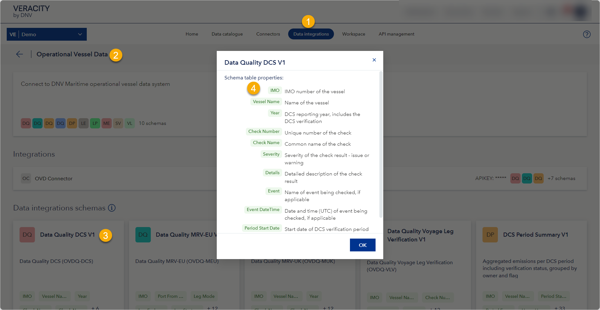

# May 2024 release
Read this page to learn what has changed in Veracity Data Workbench with the May 2024 release.

## New features
This section covers new features.

### New columns for OVD schemas
We have added the following columns to the OVD schemas called Leg Emissions Summary and Leg Part Emissions Summary:
* Count_Warnings, Int32
* Count_Issues_CII, Int32
* Count_Warnings_CII, Int32
* Count_Issues_ETS, Int32
* Count_Warnings_ETS, Int32

Also, we have added the following column to Data Quality Voyage Leg Verification:
* Check_Group (string, max 50 characters)

## Changes in existing features
This section covers changes in existing features.

### Described columns in predefined OVD datasets
We have added descriptions for predefined columns used in OVD datasets.

To see the descriptions:
1. Go to **Data integrations**.
2. Select **Operational Vessel Data** (OVD).
3. Under **Data integrations schemas**, select any schema.
4. For each predefined column, you will see a description explaining what it is.

<figure>
	
</figure>

### Corrected one column type in DCS Period Summary
Previously, in the DCS Period Summary, the Consumption Methanol column's type was set to Boolean. Now, it is corrected, and this column type is Decimal, so it shows the actual number.
