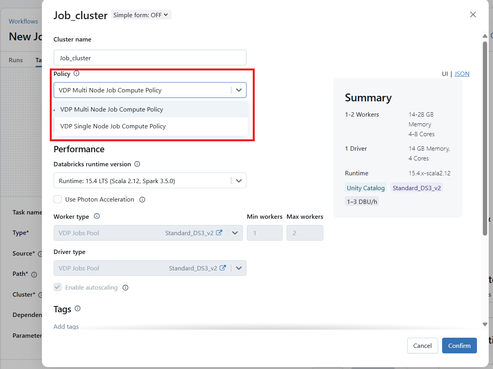
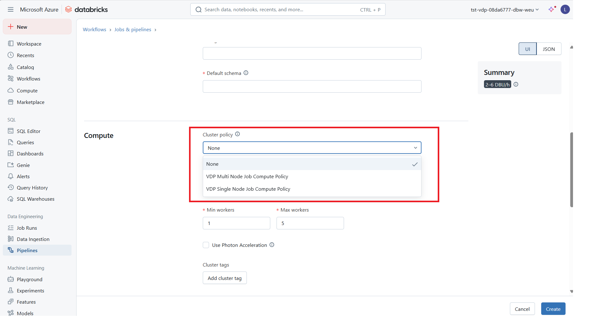

# May 2025 fourth release
Read this page to learn what has changed in Veracity Data Workbench with the May 2025 fourth release.

## Support Job/Delta Live Table
Now in Azure databricks workspace, if you want to run ETL pipeline or run job based on Job Compute, please contact our support. 
We will enable the feature on your databricks workspace, after that, you will see two cluster policies in the drop down list.

### Job
<figure>
	
</figure>

### ETL Pipeline
<figure>
	
</figure>

