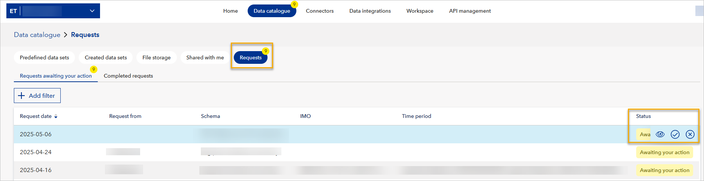

# May 2025 release
Read this page to learn what has changed in Veracity Data Workbench with the May 2025 second release. 

These changes provide improved visibility and control over data sharing, helping workspace users collaborate more efficiently.

## New features

## Manage data set access with Share Requests

You can now request and manage data set sharing between workspaces using the new **Share Request** functionality. These capabilities are available both through the API and directly in the Data Workbench interface.

## New API endpoints

The following REST API endpoints are now available:

- **Create a share request**  
  `POST /v2/workspaces/{workspaceId}/shareRequests`

- **Get details of a share request**  
  `GET /v2/workspaces/{workspaceId}/shareRequests/{shareRequestId}`

- **Query share requests**  
  `POST /v2/workspaces/{workspaceId}/shareRequests/query`

- **Accept a share request**  
  `POST /v2/workspaces/{workspaceId}/shareRequests/{shareRequestId}/accept`

- **Decline a share request**  
  `POST /v2/workspaces/{workspaceId}/shareRequests/{shareRequestId}/decline`

These endpoints allow you to initiate a request for data set access, review the request status, and respond accordingly. Filtering, sorting, and pagination are supported when listing requests.

**For details, check our API specification in the [API Explorer](https://developer.veracity.com/docs/section/api-explorer/76904bcb-1aaf-4a2f-8512-3af36fdadb2f/developerportal/dataworkbenchv2-swagger.json).**

## Manage share request from Data Workbench interface

You can manage requests in Data Workbench interface in **Data Catalogue**, after selecting the **"Requests"** tab.
<figure>
	
</figure>

- A new **"Requests awaiting your action"** page is available.
- Pending requests are listed with sorting by **Request date**.
- Pagination support allows navigating through large volumes of requests.