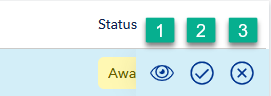

---
author: Veracity
description: This is the changelog for the May 2025 second release of Data Workbench.
---

# May 2025 second release

Read this page to learn what has changed in Veracity Data Workbench with the May 2025 second release.

These changes improve how you manage data access and enhance visibility into requests others make to access your data sets.

## New features

## Manage data set access with the Requests tab

A new **Requests** tab is now available in the **Data catalogue** section of the Data Workbench. It helps you handle data sharing requests from other users in a clear and structured way.

<figure>
	
</figure>

The tab includes two subtabs:

- **Requests awaiting your action** – shows incoming requests from users asking for access to your data sets.
- **Completed requests** – stores the full history of requests and their outcomes.

When someone requests access to a data set you manage, you’ll receive an **email notification** with a direct link to review and act on the request.

## Take action directly in the interface

In the *Requests awaiting your action* view, each row displays request details including request date, schema, IMO, and time period.

When you hover over a request’s **status**, three action icons appear:

- ??? **View details** – shows who made the request and what they are asking for.
- ?? **Accept request** – grants the user access to the data set.
- ? **Decline request** – denies the request.

<figure>
	
</figure>

When you accept a request, the user gains access immediately, and the request is logged in the *Completed requests* subtab with a status of **Approved**. If you decline it, the user is not granted access and the request is recorded with a status of **Declined**.

All past decisions—approved, declined, or processing—are visible in the *Completed requests* view for auditing and tracking.

## What’s next?

We are considering enhancements to clarify how requests are approved or declined, and what happens after each decision.

Let us know if this would be useful or if you’d like to see more improvements to the access management workflow.
