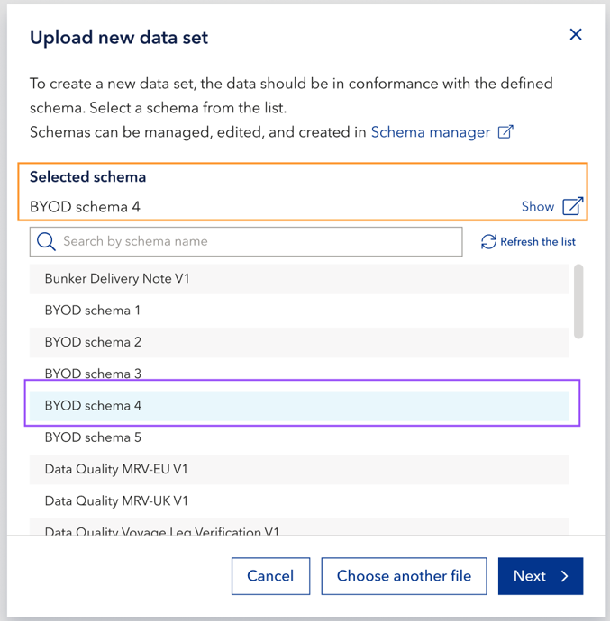

# November 2025 release
Read this page to learn what has changed in Veracity Data Workbench with the November 2025 release. 

## Changes in existing features

### Improved schema selection in the Upload new data set dialog
We've updated the **Upload new data set** dialog to make schema selection clearer and easier to use.  

- A new message now reminds you that **the active version of the schema must be locked**.  
- When you select a schema, a **Selected schema** field appears at the top of the dialog, showing which schema you've chosen.  
- The fixed **Show** link and checkmark have been removed from the list. Instead, you now see the **Show** link only when you hover over a schema name. Selecting this link opens the schema details in a new browser tab.

<figure>
	
</figure>

### New link to Developer documentation
When you select the **Help** button (the question mark icon) in the top right corner of Data Workbench, a new link now takes you directly to the **Developer guides** section of the Veracity Developer Portal.  
Use this link to learn more about the [Data Platform overview](https://developer.veracity.com/docs/section/dataplatform/overview).

## Bug fixes

### Filters not displayed in shared data sets
Previously, when a data set was shared with filters applied, the recipient couldn't see which filters were active.  

Now, all applied filters are correctly displayed when the shared data set is viewed.

