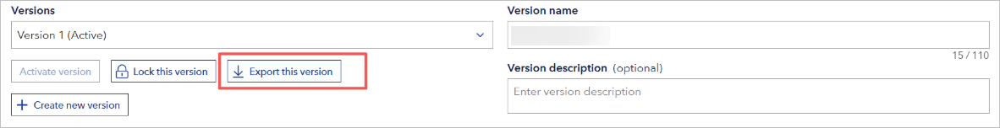
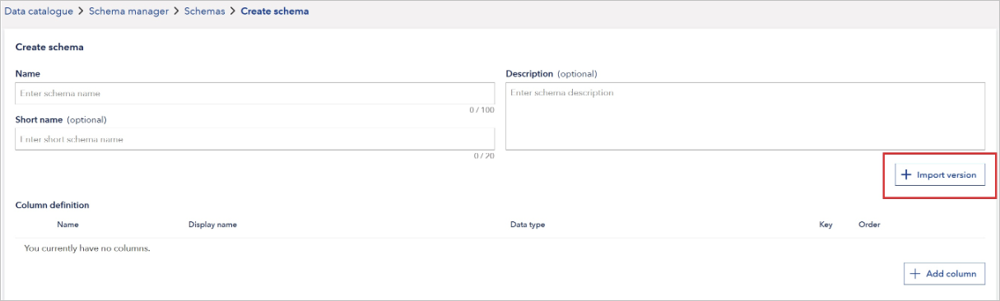
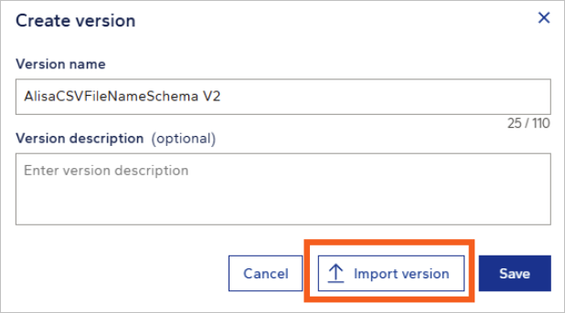

# November 2025 second release

Read this page to learn what has changed in Veracity Data Workbench with the November 2025 second release.

## New features  
This section covers new features.

### Copy schema versions using import and export  
You can now copy schema version configurations by exporting and importing column definitions via JSON files. This helps streamline schema reuse across workspaces.

#### Export a schema version  
On the **Edit schema details** page, workspace admins can click **Export this version** to download the current schema version as a JSON file named schemaVersionName.json. The file content matches the response from the Get schema version by ID Gateway API.

A toast notification confirms success or failure of the download.

<figure>
	
</figure>

**Note that** Workspace readers do not see the export button on the **View schema details** page.

#### Import a schema version 
When creating a new schema or adding a version to an existing schema, you can now import a previously exported JSON file to pre-fill column definitions.

- On the **Create schema** page, click **Import version** to upload a JSON file.
<figure>
	
</figure>

- In an existing schema, click **Import version** in the **Create version** dialog.
<figure>
	
</figure>

Only .json files are accepted. If the file is invalid, for example, incorrect format or missing fields, a descriptive error message appears. Valid files automatically populate the column definitions, no additional pasting or manual entry needed.

**Note that** only column definitions are imported. Validations and row-level rules are not included.

## Changes in existing features  
This section covers changes in existing features.

### Improved schema creation and versioning workflow  
The schema creation and versioning UI now includes import buttons that follow standard portal styling and behavior. Toast notifications display processing status during version creation.

