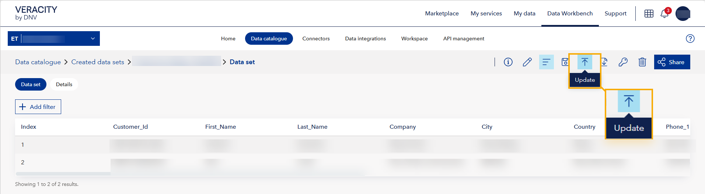

# September 2025 release
Read this page to learn what has changed in Veracity Data Workbench with the September 2025 second release. 

## New features

### Update uploaded data sets  
Workspace admins can now update existing uploaded data sets directly from the **Created datasets** page.  

When you open a data set of the **Uploaded** type that is not derived from another data set (for example, not created by applying filters or changing columns and saving it as new), and your workspace has the **Schema management** subscription, you will see a new **Update data set** button.  

<figure>
	
</figure>

When you select the **Update** button, a dialog window opens and you can:  
1. **Upload a CSV file** - Drop or select a file to start the update. The system checks that the file meets the requirements: it must be in CSV format, no larger than 1 GB, use commas as delimiters, include headers for all columns, and have a filename without special characters.
2. **Validate the file against the schema** - The uploaded file is compared with the schema used for the data set you are updating. If the columns do not match, an error message is shown and the update cannot proceed.  
3. **Choose how to apply the data** - If validation succeeds, you can select the update method. The available options depend on whether the schema defines key columns:  
   - *No key columns*: Add data, Overwrite data.  
   - *Key columns set*: Update data, Delete data, Overwrite data.  
4. **Confirm changes** - For *Delete* and *Overwrite*, a confirmation dialog is shown. Progress and results are displayed with toasts.  

#### Concurrent updates
If another admin modifies a data set (for example, by sharing it or saving a filtered view) while an update is in progress, their changes will apply to the version of the data set that existed before the update.

## Bug fixes

### Delete icon on predefined data sets
Previously, the delete icon was showing next to some predefined data sets in the Recent data sets list even though they couldn't be deleted. Now, the delete icon doesn't show next to them.

### Data set name check spinner
Previously, the loading icon shown during dataset name validation wasn't disappearing after the check was finished. Now, this is fixed.