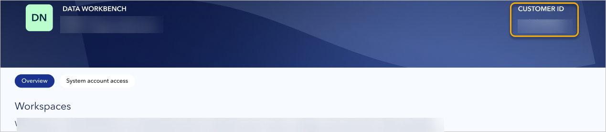
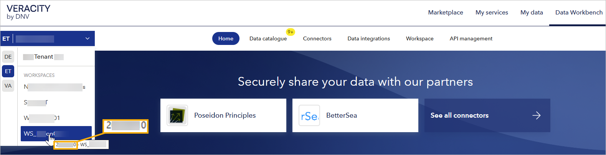

# Administration page
The Administration page lets tenant admins manage workspaces, members, and system accounts within their tenant.  

To open the Administration page:
1. In the upper-left corner, select the tenant picker.  
2. Under the tenant name, select **Administration page**.  
<figure>
	
</figure>

Alternatively, you can type the Administration page URL directly. 
In both cases, you must complete multi-factor authentication before accesing the page.

The Administration page is divided into the following tabs: 
- Overview
- System account access

## Overview tab
The **Overview** tab is the main hub for managing workspaces and tenant members.

### Workspaces section
This section shows all workspaces in your tenant as tiles.  

<figure>
	
</figure>

#### To open workspace management page  
  Select a workspace tile to open its [workspace management page](workspace.md), where you can:  
  - View workspace details (name, region, description, customer ID).  
  - See who belongs to the workspace and change their roles.  
  - Add or remove users.  
  - Access the activity log for that workspace.

#### To create a new workspace
  1. Select the tile on the left that reads **Create workspace**.  
  2. Under **Workspace name**, enter the name.  
  3. Under **Region**, select where the data should be stored (**Europe** or **USA**).  
  4. Under **Workspace description**, enter an optional description.  
  5. Select one of the following:  
     - **Create** - Creates the workspace.  
     - **Save and invite** - Creates the workspace and lets you invite users to join it.

### Tenant members section
Tenant members can have either **Admin** or **Read** access level, and they have it in all workspaces in the tenant. 
For details on access level, [go here](workspace.md).

Tenant members are shown in a table, and you can use the search field to find them by name or email address.

<figure>
	
</figure>

#### To add tenant members
1. In the right corner of the page, select **Invite tenant members**.
2. Under **Add user(s)**, for each member you want to add:
	1. Enter email address.
	1. Select a role.
	1. Confirm adding the user with the **Add** button.
3. To confirm inviting the user(s), select **Invite**.

**A tenant member uses their Veracity account to sign into Data Workbench**. If they report problems with it, tell them to follow the instructions in [To start using Data Workbench](dataworkbench.md).

#### To change tenant access level for a member
1. In the row with the user, locate the **Access level** column.
2. In the **Access level** column, select the current role and change it to another role.

#### To copy email address of a member
In the row with the user, in the right corner of the table with the users:
- Select the copy email icon.
- Alternatively, select the three dots and then **Copy email**.

#### To delete a tenant member
1. In the row with the user, select three dots.
2. Select **Delete**.
3. To confirm, select **Yes, proceed**.

#### To delete multiple tenant members
1. Next to each member you want to delete, tick the tick box.
2. In the right corner of the **Tenant members** section, select the **garbage can icon**.
3. To confirm, select **Yes, proceed**.

<figure>
	
</figure>

## System account access tab
The **System account access** tab gives tenant admins visibility and control over system accounts connected to the tenant.  

A system account connected to a tenant has read and write access to all data in all workspaces of that tenant.

If you need help creating or configuring a system account, contact the Data Workbench support team.

### System account connections
This section shows all services connected to workspaces in this tenant. Each service is a tile, and if it is connected, it has a green badge that reads **Connected**.

<figure>
	
</figure>

### To connect system account and grant it access to data
1. On the left, select the tile that reads **Connect system account**.
2. Under **System details**, enter service account email address or the ID of this service or application.
3. Under **Set access level**, select an access level you want to give it (Admin or Reader).
4. To confirm connecting system account, select **Save and close**.

### To view and edit system account details
1. Hover over the tile with a system account.
2. In the top right corner of the tile, select the three dots.
3. Select **System account details**.
4. View **System account name**, **Service account ID**, and **Access level**.
5. Optionally, change account's **Access level**.
6. To confirm changes, select **Save and close**.

### To disconnect system account and revoke its acccess to data
1. Hover over the tile with a system account.
2. In the top right corner, select the three dots.
3. Select **Disconnect**.
4. To confirm, select **Yes, proceed**. This will remove the account permanently.

### System accounts versus service accounts
The table below highlights the main differences between system accounts and [service accounts](apimanagement.md) in Data Workbench.  

| Feature                     | Service account            | System account              |
|-----------------------------|-----------------------------------------------|---------------------------------------------------|
| **Scope**                   | Workspace-level only                         | Tenant-wide (all workspaces)                      |
| **Access levels**           | Reader or Admin (per workspace)              | Admin      |
| **Typical use**             | Connect APIs or services to a single workspace | Connect services that need access to all tenant data |
| **Management location**     | Managed on the API management page of a workspace | Connect or disconnect on the Administration page under System account access |

## To find your customer ID
In Data Workbench, the customer ID uniquely identifies your tenant and is the same across all workspaces in that tenant.

You can check your Customer ID in the right corner of the top banner.

<figure>
	
</figure>

Alternatively, you can view it when you hover over your workspace name in the tenant picker.
<figure>
	
</figure>