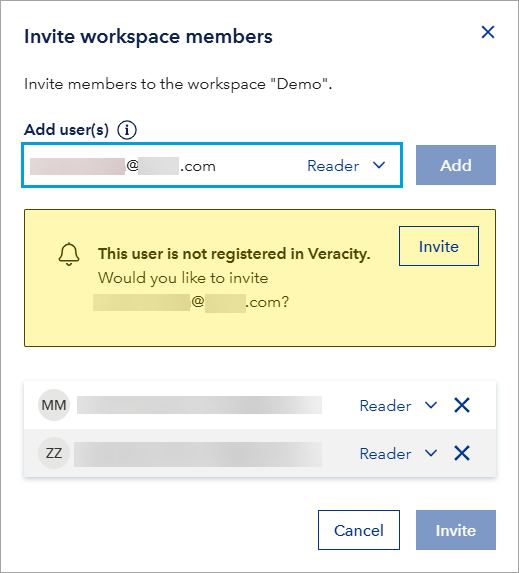
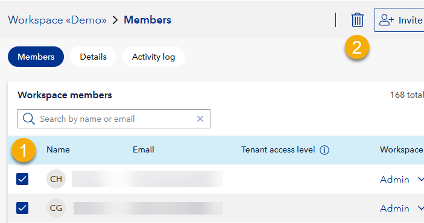

# Workspace
The workspace page has three tabs related to your Data Workbench workspace:
* Members: Workspace member management.
* Details: Workspace name, region, and description.
* Activity log: Logs of all activity in a workspace.

## Members and access levels
Under **Workspace members**, you can use the search bar to find a workspace member by their name or email.
For each member, you see the following data:
* Name
* Email
* Tenant access level
* Workspace access level

Access level are the member's permissions to access and modify data, and they can be defined on tenant and workspace level.

Regarding **Tenant access level**:
* A member can belong to a tenant containing this workspace and have a Tenant Admin or Tenant Reader role in this tenant.
* A Tenant Admin can fully manage the account (tenant) and all workspaces.
* A Tenant Reader can only view all workspaces and read data in them.
* By default, a member's tenant role gives them the same permissions in each workspace in this tenant.
* A Tenant Admin or Tenant Reader cannot be removed from a workspace in this tenant.
* You can upgrade a Tenant Reader's permission in a workspace to Workspace Admin.

Regarding **Workspace access level**:
* A Workspace Admin has full control over the workspace, including managing members (add, change role, remove) and all functions.
* A Workspace Reader has limited access to view content, share data, and download data within the workspace.

### To add workspace members
To add one or more members to the workspace:
1. In the top right corner, select **Invite workspace members**.
2. Enter the member's email address and select the member's role ("Reader" or "Admin").
If the member is not registered in Veracity, you will be prompted to invite them to Veracity.
3. Select the **Add** button. This will add the member to the workspace. You can add more than one member.
4. Select the **Invite** button. This will send the member a message informing them they were added to the workspace.

<figure>
	
</figure>

**If a member needs help with signing into the workspace**, tell them to consult [To start using Data Workbench](dataworkbench.md).

### To change member's role
To change a member's role:
1. Find the member in the list.
2. In the row with the member, locate the **Tenant access level** or **Workspace access level** column.
3. In the column, select the member's current role and, in the dropdown that shows, select another role for the member.

Note that:
* To change the tenant access level for a member, you need to be Tenant Admin.
* To change the workspace access level for a member, you need to be Tenant Admin or Workspace Admin.

### To remove member
To remove a member from the workspace:
1. Find the member in the list.
2. In the row with the member's name, select ***⋯*** (three dots). It will open a dropdown.
3. From the dropdown, select **Delete**.

To remove multiple members from the workspace:
1. Next to the members you want to remove, tick the tickbox.
1. In the top right corner, select the garbage can icon.

<figure>
	
</figure>

## Details
The details tab shows:
* Workspace name: The display name for this workspace.
* Region: Where this workspace's data is stored (EU or USA). Note that after you select a Region, you cannot change it. Data residency regulations may require you to select a specific region.
* Description: Workspace description.
* Customer ID: Uniquely identifies your tenant and is the same across all workspaces in that tenant.

## Activity log
The activity log provides an audit trail of all actions performed within the workspace, which can be helpful for troubleshooting and compliance

Data Workbench logs the following events, including information about who performed the action and when:

**1. User & access management:**

*   Adding a new member to the Data Workbench workspace.
*   Changes to the tenant members (invited member, member role updated, member deleted).
*   Changes to the workspace members (invited member, member role updated, member deleted).

**2. Tenant management:**

*   Changes to the tenant (created, role added, role deleted).

**3. Workspace management:**

*   Changes to the workspaces (created, changed workspace description, role added, role deleted).

**4. Data schema management:**

*   Changes to the schemas (added, updated).
*   Changes to the schema versions (add schema version to schema, change default schema version of schema).

**5. Data management:**

*   Changes to the data sets (created, modified, deleted) and access to them (including granting and revoking SAS access keys).
*   Downloading a data set.
*   SAS key generation (read-only, read-write).
*   SAS key revocation.

**6. Integrations & API access:**

*   Changes to the data integrations (created, modified, deleted).
*   Changes to the service accounts for API sharing (created, updated, regenerate service account secret, deleted).
