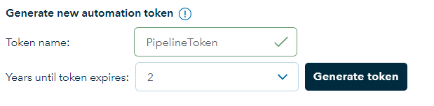

# Veracity Resource Management (VRM)

> Veracity Resource Manager (VRM) is a Veracity Developer service you can use to manage and deploy resources using an infrastructure as code paradigm. It enables you to provision and modify resources using a variety of features including access controls, tags and secret management.

## Objectives

The goal for this project is to make Veracity DevOps friendly by allowing developers to create VRM templates for their soulutions. The VRM template concept is heavily inspired by Azure ARM templates. 

Core features:
- parameterized
- collect output variables
- flexible 
- standardized query language [JMESPath](https://jmespath.org/specification.html)
- future proof, supports future resource types

<br>

## VRM Endpoint and authentication

To submit a template file you can post it to the VRM endpoint:

`https://api.veracity.com/developer/vrm/v1`

specifying the Project id found in the "Settings" tab in your project in [My Projects](https://developer.veracity.com/projects) in the path.

In the request add an authorization header with a bearer token. This token can be generated under **"Generate new automation token"** in the "Settings" tab of your project:

<figure>
	
</figure>

The full request should look like this:

```
POST https://api.veracity.com/developer/vrm/v1/projects/{projectId}/resourceGroups/files HTTP/1.1
Host: api.veracity.com
Authorization: Bearer [token]
Content-Type: application/json
```

The body of the post request must be a JSON payload with the contents of your template file and parameter file base64 encoded:

```json
{
  "format": "json",
  "template": "{base64-encoded-template-file}",
  "parameters": "{base64-encoded-parameter-file}"
}
```

We have a Github repository with some sample template and parameter files. This allso contains a Powershell module that can be used to submit templates to VRM.

[https://github.com/veracity/vrm-samples](https://github.com/veracity/vrm-samples)

## Structure of the template file

### resourceGroup

Creates a resource group in Veracity. "Name", "description" and "tags" can only be set on creation and will not overwrite changes made in the UI. While "isProduction" and "locked" state can be updated. Changing the name will create a new resource group.

### variables

The variables can be used to create naming conventions for your service and the resources you need.
In principle you can have 1 parameter that changes between your environments.

### resources
this is the main section of the message defining the structure of your solution. A simple web app that has a tile on veracity MyServices has two nodes here. a veracity.services and a veracity.application.

#### resource dependencies

The current version do not support dynamic resource dependency discovery. Resources are processed in the order they are listed in the template.

### outputs
Defines what to output to the CI/CD pipeline for later use.

## The parameter file

Used to parameterize the VRM template. This allows you to have different name for the resources depending on the environment.

<hr>

## Query language

VRM templates use [JMESPath](https://jmespath.org/specification.html) to express queries allowing you to look up and return the needed information from the result including secrets, keys and id's that you need to configure your services and applications.
VRM has 3 language extentions allowing you to easily look up parameter values and use that in the queries.
Any inline query starts with a '$'.

> The [JMESPath](https://jmespath.org/specification.html) language is described in an ABNF grammar with a complete specification. This ensures that the language syntax is precisely defined.


### language extentions

|Name          |Description                                             |Usage                                     |
|--------------|--------------------------------------------------------|------------------------------------------|
|parameter     |grabs the value of a parameter and uses it in your query|parameter('parameterName')                |
|variable      |grabs the value of a variable and uses it in your query |variable('variableName')                  |
|concat        |concatenate property, variable or constant              |concat(parameter('parameterName'),'const')|

## Validation and error messages

The VRM service does a best effort to do validation of the content but detailed validation can only be fully done at provisioning time. 

## execution order and dependencies

Some resource types support, or require, references to other resource type instances. The VRM service will provision each resource sequentially in the order they are defined in the template file. 

### Query sample
```json
{
    "outputs": [
      {
        "name": "apimProduct",
        "value": "$resources[?name== parameter('appName')].sections.advanced.apiProductSubscriptions[*].{id:productId,subscriptionKey:key}",
        "type": "object"
      }
    ]
  }
```
## Resource Type Schemas
|Schema name                               |description|
|------------------------------------------|---------------------------------------------|
[veracity.service](serviceschema.md)    |Define a veracity service. A service is the representation of yor application within Veracity and where we connect user subscriptions to|
[veracity.application](appapischema.md) |A Veracity application represents your app/api in Veracity Identity and allow you to connect to api's and/or expose api scopes|

## Sample

### Parameters
```json
[
  {
    "name": "rgName",
    "value": "vrm test3",
    "type": "string"
  },
  {
    "name": "serviceName",
    "value": "veracityResourceManager_test3",
    "type": "string"
  },
  {
    "name": "appName",
    "value": "veracityResourceManager_test3_app",
    "type": "string"
  },
  {
    "name": "appUrl",
    "value": "https://demo3.veracity.com",
    "type": "string"
  },
  {
    "name": "appReplyUrl",
    "value": "https://demo3.veracity.com/oidc",
    "type": "string"
  }
]
```

### Template
```json
{
    "resourceGroup": {
    "name": "$parameter('rgName')",
    "description": "testing stuff!",
    "tags": [ "demo", "test", "whatever" ]
  },
  "resources": [
    {
      "name": "$parameter('serviceName')",
      "sku": "standard",
      "resourceType": "veracity.service",
      "sections": {
        "properties": {
          "businessOwnerId": null,
          "description": "",
          "category": null,
          "shortName": "NP_Dev_DemoService",
          "openInNewTab": true,
          "visible": true,
          "serviceUrl": "$parameter('appUrl')",
          "shortDescription": "",
          "technicalContactEmail": "",
          "providerCompanyName": null
        },
        "advanced": {
          "parentServiceId": null,
          "childServiceIds": [],
          "passwordPolicy": null,
          "accessLevels": {
            "useAccessLevels": false,
            "accessLevels": null
          }
        }
      }
    },
    {
      "name": "$parameter('appName')",
      "sku": "app",
      "resourceType": "veracity.application",
      "sections": {
        "properties": {
          "isApi": false,
          "clientType": "Confidential",
          "redirectUrls": [
            "$parameter('appReplyUrl')"
          ],
          "applicationUrl": "$parameter('appUrl')",
          "allowImplicitGrantFlow": true,
          "appIdUri": null,
          "tokenVersion": 2,
          "publishedScopes": [],
          "services": [
            "$resources[?name== parameter('serviceName')].id"
          ]
        },
        "advanced": {
          "apiProductSubscriptions": [
            {
              "productId": "veracity-platfrom-api",
              "productName": "Veracity Platform API"
            }
          ],
          "clients": [],
          "apiAcceses": [
            {
              "apiClientId": "a4a8e726-c1cc-407c-83a0-4ce37f1ce130",
              "scopes": [
                "user_impersonation"
              ]
            }
          ]
        }
      }
    }
  ],
  "outputs": [
    {
      "name": "serviceId",
      "value": "$resources[?name== parameter('serviceName')].id",
      "type": "string"
    },
    {
      "name": "apimProduct",
      "value": "$resources[?name== parameter('appName')].sections.advanced.apiProductSubscriptions[*].{id:productId,subscriptionKey:key}",
      "type": "object"
    },
    {
      "name": "clientId",
      "value": "$resources[?name== parameter('appName')].id",
      "type": "string"
    }
  ]
}
```

## ouput statements

#### Value types
```json
{
      "name": "serviceId",
      "value": "$resources[?name== parameter('serviceName')].id",
      "type": "string"
    },
    {
      "name": "apimProduct",
      "value": "$resources[?name== parameter('appName')].sections.advanced.apiProductSubscriptions[*].{id:productId,subscriptionKey:key}",
      "type": "object"
    },
    {
      "name": "clientId",
      "value": "$resources[?name== parameter('appName')].id",
      "type": "string"
    },
    {
      "name": "secret",
      "value": "$resources[?name== parameter('appName')].sections.properties.secrets[0].secretText",
      "type": "string"
    }
```

#### complex objects

```json
{
      "name": "appRegCombined",
      "value": "$resources[?name== parameter('appName')].{clientId:id,secret:sections.properties.secrets[0].secretText,apiKeys:sections.advanced.apiProductSubscriptions[*].{id:productId,subscriptionKey:key}}",
      "type": "string"
    }
```

###

### output

```json
{
  "errors": null,
  "values": [
    {
      "name": "serviceId",
      "value": "197d9a24-9c26-42bc-8fda-dd21d4531016"
    },
    {
      "name": "apimProduct",
      "value": [
        {
          "id": "veracity-platfrom-api",
          "subscriptionKey": "9afc346940a14a30b27dec724d903a4c"
        }
      ]
    },
    {
      "name": "clientId",
      "value": "fee9bbeb-2938-4f3a-8896-6a928aea3034"
    }
  ]
}
```

