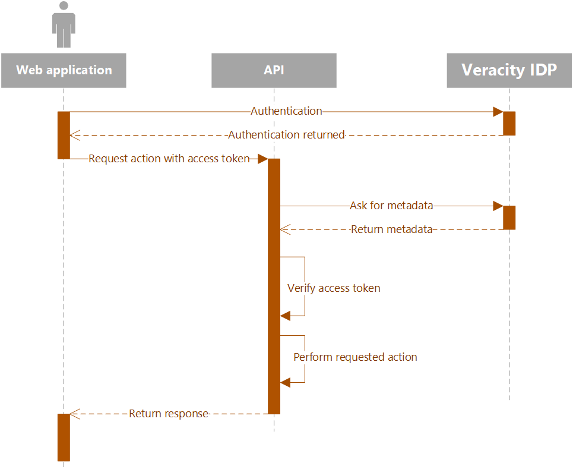

# Authentication for APIs
In contrast to [web and native application](web-native.md) authentication for APIs do not involve any kind of user interaction yet they still need to be able to validate the users identity in order to trust that the user is who they claim to be. It is important to also note that *authorization* (the act of determining if the user is allowed to perform an operation) is **not** handled by the Veracity Identity Provider (IDP) which means your API needs to perform this step internally.

[NOTE! Please be aware of this security flaw when you develop an API.](../whatsnew.md#api-security-flaw)

<figure>
	
	<figcaption>An application receiving calls from another will have to validate the incomming request as well as the access token provided to ensure the user is who they claim to be.</figcaption>
</figure>

When any API is called within the Veracity ecosystem it should be provided with a relevant access token from the calling code. The access token should be placed in the `Authorization` header of the request as a `Bearer` token. The API can then grab the token and verify and decode it to ensure the user is who they claim to be. Before executing any operation the API should also look up if the user has permissions to perform the requested operation. This can, for instance, be done by the API accessing it's own internal database of users indexed by the `userId` claim from the access token and retrieving additional information.

The process the API should follow is:
1. Receive the incomming request and extract the token from the `Authorization` header.
2. Validate and decode the token.
3. Lookup additional permissions for the user (if needed) from an internal database.
4. If token is valid and user has permission perform the request and return a response.

## Validating the access token
In order to properly validate the access token received with the request the API needs some additional information from the Veracity IDP. This information is available through the metadata endpoint which is available here:

```
https://login.veracity.com/{tenantid}/v2.0/.well-known/openid-configuration?p={policy}
```

Replace the placeholders with the following parameters:
Parameter|Value
-|-
Tenant ID|`a68572e3-63ce-4bc1-acdc-b64943502e9d`
Policy|`B2C_1A_SignInWithADFSIdp`

Visiting this URL in your browser will return details about the Veracity IDPs OAuth configuration. The result will look something like this:

```json
{
  "issuer": "https://login.veracity.com/a68572e3-63ce-4bc1-acdc-b64943502e9d/v2.0/",
  "authorization_endpoint": "https://login.veracity.com/a68572e3-63ce-4bc1-acdc-b64943502e9d/oauth2/v2.0/authorize?p=b2c_1a_signinwithadfsidp",
  "token_endpoint": "https://login.veracity.com/a68572e3-63ce-4bc1-acdc-b64943502e9d/oauth2/v2.0/token?p=b2c_1a_signinwithadfsidp",
  "end_session_endpoint": "https://login.veracity.com/a68572e3-63ce-4bc1-acdc-b64943502e9d/oauth2/v2.0/logout?p=b2c_1a_signinwithadfsidp",
  "jwks_uri": "https://login.veracity.com/a68572e3-63ce-4bc1-acdc-b64943502e9d/discovery/v2.0/keys?p=b2c_1a_signinwithadfsidp",
  "response_modes_supported": [
    "query",
    "fragment",
    "form_post"
  ],
  "response_types_supported": [
    "code",
    "code id_token",
    "code token",
    "code id_token token",
    "id_token",
    "id_token token",
    "token",
    "token id_token"
  ],
  "scopes_supported": [
    "openid"
  ],
  "subject_types_supported": [
    "pairwise"
  ],
  "id_token_signing_alg_values_supported": [
    "RS256"
  ],
  "token_endpoint_auth_methods_supported": [
    "client_secret_post",
    "client_secret_basic"
  ],
  "claims_supported": [
    "dnvglAccountName",
    "myDnvglGuid",
    "userId",
    "oid",
    "name",
    "given_name",
    "family_name",
    "sub",
    "email",
    "upn",
    "mfaType",
    "mfa_required",
    "authenticatedBy",
    "iss",
    "iat",
    "exp",
    "aud",
    "acr",
    "nonce",
    "auth_time"
  ]
}
```

Once your API has retrieved the token from the header it should use the above metadata to validate it according to the current best-practice for OAuth token validation available [here](https://auth0.com/docs/tokens/guides/access-token/validate-access-token#json-web-token-jwt-access-tokens). You **MUST** validate the signature of the token using the relevant Json Web Token key. See the `jwks_uri` endpoint in the metadata for a list of public key signatures and validate accordingly. You can read more about validating the siganture [here](https://docs.microsoft.com/en-us/azure/active-directory/develop/access-tokens#validating-the-signature).

Once these steps are done you can trust that the token was issued by Veracity, is not expired and was signed by the Veacity IDP. Only then can you use the information within to continue handling the request. If any of the validation steps fail your API must reject the token and return a `401 Unauthorized` response indicating to the calling code that the token is invalid and you will not handle the request.
