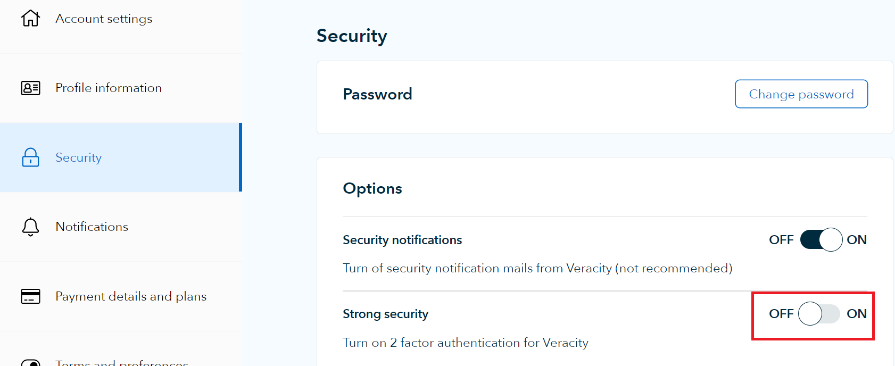
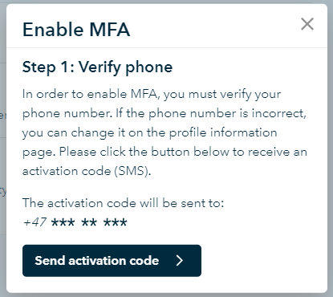
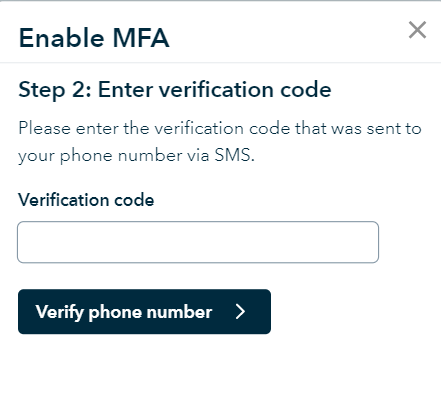
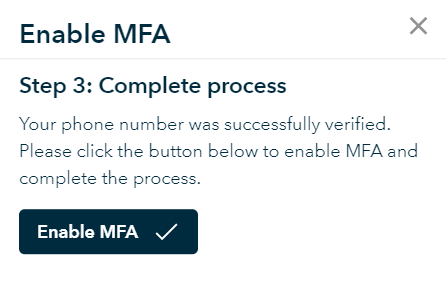

# Multi-Factor Authentication (MFA)
*Note!* Currently only phone-based MFA (SMS or call) is supported.

## Types of Multi-Factor Authentication offered by Veracity

### Service-specific MFA
A service can invoke MFA for all users of its service or for certain functions within its service. This is accomplished by sending the following parameter in the login request:

*mfa_required=true*

If only certain functions within a service shall invoke MFA, then the service can upon usage of the function redirect the user to Veracity login adding the mentioned parameter. If MFA shall only be invoked for certain users of a service (such as admin users), then after a successful standard login, the service can redirect the user back to Veracity login adding the mentioned parameter, and MFA will then be invoked.

Example of logon request invoking MFA:

<code style="overflow-wrap: break-word">
https://login.veracity.com/dnvglb2cprod.onmicrosoft.com/oauth2/v2.0/authorize?p=B2C_1A_SignInWithADFSIdp&client_id=58d531de-c4f6-4fce-b792-4a1edfe32e2d&nonce=defaultNonce&redirect_uri=https%3A%2F%2Fjwt.ms&scope=openid&response_type=id_token<strong>&mfa_required=true</strong>
</code>

### User-initiated MFA
A user can choose to always use MFA for any service they use in Veracity. This can be done by toggling the following option in the user’s profile:

<figure>
	
</figure>

If the user has not already defined a phone number in his profile, he will be asked to do so. Once a phone number is present in the profile and strong authentication is toggled ON, the user will see the following message:

By pressing the "Send activation code" button, the user will recieve an activation code used to verify the phone number used for MFA on the account.

After verifying the phone number, the process is completed by pressing the "Enable MFA" button.

## Invoking MFA on user authentication
When MFA is invoked, it will by default only be invoked once during the lifetime of the user’s session. The session lifetime for B2C is set to 8 hours but will be terminated if user closes the browser. This means that if the user has already done MFA previously in the session, e.g. a service requested it, he will by default not be prompted again if he navigates to a new service that also requires MFA.

A service can decide to force MFA even if it has already been done earlier in the session by sending the parameters *&mfa_required=true&prompt=login* in the login request. User will then be asked both to log in and do MFA.

## Verifying that MFA has been done
In order to verify that MFA has been completed in the session, you can look for the claim *mfaType* which should have the value *phone*. If no MFA has been done, it has the value *none*.

If it is a federated user, meaning the user logs in to Veracity with an account in their own company, and MFA is invoked on the federated company side, MFA will not be prompted again on Veracity side. The claim *mfaType* will then have the value *federatedIdP*.
