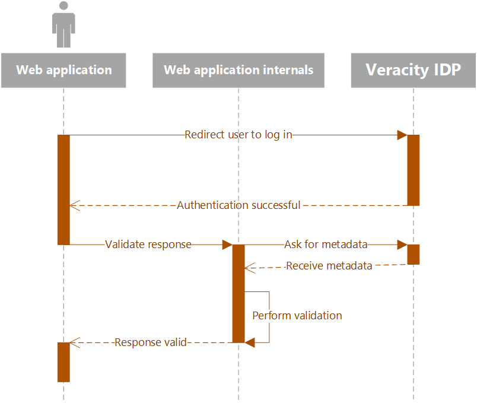

# Authentication for Web and Native Applications
Authenticating users is usually the first step any application needs to do before it can be used. Performing authentication with the Veracity IDP is done using the industry standard protocol *OpenID Connect* built on top of [OAuth 2.0](https://auth0.com/docs/protocols/oidc) flows. This ensures compatibility with a wide range of services accross the internet. In this document we'll go through the steps needed to authenticate with Veracity as a web application or native application. These use cases only differ in the parameters that are sent so they have been combined into one single document.

<figure>
	
	<figcaption>Overview of the authentication process.</figcaption>
</figure>

The process of authenticating users consists of a few steps:
1. Redirect the user to the login page for Veracity.
2. Await the users response and subsequent redirect back to your application.
3. Inspect the response and validate it.
4. (Optionally) Exchange an authorization code for an access token.
5. (Optionally) Validate the access token.

If you only wish to authenticate the user and do not need to call any Veracity APIs at all you can skip step 4 and 5. Though in most cases you would probably need to do theses steps for your application to operate correctly. The remaining sections of this document will cover every step in detail.

## Helper libraries
The Veracity IDP implements authentication using OpenID Connect. There are multiple libraries online that aid in building applications 

## Authenticating a user
Before you begin the authentication process you need a few parameters. You also need to register your application with Veracity to obtain a *client id*, *reply url* and, if you are building a web application and wish to call Veracity APIs as well, *client secret*. If you intend to call Veracity APIs as well you will also need a subscription key for each API endpoint you want to communicate with. All of this can be obtained from the [Veracity for Developers Project Portal](https://developer.veracity.com/projects). Simply create an account and register your application here and you should receive the relevant parameters.

In addition you also need to know a few parameters specific to the Veracity platform these are the *tenant id*, *policy* and any scopes you want access tokens for. In total here is all the parameters you should have:

Parameter|Value
-|-
Client ID|`[from developer portal]`
Client Secret (only if web application)|`[from developer portal]`
Reply URL|`[from developer portal]`
Tenant ID|`a68572e3-63ce-4bc1-acdc-b64943502e9d`
Policy|`B2C_1A_SignInWithADFSIdp`
Services API scope|`https://dnvglb2cprod.onmicrosoft.com/83054ebf-1d7b-43f5-82ad-b2bde84d7b75/user_impersonation`
Data Fabric API scope|`https://dnvglb2cprod.onmicrosoft.com/37c59c8d-cd9d-4cd5-b05a-e67f1650ee14/user_impersonation`

With this information you can now construct the URLs needed to authenticate and authorize users with Veraicty. Before we do however it is useful to know about the metadata endpoint. This is a url where you can get detailed information about the configuration of the OAuth 2.0 implementation used in Veracity. The format of the URL is:

```
# Veracity Metadata URL
https://login.veracity.com/a68572e3-63ce-4bc1-acdc-b64943502e9d/v2.0/.well-known/openid-configuration?p=B2C_1A_SignInWithADFSIdp
```

If you visit this URL in your browser the IDP will return details about its OAuth configuration. When verifying tokens you will need this information. It also contains the authorization URL as well as token endpoint URL which you will need later. Let's construct the authorization URL based on the information returned from the metadata endpoint. Here is an example of the data returned:

```json
{
  "issuer": "https://login.veracity.com/a68572e3-63ce-4bc1-acdc-b64943502e9d/v2.0/",
  "authorization_endpoint": "https://login.veracity.com/a68572e3-63ce-4bc1-acdc-b64943502e9d/oauth2/v2.0/authorize?p=b2c_1a_signinwithadfsidp",
  "token_endpoint": "https://login.veracity.com/a68572e3-63ce-4bc1-acdc-b64943502e9d/oauth2/v2.0/token?p=b2c_1a_signinwithadfsidp",
  "end_session_endpoint": "https://login.veracity.com/a68572e3-63ce-4bc1-acdc-b64943502e9d/oauth2/v2.0/logout?p=b2c_1a_signinwithadfsidp",
  "jwks_uri": "https://login.veracity.com/a68572e3-63ce-4bc1-acdc-b64943502e9d/discovery/v2.0/keys?p=b2c_1a_signinwithadfsidp",
  "response_modes_supported": [
    "query",
    "fragment",
    "form_post"
  ],
  "response_types_supported": [
    "code",
    "code id_token",
    "code token",
    "code id_token token",
    "id_token",
    "id_token token",
    "token",
    "token id_token"
  ],
  "scopes_supported": [
    "openid"
  ],
  "subject_types_supported": [
    "pairwise"
  ],
  "id_token_signing_alg_values_supported": [
    "RS256"
  ],
  "token_endpoint_auth_methods_supported": [
    "client_secret_post",
    "client_secret_basic"
  ],
  "claims_supported": [
    "dnvglAccountName",
    "myDnvglGuid",
    "userId",
    "oid",
    "name",
    "given_name",
    "family_name",
    "sub",
    "email",
    "upn",
    "mfaType",
    "mfa_required",
    "authenticatedBy",
    "iss",
    "iat",
    "exp",
    "aud",
    "acr",
    "nonce",
    "auth_time"
  ]
}
```

The URL you need is the `authorization_endpoint`. This is where you need to redirect users in order to perform authentication. However you cannot just redirect them directly to that address. You need to specify a few parameters and encode them as part of the request. You can find more details about the parameters [here](https://docs.microsoft.com/en-us/azure/active-directory/develop/v2-oauth2-auth-code-flow#request-an-authorization-code). For Veracity you'll need to provide the following parameters:

Parameter|Value
-|-
`client_id`|`[from developer portal]`
`scope`|`openid offline_access [+ one of the service scope claims]`
`redirect_uri`|`[Reply URL from developer portal]`
`state`*|State data you wish the endpoint to send back to you once the user is authenticated.
`response_type`|`code id_token` (you can skip `code` if you do not need an access token)
`response_mode`|`form_post`

\* **Note on the `state` parameter**: This parameter is meant to contain data that will be returned back to your application after the user is authenticated. You may encode anything you want, but this parameter is commonly used in place of a nonce to prevent cross-site scripting attacks. If you want to send actual data in this parameter you should consider also adding a nonce value that you validate once the request comes back.

All parameters must also be URL encoded before being sent to remove any illegal characters from the URL. With node/javascript you can do this using the `encodeURIComponent` function. Read more about it [here](https://developer.mozilla.org/en-US/docs/Web/JavaScript/Reference/Global_Objects/encodeURIComponent). Here is an example of the complete, encoded url (line breaks added for clarity):

```url
https://login.veracity.com/a68572e3-63ce-4bc1-acdc-b64943502e9d/oauth2/v2.0/authorize

?p=b2c_1a_signinwithadfsidp
&client_id=6731de76-14a6-49ae-97bc-6eba6914391e
&response_type=code%20id_token
&response_mode=form_post
&redirect_uri=http%3A%2F%2Flocalhost%2Fmyapp%2Fauth-return
&state=uaweghlibuysdahewkbaskjdg
&scope=openid%20offline_access%20https%3A%2F%2Fdnvglb2cprod.onmicrosoft.com%2F83054ebf-1d7b-43f5-82ad-b2bde84d7b75%2Fuser_impersonation
```

The above request will authenticate a user and return an authorization code that can be exchanged for an access token that works with the Services API.

You can now authenticate users by redirecting their browser to the `authorize` endpoint with your parameters. The user will be prompted to log in with Veracity and, once complete, returned back to your application. The way the return process works is that the Veracity IDP will issue a POST request to your specificed `redirect_uri` (known as Reply URL in the Developer Portal) and included in the body will be all the parameters you asked for (due to the `response_mode` parameter).

Example response:
```json
{
	state: "8ohxSOcjcvkB1JfS6yIJE",
	code: "eyJraWQiOiJhOXZ5SjJVX25SM3ZmakZubEpUQlFLbHhfUFF3UDhqU...",
	id_token: "eyJ0eXAiOiJKV1QiLCJhbGciOiJSUzI1NiIsImtpZCI6ImVnR..."
}
```

Before you start using the id_token or authorization code you should validate them. The ID token validation is handled using the [standard validation regimen for OAuth 2.0 ID tokens](https://auth0.com/docs/tokens/guides/id-token/validate-id-token). Once you have validated the ID token you can use the `c_hash` claim from it to validate the authorization code. Then you can use the token as you wish and request an authorization code from the access token endpoint.

## Retrieving an access token for the user
Once you have an authorization code you can request an access token from the Veracity IDP using the `token_endpoint` URL from the metadata earlier. The access token request should be done from your backend without involving the user at all. This is because you will need to send not only your client id and reply url, but also your client secret (if you are building a web application) which should never be known to anyone except your application and the IDP. The parameters you can send to the token endpoint are documented [here](https://docs.microsoft.com/en-us/azure/active-directory/develop/v2-oauth2-auth-code-flow#request-an-access-token). For Veracity you'll need to provide the following parameters:

Parameter|Value
-|-
`client_id`|`[from developer portal]`
`grant_type`|`authorization_code`
`scope`|The same scope string you used with the authentication request.
`code`|The authorization code from the authentication request.
`redirect_uri`|`[Reply URL from developer portal]`
`client_secret`*|`[from developer portal]`

\* **Note on client secret**: The client secret paramater is required for web applications where the back end is fully controlled by you and should never be disclosed to anyone. For native applications you should not use the `client_secret` parameter.

Once you have the parameters you need to construct an HTTPS `POST` request from your server side code (or internally in the native application) and encode the parameters as the `application/x-www-form-urlencoded` payload ([read more here](https://developer.mozilla.org/en-US/docs/Web/HTTP/Methods/POST)). Once this call returns you will receive a response similar to this:

```json
{
	"access_token": "eyJ0eXAiOiJKV1QiLCJhbGciOiJSU...",
	"id_token": "eyJ0eXAiOiJKV1QiLCJhbGciOiJSUzI1Ni...",
	"token_type": "Bearer",
	"not_before": "1569076697",
	"expires_in": "3600",
	"expires_on": "1569080297",
	"resource": "83054ebf-1d7b-43f5-82ad-b2bde84d7b75",
	"id_token_expires_in": "3600",
	"profile_info": "eyJ2ZXIiOiIxLjAiLCJ0aWQiOiJhNjg1N...",
	"refresh_token": "eyJraWQiOiJhOXZ5SjJVX25SM3ZmakZu...",
	"refresh_token_expires_in": "1209600"
}
```

It contains some information about the token as well as the requested access token itself. The access token will allow your application to perform authorized requests on behalf of the user against the requested API endpoints (defined by the scopes option from earlier). You now need to validate the access token and as you did with the identity token earler and store it away safely within your application. You should also have received a refresh token (if you requested the scope `offline_access` earlier). This token can be used to ask for a new access token later should the current one expire. It cannot be used to access any services itself. Veracity does not directly disclose the lifetime for either the access token or refresh token as it may be changed without warning in response to security changes. Your application must know how to deal with both an expired access token and refresh token and prompt the user to log in once more if the latter expires.

Now that you have the access token you are able to make requests to the API you specified a scope for earlier. Simply construct an HTTPS request to the relevant endpoint and make sure you add the token in the `Authorization` header as a bearer token as well as your subscription key for the intended API. Here is an example of a request to the `/my/profile` endpoint of the Services API.

```
GET https://api.veracity.com/Veracity/Services/V3/my/profile HTTP/1.1
Host: api.veracity.com
Ocp-Apim-Subscription-Key: [subscription-key]
Authorization: Bearer [token]
```

## Logging out
The logout process for a user involves two steps:

1. Clear all local session data for your application.
2. Redirect user to `https://www.veracity.com/auth/logout` in order to centrally log them out.

An authenticated user usually has an active session with your application. Such a session may contain access tokens and refresh tokens so that your application can query Veracity and other APIs as needed. Logging users out correctly is a vital part of a secure application as it will mitigate potential misuse of the access tokens the user has acquired. Access tokens issued by Veracity cannot normally be revoked thus you need to ensure that you are in complete control of the access token and that it never leaves your trusted application core. Once the user decides they are done with your service for the day and sign out you must also ensure the access and refresh tokens are deleted. This is done by clearing all session data upon logout.

In ExpressJS with Passport this is usually as easy as calling `request.logout()` and there are probably equivalent methods within your preferred library. Once a user starts the logout process this is the first thing you should do. Clearing session data (if done correctly) will delete any access and refresh tokens you acquired for the user earlier thus preventing access in the future. Once complete the user has been logged out from your system, but not from Veracity as a whole yet. In order log them out completely you need to also redirect them to the central logout endpoint on `https://www.veracity.com/auth/logout`. This will perform a Single-Sign-Out of all internal and other third-party services ensuring the session is properly terminated. After this the user is prompted to close their browser in order to clear any remaining session data. Only then is the user completely signed out.

**Note**: Veracity does not provide any mechanism for routing the user back to your application after being redirected to the Single-Sign-Out endpoint. This is by design in order to prompt them to close their browser to complete the sign-out process.
