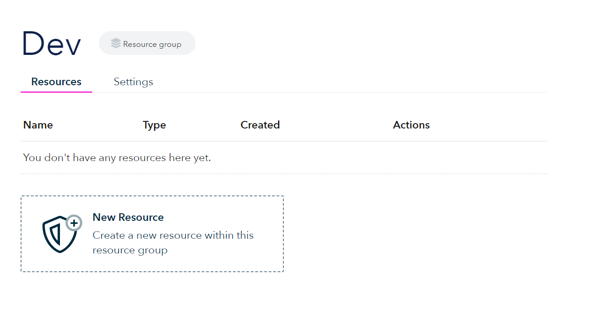
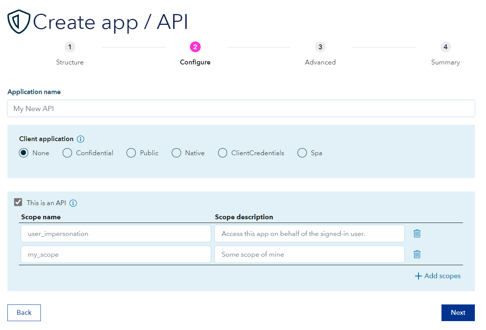
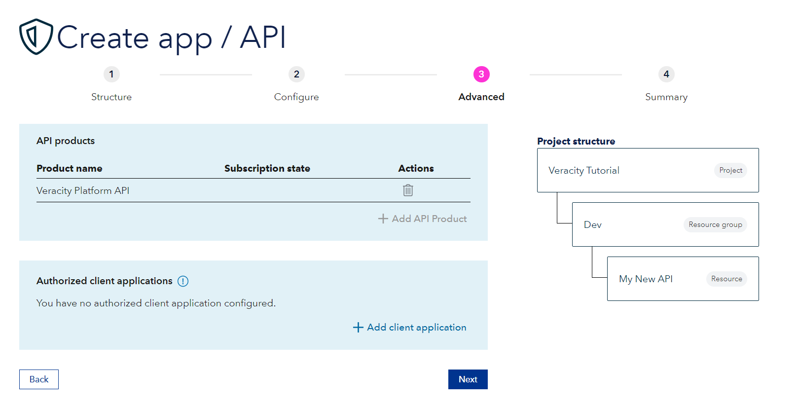
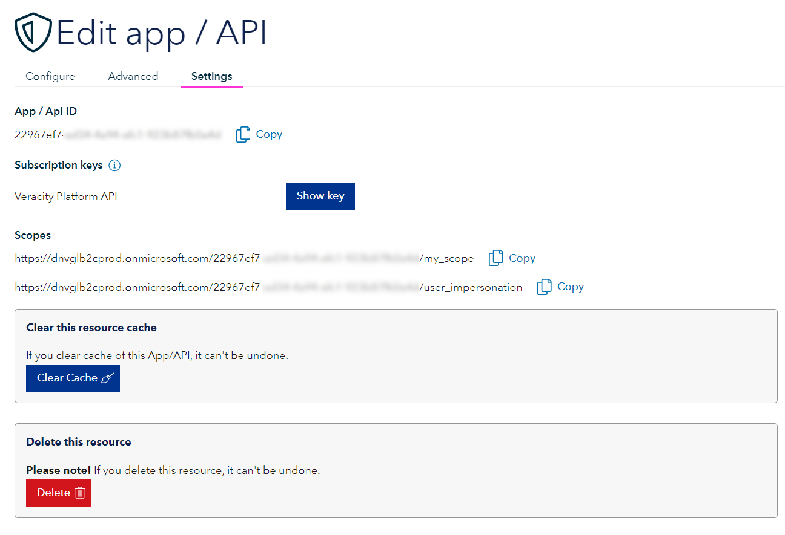

[Previous - 1. Introduction to the Client Credentials flow](1-client-credentials-introduction.md)

## Create a new resource

<figure>
	
	<figcaption>Create a new resource in a chosen resource group in Developer Potal on Veracity.</figcaption>
</figure>

## Pick resource type

<figure>
	
	<figcaption>As the resource type pick App or API.</figcaption>
</figure>

## Pick localization

<figure>
	
	<figcaption>Select project and resource group of the resource to be created.</figcaption>
</figure>

## Configure your API

<figure>
	
	<figcaption></figcaption>
</figure>

Write the API name under **Application name**.

For client application leave None.

Check the "This is an API" checkbox.

If you need to, add scopes.

## Advances tab

<figure>
	
	<figcaption>If you have created a client application earlier you can add them here.</figcaption>
</figure>

## Summary

In the Summary tab, confirm the presented information for your API and click **Submit**.

Once finished, you will be redirected to your resource, where you can edit any data. In the Settings tab you can find your API's ID under **App / Api ID**, and also **Subscriptions keys** and **Scopes**.

<figure>
	
	<figcaption></figcaption>
</figure>

Next up, we will configure a client application that will call to this API.

---

[Previous - 1. Introduction to the Client Credentials flow](1-client-credentials-introduction.md) --- [Next - 3. Configuring Client application in Veracity](3-client-creation-in-veracity.md)