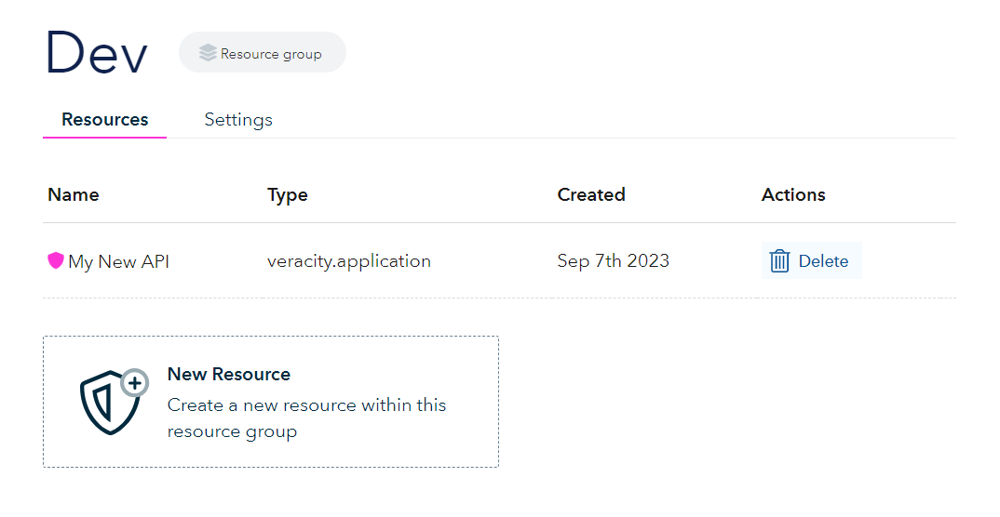
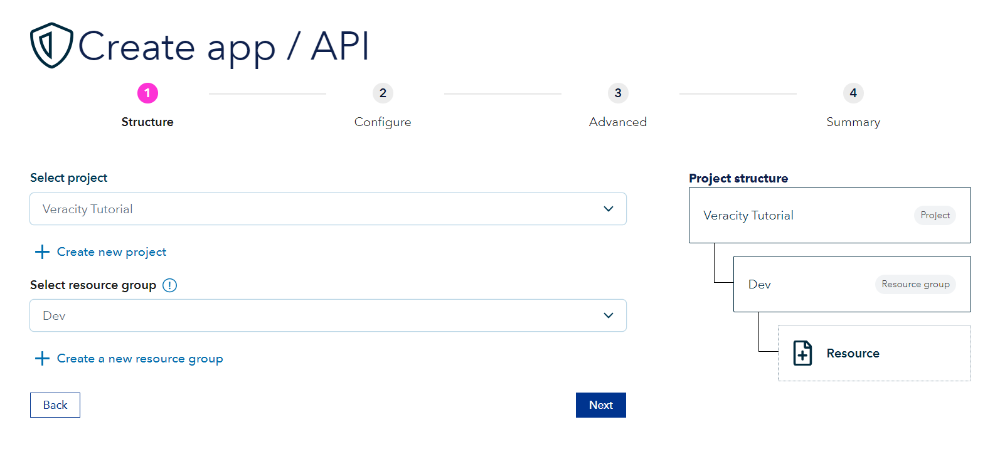
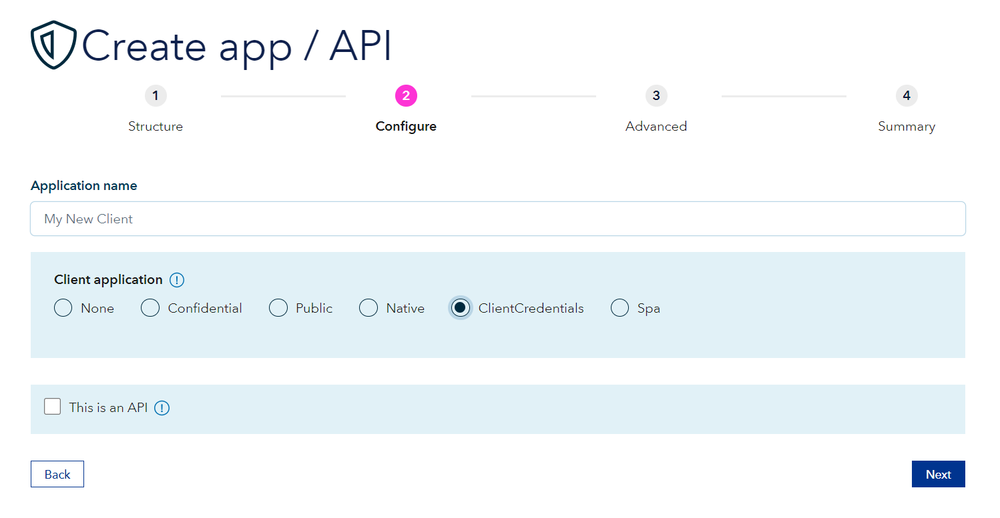
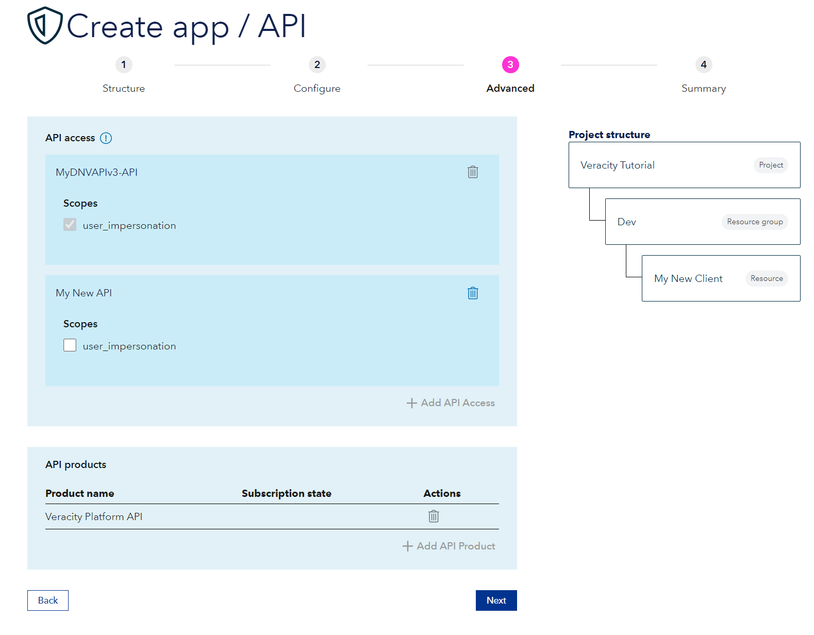
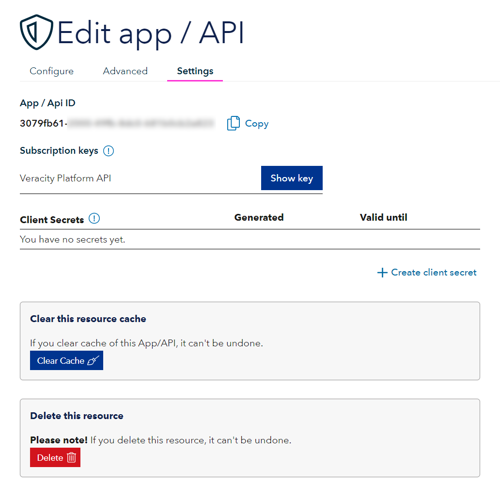

# Configure client application 

[Previous - 2. Introduction to the Client Credentials flow](2-api-creation-in-veracity.md)

## Create a resource

<figure>
	
	<figcaption>Create a new resource in a chosen resource group in Developer Portal on Veracity.</figcaption>
</figure>

## Pick resource type

<figure>
	
	<figcaption>As the resource type pick App or API.</figcaption>
</figure>

## Pick localization

<figure>
	
	<figcaption>Select project and resource group of the resource to be created.</figcaption>
</figure>

## Configure your application

<figure>
	
	<figcaption>Next is the Configure step</figcaption>
</figure>

Write the application name under **Application name**.

For client application check Client Credentials.

## Advanced tab

<figure>
	
	<figcaption>In the API Access section click Add API Access and from the dropbox that will appear select the API you just created.</figcaption>
</figure>

Press Next.

## Summary

Confirm the presented information for your application and click **Submit**.

Once finished, you will be redirected to your resource, where you can edit any data. 

<figure>
	
	<figcaption>In the Settings tab you can find the data needed to configure your client application.</figcaption>
</figure>

From this part of the screen you should note:
- App ID under the field **App / Api ID**
- any client secret you create by pressing **Create client secret** button.

Remember to always protect this data and keep it confidential.

Next up, we will show you how to acquire an access token.

---

[Previous - 2. Creating an API in Veracity's Developer Portal](2-api-creation-in-veracity.md) --- [Next - 4. Acquiring an access token](4-msal-access-token.md)