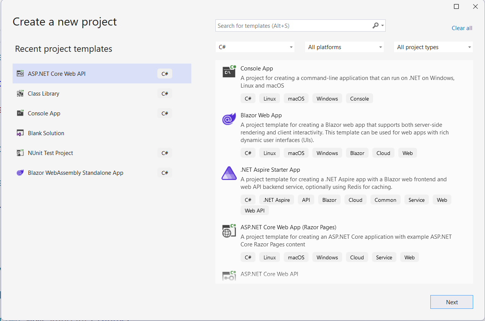

# Validate access token in your API in C#

[Previous - 4. Acquiring access token using MSAL in C#](4-msal-access-token.md)

In this tutorial we will validate a Client Credentials token. 

Note that all code samples are written in .NET.

First we need to create a simple **ASP.NET Core Web API** project in Visual Studio:

<figure>
	
	<figcaption>The project type ASP.NET Core Web API can be found among other templates</figcaption>
</figure>

This template gives us a bare bones API, an unprotected API Controller with an example action that returns some data. Exactly what we need to test our token!

Inside the `appsettings.json` file add the following section:

```json
"AzureAdB2C": {
  "Domain": "dnvglb2cprod.onmicrosoft.com",
  "Instance": "https://login.veracity.com",
  "SignUpSignInPolicyId": "B2C_1A_SignInWithADFSIdp",
  "TenantId": "a68572e3-63ce-4bc1-acdc-b64943502e9d",
  "ClientId": "{your client ID}",
  "ClientSecret": "{your client secret}",
  "Scopes": "https://dnvglb2cprod.onmicrosoft.com/{App ID}/{my_scope}"
}
```

Although, we used .default scope when asking for token, we still configure our API with the scope you chose when configuring it in [developer.veracity.com](https://developer.veracity.com/).

You can find there all the variables you need. Both `Client ID` and `App ID` point to the `App / Api ID` you can find in the Settings tab. 

In the Program.cs file add this code

```csharp
builder.Services.AddAuthentication(JwtBearerDefaults.AuthenticationScheme)
	.AddMicrosoftIdentityWebApi(options => { }, options =>
	{
        builder.Configuration.GetRequiredSection("AzureAdB2C").Bind(options);
	});
```

Place it before this line.

```csharp
var app = builder.Build();
```

Make sure that you have

```csharp
app.UseAuthorization();
```

Preferably before

```csharp
app.MapControllers();
```

The only thing you need to do now is to place the `[Authorize]` attribute next to an action or a controller. The test API we just created provides you with `WeatherForecastController` which you can adjust for your testing purposes.

Now when you will call the `/weatherforecast` endpoint will throw a `401 Unauthorized` result. In order to be authorized you need to add an `Authorization` header with the value `Bearer {token}` where in place of `{token}` you place the access token acquired in the previous step.

---

[Previous - 4. Acquiring access token using MSAL in C#](4-msal-access-token.md) --- [Next - 6. Summary](6-summary.md)
