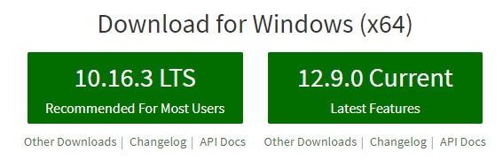
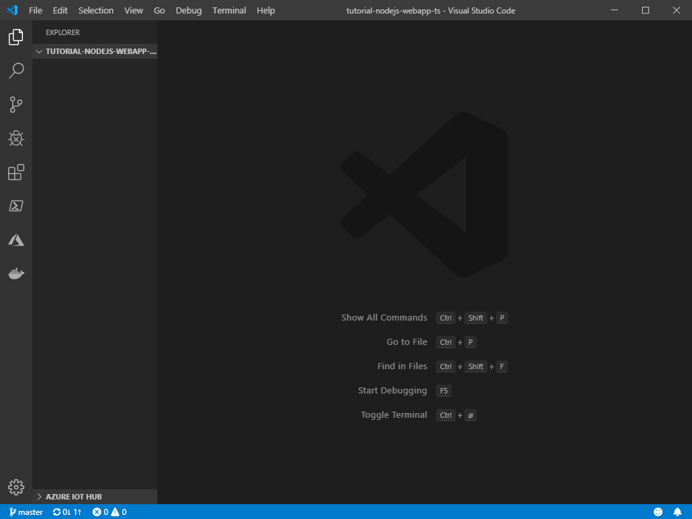
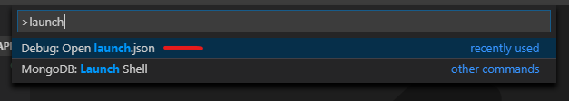
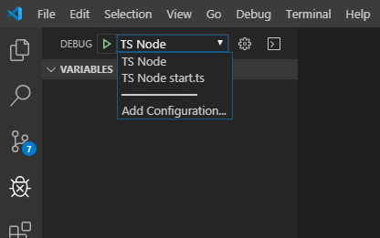

# 2. Development environment
[Previous - Introduction](1-introduction.md)

Every project starts with an empty development environment. In this tutorial we will build our application using Microsofts excellent [Visual Studio Code](https://code.visualstudio.com/) as our Interactive Development Environment (IDE). It has full support for TypeScript and Git out of the box which is ideal for our project. Allthough this tutorial will use Visual Studio Code (VSCode) you are free to use any IDE you want (including notepad if you are so inclined). The code will work regardless.

Before we begin let's list the essential features our development environment should support:

- Write TypeScript and export it to vanilla JavaScript we can run on node.
- Debugging with breakpoints and inspection.
- Linting our code so that structure and basic formatting is consistent and small errors are avoided.

To set up our IDE we first download and install VSCode from [https://code.visualstudio.com/](https://code.visualstudio.com/). Then we must install NodeJS from [https://nodejs.org/](https://nodejs.org/).

The website provides us with two versions to choose from.

<figure>
	
	<figcaption>Node gives us two choices for version: Safe, long term, or cutting edge.</figcaption>
</figure>

Although the differences are minimal we will choose the LTS version. LTS stands for Long Term Support which means it will be actively maintained for longer. This is also usually the version running in hosting environments (such as Azure or Google Cloud Platform) which means we will have a local environment that matches production as much as possible. If you know where you want to host your application you should check with the provider which version of Node is installed and install the same one locally. This will avoid potential headaches from version differences.

Now that we have the IDE and runtime we create a folder to hold our project and open it in Visual Studio Code. You may also wish to initialize git or another source control system within this folder so that you are able to track code changes and collaborate. To initialize git open the folder in a terminal and type `git init`

**Tip**: You can open code for the current folder from the terminal directly. Simply CD to the folder you want and type `code .`

<figure>
	
	<figcaption>Welcome to the blank canvas. So many possibilities...</figcaption>
</figure>

Lets open an integrated terminal. We will use it several times throughout this tutorial. Hit `Ctrl+Shift+P` to bring up the command palette in VSCode and type `integrated terminal`. You should see the terminal appear at the bottom of the window.

The terminal should already be opened to the project folder. If not simply navigate to it. Now we can set up our node project using the handy package manager tool `npm`. NPM not only allows us to define some project metadata it also keeps track of all our dependencies and helps us run scripts for custom tasks. Read more about npm on their website [https://docs.npmjs.com/about-npm/](https://docs.npmjs.com/about-npm/).

We will use `npm` to create our initial `package.json` file. This file will contain metadata about our project including a list of all our dependencies.

Run this command and follow the on-screen instructions
```
npm init
```

Once complete the `package.json` will be created in your project folder. Feel free to modify it as needed, but avoid changing the dependency sections unless you know what you are doing. We are now ready to begin installing the dependencies we will need to build our application.

NPM keeps track of not only our applications dependencies, but also those needed to build, compile and test our code. For this tutorial we will use the following:

**Application dependencies**
- `express` - The web server framework we will use.
- `express-session` - Plugin for express that allows us to keep user information accross requests in session.
- `passport` - Library that aids in building applications that require authentication.
- `body-parser` - Plugin for express that allows parsing the body of a request. Needed to handle POST requests to our application.
- `@veracity/node-auth` - The Veracity authentication library. It helps us authenticate users with Veracity and retrieve access tokens.

Run this command to install these dependencies
```
npm i express express-session passport body-parser @veracity/node-auth
```

In addition we need a few tools to facilitate development. Such dependencies are called `devDependencies` in `npm`. We need the following:

**Development dependencies**
- `typescript` - In order to write and compile TypeScript we need to install it.
- `node-forge` - SSL implementation in node. We will only use this for generating self-signed certificates during development.
- `ts-node` - A utility that allows us to run TypeScript files directly from the command line. We will use this for debugging our application.
- `tslint` - Tool for linting our code. The linter will show us common errors and formatting issues and can automatically fix certain issues for us when we save a file.

Run this command to install the development dependencies
```
npm i -D typescript node-forge ts-node tslint
```

Now we have all the utilities we need. Next we must configure TypeScript so it can transpile our application. In most of the TypeScript tutorials you find online you will probably see them install TypeScript as a global dependency. This allows you to use the command line utility `tsc` from any folder on your machine. Although this may be convenient it "hides" the dependency from the project itself since `typescript` will not be listed in `package.json`. Also, if you have multiple projects using different versions of TypeScript you will have to install it on a per-project basis anyway. For these reasons we recommend that you install TypeScript as a devDependency within your project directly. You can still use the `tsc` command through a small utility that comes with `npm` called `npx`. This is how we will use `tsc` for the remainder of this tutorial.

With TypeScript installed we can now initialize our `tsconfig.json` file. This file tells TypeScript how to convert our project into vanilla JavaScript through a process called *transpilation*. Run this command:
```
npx tsc --init
```

A new `tsconfig.json` file should be created in the root of your project. It contains a lot of settings already, most of which are commented out. We will not cover every setting here, however you can read the full documentation on the [TypeScript website](https://www.typescriptlang.org/docs/handbook/tsconfig-json.html).

For now we'll update the file to suit our project. Open it and apply the following settings:
```json
{
  "compilerOptions": {
    "target": "es2018",
    "module": "commonjs",

    "strict": true,
    "noImplicitAny": true,
    "strictNullChecks": true,
    "outDir": "./dist",

    "noUnusedLocals": true,
  
    "allowSyntheticDefaultImports": true,
    "esModuleInterop": true
  },
  "exclude": [
    "scripts",
    "dist"
  ]
}
```

Now we need to set up `tslint`. It requires its own configuration file called `tslint.json` as well as an extension simply called `TSLint` for VSCode. For other editors there are probably equivalent extensions available. Create this file in the root directory and add this content:
```json
{
	"defaultSeverity": "error",
	"extends": [
			"tslint:latest"
	],
	"linterOptions": {
		"exclude": [
			"**/*.json",
			"**/*.js"
		]
	},
	"jsRules": {},
	"rules": {
		"indent": [true, "tabs", 2],
		"variable-name": [true, "allow-leading-underscore", "ban-keywords", "check-format", "allow-pascal-case"],
		"curly": [true, "ignore-same-line"],
		"trailing-comma": [true, {"multiline": "never", "singleline": "never"}],
		"semicolon": [true, "never"],
		"no-submodule-imports": [false],
		"object-literal-sort-keys": [false],
		"whitespace": [true, "check-module"],
		"no-implicit-dependencies": [false],
		"no-var-requires": [false],
		"ordered-imports": [true],
		"no-empty-interface": [false],
		"no-console": [false]
	}
}
```

To install the extension open the extension palette and search for `TSLint`. Reload the workspace when you are done.

This will address a lot of common coding issues. Here are some of the essential features:
- Tab indenting (you can fight in the comments)
- No semicolons
- Ordered imports
- Consistent whitespaces
- ++

The linter is able to automatically fix certain things like indentation, import order and remove semicolons when we save a file. To enable this feature we need to change the local workspace settings in VSCode.
1. Open the command palette and search for `open workspace settings`.
2. Search for the setting `code actions on save` and click "Edit in settings.json". This should create a new `settings.json` file within the `.vscode` directory.
3. Add the following setting and save the file:
```json
"editor.codeActionsOnSave": {
  "source.fixAll.tslint": true
}
```

The linter will now automatically correct any errors that do not affect the implementation whenever you save a `.ts` file.

Our environment is almost complete. We have all the tools needed and our `package.json` file should look very close to this:

```json
{
  "name": "tutorial-nodejs-webapp-ts",
  "version": "1.0.0",
  "description": "",
  "main": "index.js",
  "scripts": {
    "test": "echo \"Error: no test specified\" && exit 1"
  },
  "repository": {
    "type": "git",
    "url": "git+https://github.com/veracity/tutorial-nodejs-webapp-ts.git"
  },
  "keywords": [],
  "author": "",
  "license": "ISC",
  "bugs": {
    "url": "https://github.com/veracity/tutorial-nodejs-webapp-ts/issues"
  },
  "homepage": "https://github.com/veracity/tutorial-nodejs-webapp-ts#readme",
  "dependencies": {
    "@veracity/node-auth": "^0.3.1-beta",
    "body-parser": "^1.19.0",
    "express": "^4.17.1",
    "express-session": "^1.16.2",
    "passport": "^0.4.0"
  },
  "devDependencies": {
    "node-forge": "^0.8.5",
    "ts-node": "^8.3.0",
    "tslint": "^5.19.0",
    "typescript": "^3.5.3"
  }
}
```

The final step before we begin coding is to set up our environment to be able to debug our application. Visual Studio Code has a powerfull, built-in debugger that we will use, but it requires some set up in order to run TypeScript files directly.

In VSCode open the command palette and type "launch". You should see an option `Debug: Open launch.json`. Launch it and from the drop down pick node.js.

<figure>
	
	<figcaption>Open launch.json to configure how the debugger starts up.</figcaption>
</figure>

A launch file will be created in the `.vscode` folder of your project. Now we need to update the configuration setting like so:

```json
{
	// Use IntelliSense to learn about possible attributes.
	// Hover to view descriptions of existing attributes.
	// For more information, visit: https://go.microsoft.com/fwlink/?linkid=830387
	"version": "0.2.0",
	"configurations": [
		{
			"name": "TS Node",
			"type": "node",
			"request": "launch",
			"args": ["${fileBasename}"],
			"runtimeArgs": ["-r", "ts-node/register"],
			"cwd": "${fileDirname}",
			"protocol": "inspector",
			"outputCapture": "std",
		}
	]
}
```

Save the file and click the debug icon in VSCode. You should now see `TS Node` in the configuration drop down. Launching the debugger now will cause `ts-node` to run the active file in debug mode allowing you to set breakpoints, inspect memory and all the other debugging goodies. Optionally you can add another configuration that will always run a specific file regardless of which one you have open. This is useful when your application always has a single start file (like in this project). To do this add a second configuration like this:

```json
{
	"name": "TS Node start.ts",
	"type": "node",
	"request": "launch",
	"args": ["${workspaceRoot}/src/start.ts"],
	"runtimeArgs": ["-r", "ts-node/register"],
	"cwd": "${workspaceRoot}",
	"protocol": "inspector",
	"outputCapture": "std",
}
```

You can now switch between the `TS Node` and `TS Node start.js` configurations as needed.

<figure>
	
	<figcaption>Open launch.json to configure how the debugger starts up.</figcaption>
</figure>

Now we are ready to begin development.

[Previous - Introduction](1-introduction.md) --- [Next - 3. Express webserver](3-express-webserver.md)