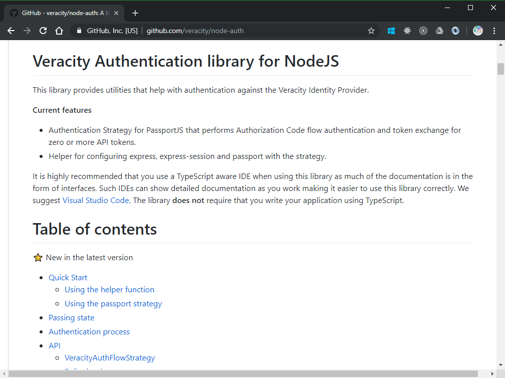

# 4. Authentication
[Previous - 3. Express webserver](3-express-webserver.md)

In the previous section we set up our webserver to handle https requests and even managed to return some text from it. In this section we will expand it to allow users to log in via Veracity and return to our application when done. We will also set up our code to negotiate for access tokens so that we can call other APIs on behalf of the currently logged in user.

Veracity uses a process called **OpenID Connect** to authenticate users and **OAuth 2 Authorization code flow** to retrieve access tokens for resources. There is also a library provided for Node applications that handle all the details for us using a PassportJS strategy. We will use this library to avoid having to deal with the intricacies of these processes, but it is recommended that you at least have a basic understanding of the underlying details. With that said, let's take a peek at the library we'll be using. You can find up-to-date documentation on the library GitHub page at [https://github.com/veracity/node-auth](https://github.com/veracity/node-auth).

<figure>
	
	<figcaption>The readme file for the Veracity Node Auth library provides all the details needed to use it.</figcaption>
</figure>

There are two primary ways to use the library:

1. We can use a helper function called `setupAuthFlowStrategy` that handles all the application configuration for us. This is the easiest way to get started, but it does take away some control from you regarding the actual setup process.
2. We can use the PassportJS strategy `VeracityAuthFlowStrategy ` directly and set up the surrounding stuff ourselves.

The first approach only requires us the ensure we have the necessary configuration parameters ready to drop in. Looking at the example from the library GitHub page, we end up with a relatively simple code snippet for setting up authentication:

```typescript
const settings = {
	appOrRouter: app, // Our app instance
	strategySettings: { // These settings comes from the Veracity for Developers application credential
		clientId: "", // Your client id
		clientSecret: "", // Your client secret
		replyUrl: "" // Your reply url
	},
	sessionSettings: {
		secret: "66530082-b48b-41f1-abf5-0987eb156652",
		store: new MemoryStore() // We use a memory store here for development purposes, this is not suitable for production code.
	}
})
setupAuthFlowStrategy(settings)
```

Provided we fill in our application details this is sufficient to get users authenticated and negotiating the access token needed to talk to the Services API on Veracity. Behind the scenes this helper function will set up passport, session and even register the necessary endpoints on our application. However this also hides all the setup details (which does not make for a good tutorial) so instead we will use the strategy alone in order to set up our authentication.

To get authentication working using the "advanced" method, we need to do the following:

1. Enable session support on our express application.
2. Configure passport and apply its middleware to our express application.
3. Set up the Veracity strategy and add it to passports list of strategies.
4. Add request handlers for the necessary endpoints to deal with authentication requests.

We already have the necessary dependencies installed in our project and our `start.ts` file sets up the basic server nicely for us. Now we need to configure authentication. Let's create a file called `setupAuth.ts` where we can do all the necessary steps.

First we create the setup function that will take the necessary arguments and configure the rest. We also import the dependencies we will need here. Notice the errors on some of the types. We should also install type definitions for these. Like before run this in a terminal:

```
npm i -D @types/passport @types/express-session
```

Notice that we don't need types for `body-parser`. That is because its types were installed alongside `@types/express` so they are already present.

```typescript
import { VeracityAuthFlowStrategy } from "@veracity/node-auth"
import { makeSessionConfigObject } from "@veracity/node-auth/helpers"
import bodyParser from "body-parser"
import { Router } from "express-serve-static-core"
import session, { MemoryStore } from "express-session"
import passport from "passport"

export const setupAuth = (app: Router) => {
	
}
```

First let's create a small function that will help us set up sessions. It is useful to ensure functions are small and have as few responsibilities as possible. Not only are such functions easier to read, but they can be reused if needed. We create a function called `setupSession` inside our `setupAuth.ts` file where we will configure our session handler. We don't export this because only the `setupAuth` function will need it. However, it's easy to export it later should we need to. 

```typescript
const setupSession = (app: Router) => {
	app.use(session({
		...makeSessionConfigObject({
			secret: "13546fed-256c-4b4c-88a4-d5253636af0b",
			store: new MemoryStore()
		})
	}))
}

export const setupAuth = (app: Router) => {
	setupSession(app)	
}
```

Now we can call it from `setupAuth` and our session should be configured. Notice that we are using another helper function from `@veracity/node-auth` here called `makeSessionConfigObject`. The reason for this is that it's a bit complex to figure out exactly what is needed to configure our session correctly if we've never done it before. This helper function ensures we get a proper configuration object that works in most cases and is secure (as far as it can go).

Next we'll configure passport and attach the necessary middleware to our application:

```typescript
const setupPassport = (app: Router) => {
	app.use(passport.initialize())
	app.use(passport.session())

	passport.serializeUser((user, done) => {
		done(null, user)
	})
	passport.deserializeUser((id, done) => {
		done(null, id)
	})
}

export const setupAuth = (app: Router) => {
	setupSession(app)
	setupPassport(app)
}
```

The serialize and deserialize functions are documented on the PassportJS website. For our case we simply create pass-through functions here. Lastly we add `setupPassport` to our `setupAuth` function.

So far so good. Now we must configure the `VeracityAuthFlowStrategy` and register it with passport. Let's create another function to handle this called `setupStrategy` and add the necessary code.

```typescript
const setupStrategy = () => {
	const strategy = new VeracityAuthFlowStrategy({
		clientId: "",
		clientSecret: "",
		replyUrl: ""
	}, (options, done) => {
		done(null, options)
	})

	passport.use("veracity", strategy)

	return strategy
}

export const setupAuth = (app: Router) => {
	setupSession(app)
	setupPassport(app)
	setupStrategy()
}
```

With OpenID Connect you are required to specify certain identifying parameters for your application. For Veracity they are: `clientId`, `clientSecret` and `replyUrl` (sometimes called redirect url). If you haven't already done so now would be an excellent time to head over to [Veracity for Developers](https://developer.veracity.com) and register your application. You will need to create an **Application Credential** resource in the portal there and take note of the parameters it returns. Once done you should fill inn these parameters in the settings object passed to `VeracityAuthFlowStrategy`.

The second argument to `VeracityAuthFlowStrategy` is a `verifier` function. It is responsible for verifying that the user login has completed and (if needed) augmenting the user object with additional information. The function may be asynchronous if you wish to call external services, but try to make it as fast as possible as this is something every user will have to go through when logging in to your application. For our tutorial we will simply trust the data from the Veracity IDP and pass this along. The second argument to the `done` function here is what will be placed on the `req.user` property for our application to see. Lastly we add a call to `setupStrategy` in `setupAuth` so it will be used.

You may notice that we are returning the strategy object from `setupStrategy`. We'll get to why we do this shortly.

The final configuration we need perform is to register the necessary endpoints on our application in order to allow users to log in and log out. We need the following:

1. A url where users can begin logging in.
2. The reply url where users are returned after entering their credentials.
3. A url where users can log out correctly.

Let's create a function to handle this called `setupEndpoints` and set up our endpoints there.
```typescript
const setupEndpoints = (app: Router, strategy: VeracityAuthFlowStrategy) => {
	app.get("/login", passport.authenticate("veracity"))

	app.post(
		"/auth/oidc/loginreturn", // This must be the path section of your reply url
		bodyParser.urlencoded({extended: true}),
		passport.authenticate("veracity"),
		(req, res) => {
			res.redirect(req.query.returnTo || "/")
		}
	)

	app.get("/logout", strategy.logout)
}

export const setupAuth = (app: Router) => {
	setupSession(app)
	setupPassport(app)
	const strategy = setupStrategy()
	setupEndpoints(app, strategy)
}
```

This is perhaps the most complex function we will write. Let's go through it in detail.

```typescript
app.get("/login", passport.authenticate("veracity"))
```
This first one is relatively simple. We set up a handler that will begin user authentication using our "veracity" strategy on the "/login" path. When a user navigates to this URL they will be redirected to the Veracity IDP and prompted for their credentials.

```typescript
app.post(
	"/auth/oidc/loginreturn", // This must be the path section of your reply url
	bodyParser.urlencoded({extended: true}),
	passport.authenticate("veracity"),
	(req, res) => {
		res.redirect(req.query.returnTo || "/")
	}
)
```
The next section is rather more difficult. It registers a handler for HTTP POST messages to a return url. This must be the path of one of your reply urls registered in the Veracity for Developers portal. Users will be returned to this endpoint with their token information after they log in. We also need to capture the data sent back from the Veracity IDP. They are passed as form parameters on the request body thus we need the help of `body-parser` to parse this information.

Once we have parsed everything we pass control over to our strategy again. This time however it will read the body of the request, validate the information therein, retrieve any access tokens for us that we requested (through API scopes), and finally pass control to our handler at the very end. In this handler we utilize a feature of the strategy that reconstructs the query parameters sent to our initial login endpoint on this request object. If `returnTo` was defined we assume that is a url that the user should be redirected to, otherwise we simply return them to the front page.

```typescript
app.get("/logout", strategy.logout)
```
The last step is to set up our logout handler. Again we can utilize a helper function provided on the strategy object directly, which is why we returned it from the `setupStrategy` function. The `logout` function provided there is a middleware compatible function that ensures the user is logged out from all Veracity services. This is done by routing the user back to Veracity to perform the final steps so users will leave your application at this point. It will also call the `logout` method on the request object which is provided by `passport`. This will clear all user session data from the session. If you want to perform additional steps you can do this by inserting your own handler before `strategy.logout`. Just remember to call next() once you are done.

That's all we needed to set up authentication. The final step is to call our `setupAuth` function from `start.ts`.

```typescript
import express from "express"
import { createServer } from "./server"
import { setupAuth } from "./setupAuth"

const app = express()

setupAuth(app)

app.get("/", (req, res) => {
	res.send("OK")
})
app.get("/user", (req, res) => {
	if (!req.isAuthenticated()) {
		res.status(401).send("Unauthorized")
		return
	}
	res.send(req.user)
})

createServer(app, 3000)
```
Let's add an endpoint that will dump our user information if the user is authenticated so we can see what's been stored.

You should now be able to authenticate with Veracity using your application. Let's test it out by running our start file in debug mode. Open your browser to [https://localhost:3000/login?returnTo=/user](https://localhost:3000/login?returnTo=/user). You should be prompted for your credentials and then after some round trips returned back to `/user` in your application. Neat!

<video controls loop>
	<source src="assets/authentication-working.mp4">
</video>

That's it for authentication. Next up, calling apis in order to get additional user information.

[Previous - 3. Express webserver](3-express-webserver.md) --- [Next - 5. Calling APIs](5-calling-apis.md)
