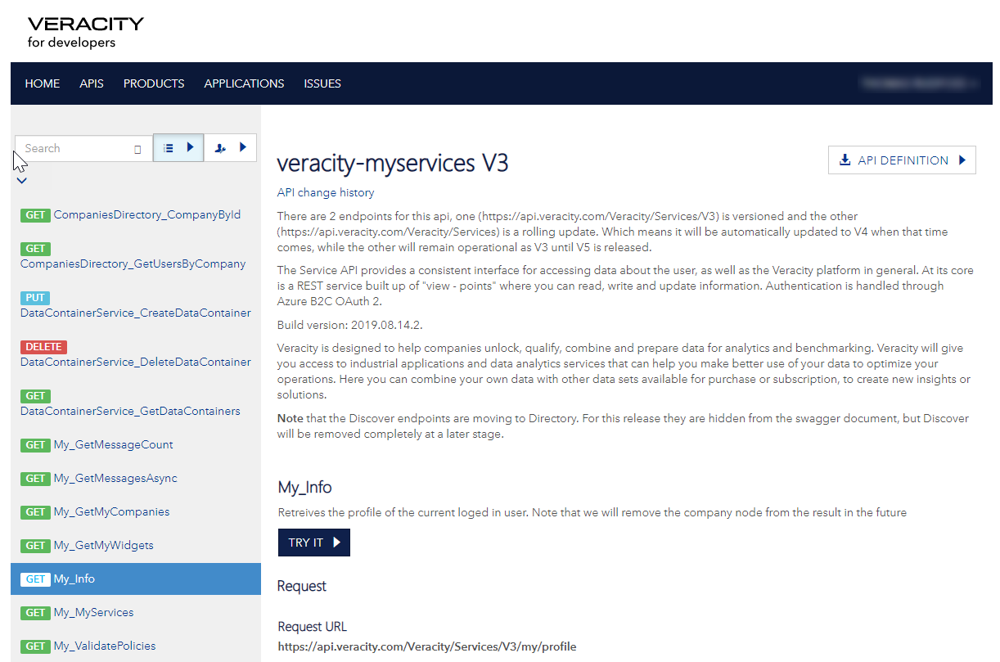

# 5. Calling APIs
[Previous - 4. Authentication](4-authentication.md)

In the previous section we set up authentication so that users can log in and return to our application. Once they do we can be sure they are who they claim to be. Now we will use an access token to communicate with another API in the Veracity eco-system. We will focus on the Services API though the process is virtually identical for any other API as well.

In order to be able to talk to the APIs you need the access token for the user as well as a subscription key. The token is retrieved by the login mechanism in the previous step, but the subscription key is handled differently. You should have received one when you created your application credentials on the Veracity for Developers portal. If you haven't yet created these credentials now is an excellent time to do it. Visit [https://developer.veracity.com/](https://developer.veracity.com/) to get started.

Now that we have all the necessary elements we can take a look at the APIs. If you go to the Veracity for Developers website you will find a link at the top to the API Explorer. This tool provides an overview of the APIs provided by Veracity. We'll be using the Services (or veracity-myservices V3) API. If you navigate to the APIS section you see a list APIS to choose from. If you cannot see "veracity-myservices V3" then head over to Products and subscribe to it first.

<figure>
	
	<figcaption>The API explorer contains documentation for all the endpoints as well as a mechanism for trying them out.</figcaption>
</figure>

There are quite a few APIs available on the Veracity platform, both first and third-party. For this tutorial we'll use the Services API to return information about the user through the following endpoints:

- `https://api.veracity.com/Veracity/Services/V3/my/profile` - Returns general profile information
- `https://api.veracity.com/Veracity/Services/V3/my/services` - Returns the users services

Both of these endpoints respond to simple `GET` calls. We can use the "Try it" function in the API explorer or a tool like [Postman](https://www.getpostman.com/) or [Insomnia](https://insomnia.rest/) to test them though we have to provide the access token and subscription key manually for the latter two. Instead we'll expand our application to allow users to call these APIs directly.

Let's create another file called `services.ts`. This file will be responsible for registering the endpoints in our application that will be redirected to the Veracity APIs we intend to call. Let's add some basic structure to it:

```typescript
import { Router } from "express"

export const registerServiceEndpoints = (app: Router) => {

}
```

Now let's register our first handler inside the `registerServiceEndpoints` function:
```typescript
app.get("/info", async (req, res, next) => {
	
})
```

Inside here we'll make a request for user information from the Services API. Notice that this is an `async` function. Although express does not have any native support for this we can still use them as long as we ensure we handle errors correctly. Before we write anything else let's add proper error handling:
```typescript
app.get("/info", async (req, res, next) => {
	try {
		// our code will go here
	} catch (error) {
		next(error)
	}
})
```

All errors will now be passed to the normal express error handling mechanism while we can use `await` internally to wait for any function returning a promise. Speaking of that, we'd like to make the process of calling the APIs as easy as possible for us. Let's add some helper libraries and a small function that will take care of the plumbing for us.

We'll use the `request-promise-native` library for node to send actual requests. This library provides a nice, clean interface for requesting external resources as well as promise support for handling the responses. To use this we need to install a few things. Open a terminal and run:

```
npm i request request-promise-native
npm i -D @types/request-promise-native
```

This will install `request` with promise support as well as the necessary type declarations so we can import it properly with TypeScript.

Now let's create some small helper functions that will ensure we can construct proper requests to the API.
```typescript
// Put your subscription key here

const subscriptionKey = ""

const getAccessTokenForScope = (req: Request, apiScope: string) => {
	const user: IVeracityAuthFlowStrategyVerifierOptions = req.user as any
	if (!user) throw new Error("User object not present")
	if (!user.apiTokens) throw new Error("User object does not have any tokens")
	const tokenData = user.apiTokens[apiScope]
	if (!tokenData) throw new Error(`User does not have a token for ${apiScope}`)
	return tokenData.accessToken
}

const apiRequest = async (token: string, options: OptionsWithUri) => {
	const fullOptions: OptionsWithUri = {
		...options,
		headers: {
			["Ocp-Apim-Subscription-Key"]: subscriptionKey,
			Authorization: `Bearer ${token}`,
			...(options.headers || {})
		}
	}

	return request(fullOptions)
}
```

This is quite a bit of code so let's go through it slowly. First of we create a function called `getAccessTokenForScope`. This function is responsible for extracting the access token from the `user` property on the request. Although it has quite a few code statements most of them will simply throw errors if some part of the structure it expects are incorrect. In the end we only care about the raw access token. The first line in the function is a small hack to convert the type of the user object to what we know it to be. You do not need to do this, and it does not help us directly in detecting if the object is incorrect, but it does aid in writing subsequent checks because we can get auto-suggestions for the properties of the object.

The other function is merely a wrapper around the `request` function. In order to call Veracity APIs we will have to provide both the access token and our subscription key as headers in the request. This is true regardless of what type of request we are making (`GET`, `POST`, `PUT`, `DELETE` and so on) so we wrap this logic in it's own function to avoid having to retype this. I'm sure you can probably see more possibilities for improvement and cleanup here. Like any good textbook I'll leave this as an exercise for the reader.

The last thing we need to do before we can test this is to actually perform the request from the `/info` endpoint we set up earlier. Let's complete that function now:

```typescript
export const registerServiceEndpoints = (app: Router) => {
	app.get("/info", async (req, res, next) => {
		try {
			if (!req.isAuthenticated()) {
				res.status(401).send("Unauthorized")
				return
			}

			const token = getAccessTokenForScope(req, "https://dnvglb2cprod.onmicrosoft.com/83054ebf-1d7b-43f5-82ad-b2bde84d7b75/user_impersonation")
			const result = await apiRequest(token, {
				uri: "https://api.veracity.com/Veracity/Services/V3/my/profile"
			})
			res.send(result)
		} catch (error) {
			next(error)
		}
	})
}
```

Let's have a look at what's happening here. First of we do a check to see if the user is indeed authenticated. If not we will return a 401 error code which means the user has not been authenticated and therefore cannot perform the request. We also end execution here by simply calling `return`.

Next we get the access token using the helper function we made earlier. The api scope string provided here is the scope for the Services API in Veracity. It is used as the index for the token in the user object.

Now we have the information needed to perform the request. We use our apiRequest helper function to make a call to the API endpoint, `await` a response and grab the result. If an error occurs in this process the promise will be rejected. Since we are using an `async` function and awaiting the result our code will halt and our catch clause will execute instead. Here we use the normal express error mechanism to indicate that an error has occurred and passing control to the normal express error handler.

Finally we go back to our `start.ts` file and add a call to our `registerServiceEndpoints` function.
```typescript
import express from "express"
import { createServer } from "./server"
import { registerServiceEndpoints } from "./services"
import { setupAuth } from "./setupAuth"

const app = express()

setupAuth(app)
registerServiceEndpoints(app)

app.get("/", (req, res) => {
	res.send("OK")
})
app.get("/user", (req, res) => {
	if (!req.isAuthenticated()) {
		res.status(401).send("Unauthorized")
		return
	}
	res.send(req.user)
})

createServer(app, 3000)
```

Now we are ready to test our code. Launch the debugger, open your browser and log in. Now let's visit [https://localhost:3000/info](https://localhost:3000/info) and inspect the result.

<video controls loop>
	<source src="assets/calling-external-api.mp4">
</video>

Great! We are getting data directly from the API on behalf of the user. We can use this to display some information about them in the UI or we can add additional calls to get more information. Let's implement another endpoint and see if our helper functions work as expected. This time we'll request the users list of services.

In the `services.ts` file we'll add another endpoint handler:
```typescript
	app.get("/services", async (req, res, next) => {
		try {
			if (!req.isAuthenticated()) {
				res.status(401).send("Unauthorized")
				return
			}

			const token = getAccessTokenForScope(req, "https://dnvglb2cprod.onmicrosoft.com/83054ebf-1d7b-43f5-82ad-b2bde84d7b75/user_impersonation")
			const result = await apiRequest(token, {
				uri: "https://api.veracity.com/Veracity/Services/V3/my/services"
			})
			res.send(result)
		} catch (error) {
			next(error)
		}
	})
```
Again we are checking that the user is authenticated and if not we return a 401 error. Then we call the API endpoint and dump the result to the user using `res.send(result)`. Running this you should see a list of services for that user.

And there we have it. A fully working web application that can authenticate with Veracity and call the APIs. The final step before we have something we can run on a proper server (and not just locally) is to transpile it to regular JavaScript. That topic is left for the final chapter of this tutorial. Click next below to get going.

[Previous - 4. Authentication](4-authentication.md) --- [Next - 6. Transpiling for production](6-transpiling-for-production.md)
