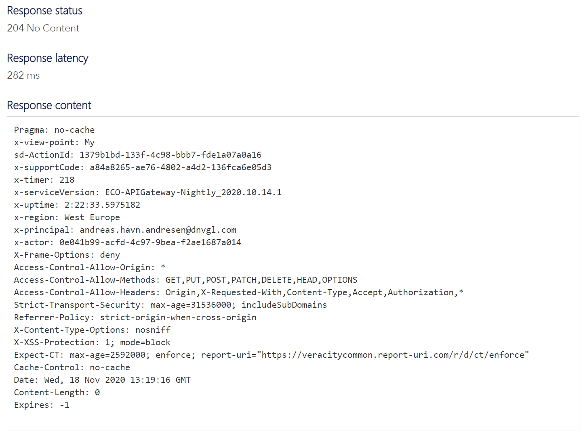
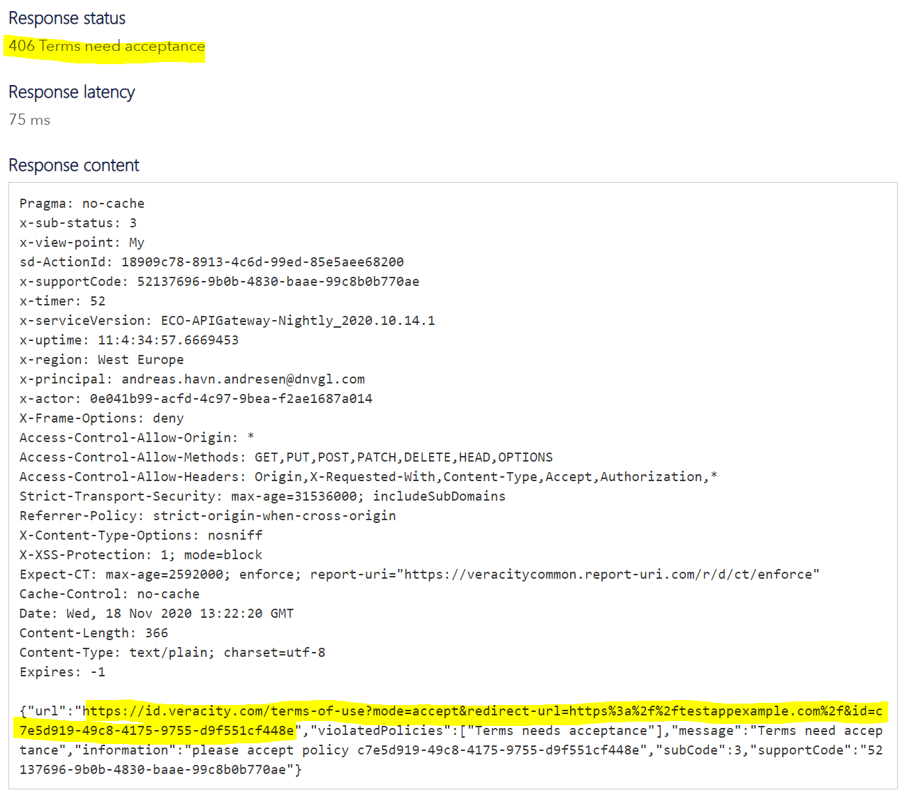
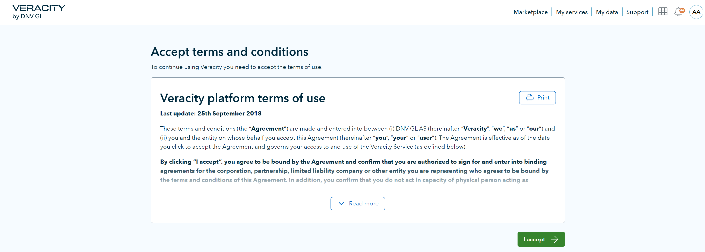
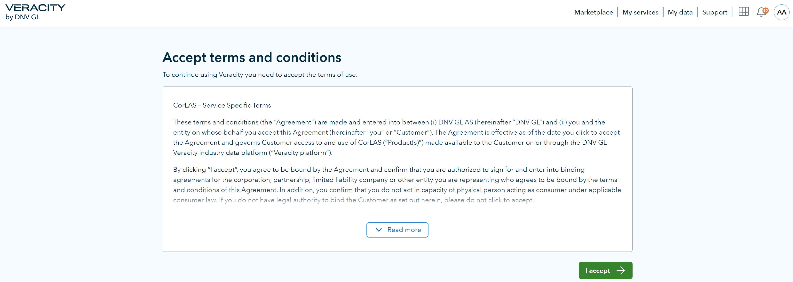

# Veracity Policy Service
The Policy Service is a small API that allows third-party applications to verify that the user has approved both the generic Veracity Terms of Service as well as any other such policies specific to your service. It is not directly associated with the Veracity Identity Provider (IDP), but they are usually used together during the authentication process.

The Policy Service consists of two API endpoints in the Services API that check whether the current user has approved the latest version of any Policy. If any are outstanding it will return a URL the user must be redirected to in order to approve the policy. Once the user approves they will be returned back to your application. Because of this required user interaction only web and native applications should use the policy API.

To call the Policy API you will need an access token for the Services API as well as a reply url that users can be redirected back to once they approve the policy. This means that the user must be authenticated first, then your application should check the policy endpoint for any outstanding policies. If the user returns without approving an outstanding policy they should not be allowed to authenticate.


The online documentation for this API is found at:
```url
https://api-portal.veracity.com/docs/services/veracity-myservices%20V3/operations/5f61dfcff2522e11c4b17ecf?&groupBy=tag
```

Here is a more detailed description of the Policy API.

The Policy API can perform 3 checks:
1. Has the user accepted the latest Veracity platform terms and conditions?
2. (optional) Does the user have a Veracity-subscription for the specific service they are attempting to access?
3. (optional) Has the user accepted the latest service-specific terms and conditions?

So the Policy API has 3 normal failure modes. Veracity terms not accepted, subscription missing or service specific terms not accepted.

The service-specific check is optional. It is no problem if you do not want Veracity to manage the service-specific terms and conditions on your behalf.
You may handle this yourself inside the application if you so wish.

The Policy API has two the endpoints:
```url
GET  https://api.veracity.com/Veracity/Services/V3/my/policies/validate()
```

```url
GET  https://api.veracity.com/Veracity/Services/V3/my/policies/{serviceId}/validate()
```

The difference between these two endpoints is that the first will only check if a user has accepted Veracity terms and conditions. The second one will check Veracity terms AND service specific terms, and it will also check the subscription for the user for the specific service. The second endpoint will ignore the service specific terms-check if no service specific terms have been configured for your service. 


You can skip the service subscription-check if needed. To do this you add the header:
`skipSubscriptionCheck: true`

This is only applicable for the endpoint:
```url
GET https://api.veracity.com/Veracity/Services/V3/my/policies/{serviceId}/validate()
```

When you call the endpoint and if nothing is wrong the Policy API will return a 204 response.

<figure>
	
</figure>

If something is wrong it will return a 406 response and let you know what failed. 

Below is an example for when I attempt to access the service and I have not accepted the latest Veracity terms:

<figure>
	
</figure>

<figure>
	
</figure>

Highlighted above you can see that the Policy API returns a URL that you should redirect the user to. 
At the end of the URL you can add your own returnURL after the “=” symbol so that the user is redirected back to your application after accepting the newest terms. This is done by sending the returnURL as a header parameter during the API call, the Policy API will then return the complete URL with a returnURL. 
Please note that you have to use https for the returnURL, otherwise Veracity will reject the redirect once the user has accepted terms. 

Note that in order to enable Service Specific T&C’s the Veracity Onboarding manager will need to enable a setting first for your service. Contact the Veracity Onboarding responsible before you start testing the Policy API.


An example below with a real service where service specific terms have not been accepted. Note that that isn’t much difference in the reply to differentiate between missing Veracity terms or missing service-specific terms, but this is not important because your application has to redirect the user to the URL in the response for both cases anyway.

<figure>
	
</figure>

<figure>
	
</figure>

For failure mode ‘subscription is missing’ you can choose yourself how you will communicate to the user that they do not have access. We recommend briefly displaying a message to the user, and then redirecting them back to the relevant Veracity Marketplace page where they can purchase access.
For failure mode ‘Veracity terms not accepted’ it is mandatory to use the provided URL and to redirect the user to Veracity so they can accept the terms and conditions.
For failure mode ‘service-specific terms not accepted’ it is the same as case ‘Veracity terms not accepted’, but it is only applicable if Veracity handles the service specific terms and conditions on your behalf. 


Subcodes from the response:

No subcode: No issues detected.

Subcode 0: Missing subscription for the specified service.

Subcode 3: Missing terms-acceptance. Subcode 3 is applicable for both missing service-specific terms and missing Veracity terms. 

If you have any questions:
<onboarding@veracity.com>
