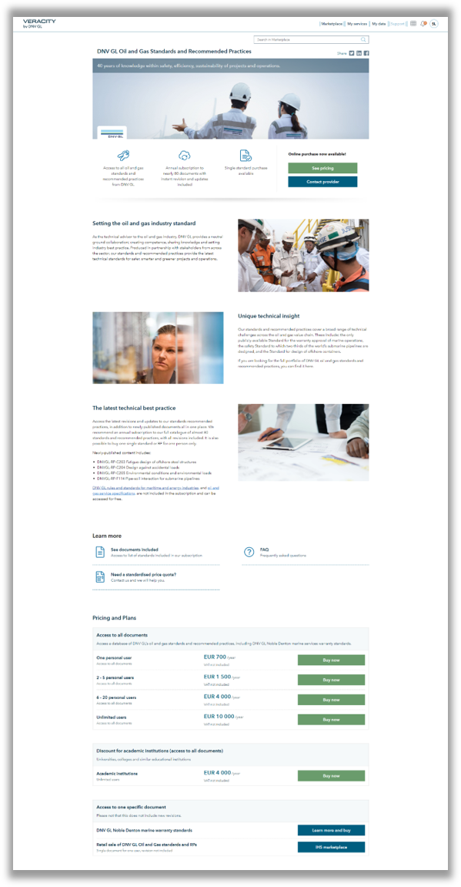

# Fully digital sales process

## Visualizing license options
In order to use a fully digital sales process you will need to visualize your prices on the product page. We currently have 2 layouts for showing prices for your services.
### Standard service
This option is best suited when you have one standard service or perhaps two variants of the service. 

In the example below they sell either a package with access to all documents or access to one specific document. In addition they have one product variant that is access to all documents but priced differently for Academic institutions.
Within the variant "Access to all documents" they offer several price plans in this case it is based on the number of users who can access the service.

### Comparable licence plans
This option is better if you offer different levels of your service and you can show which features that are included in each level and/or what quotas that are included in each level.

In the example below you can buy the Data fabric in two different variants. It's easy to see what features that are included in each tier and what usage that is included in each of the tiers

## Online contracting
In order to do online contacting the terms and conditions for your service needs to be displayed  so that the customer can click-accept. This agreement is then between you as the provider of the service and the customer. Veracity only supports B2B purchases so we are asking for the customers company information in the purchase process. The terms for your service will be displayed as below

## Payment options

After accepting the terms and conditions of the service the customer have to enter details about themselves and their company or if they are a Veracity user already, the known information will be prefilled.

In the image above the service provider have decided to offer both payment by credit card and by invoice. This is configurable, you can decide if you want to offer credit card payment and/or invoice payment. It can even be set up so that you only allow credit card for small amounts and offer both options for larger amounts.

 ## Order confirmation and invoice
 In addition to confirmation messages on screen the customer will get an order confirmation on mail. Later he will also get a formal invoice, when the purchase is paid by credit card the invoice will be marked as pre-paid

## Delivering the purchased service
Purchased products should be delivered over Veracity. This will ensure a consistent user experience and secure access to it by using the Veracity identity. Digital services/apps will be delivered over "My services", data sets on "My data". 

For digital services/apps there are several options for how access to the service can be given. 
- Veracity can give automatic access to single user licences
- Veracity can give access to multi-user licences where the customer can share licenses with other users through a separate module in Veracity. 
- Giving access automatically or manually can also be decided based on payment method and/or price.
- A manual process can be set up to give access

Giving access to the service itself is in many cases not sufficient as there are needs to set-up access levels inside the service as well. We do have some options for giving messages to initiate this process as well. 
