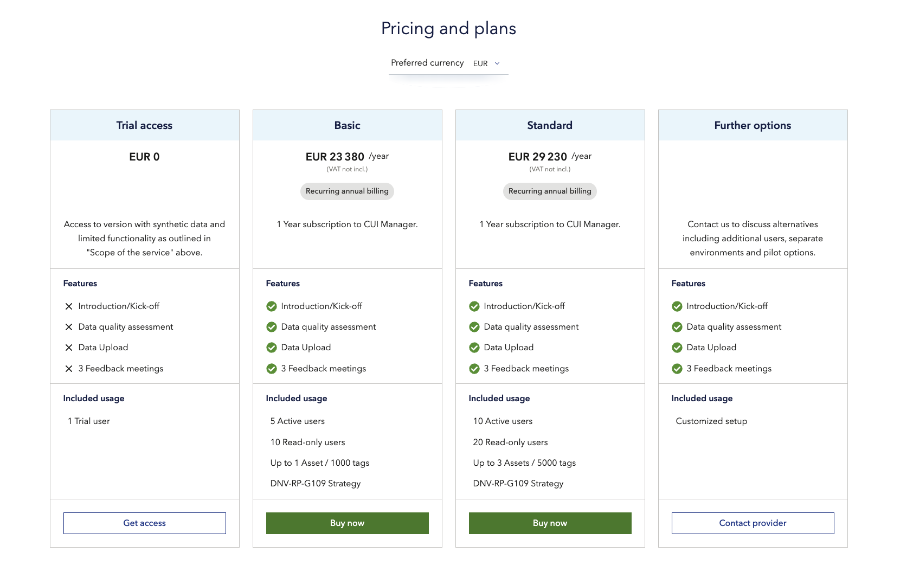

# Choosing your pricing model
Choosing the right pricing model for your product can be challenging, but this article will help you make the right choice. With Veracity, you can choose between four pricing models:
* One-time payment  
* Subscription (Single and Tiered)
* Consumption model (pay-as-you-go)
* Freemium model

## One-time Payment
One-time payments enable you to unlock the complete value of your product and receive the payment once. The benefits of this model are: 
* Instant revenue 
* Less support – customers not paying a regular fee might reach out for support less often; no support is needed for the renewal payment process. 

Keep in mind that there are some disadvantages of this model.
Less predictability – it's difficult to know if customers will come back and buy again. No recurring revenue ticking in regularly for the service provider. 
Lower conversion rate – One-time payments, by their very nature, require a higher price point. The higher the price, the harder it is to convert shoppers into customers, unless you have a very well-developed sales funnel. 
No built-in loyalty – when you pay someone every month for an extended period, there’s a lot of trust involved in the relationship. You trust them to continue to deliver on their products and they trust you to pay on time. With one-time payments, it’s over as soon as it began. Without that relationship, it’s hard to stimulate organic word of mouth and recommendations. 

## Subscription models
Subscription models are well-known, easy for customers to understand and simple for providers to set up. Their main benefits are: 
* Predictable cost for customers 
* Predictable revenue for service providers and growing revenue  if you are able to keep your subscribers.  
* Higher conversion rate – the initial asking price is cheaper and more attractive for the customer 

There are two ways you can set up a subscription model: Single and Tiered.

### Single subscription 
A single subscription means offering a single product or service with a fixed set of features at a fixed price. Avoid using this model if your resource costs vary significantly from user to user.

### Tiered subscription 
A tiered subscription means offering multiple packages with various features at different prices. Following usability principles, you should not set up more than four or five tiers, or customers will have difficulties choosing the most suitable package.  

If you offer a service for large enterprises, keep the top tier negotiable, displaying a Request quote button that will lead to a contact form.You can also offer a free trial to show your prospective customers the value of your service and help them make an informed decision. Read more about [offering trials](sellingyourproduct/paidservices.md)​ in the chapter "Selling your product". 

Below you can see an example of a tiered pricing for Veracity Adapter for Power BI (VAP)​.
<figure>
	
</figure>

## Consumption model (pay-as-you-go)​
This model allows:
* Customers to pay for what they use.
* Providers to easily cover the costs.

Keep in mind that the costs will not be predictable if you decide on this model. Customers will need some measurable consumption parameters to evaluate their costs. For the provider, sporadic use by the customers may make revenue unpredictable.

If you want to have better control of revenue, you can combine a subscription price model with a consumption price model. Then, the user will have limited capacity included in their subscription, and will be charged for any extra consumption above this capacity.

## Freemium model​ 
In a freemium model, you offer a free version of your service to the customers. The free version usually has limitations in functionality or some other limitations; if users need to unlock some features in the application/service they must upgrade to a paid version.  

There are some disadvantages of this plan you need to consider:
* It might be difficult to convert free customers to paying customers. 
* You should carefully consider what to “give away” in the free version to ensure that customers do not get fully satisfied by staying on the free version. 
* You need to factor in the cost of running a free service when calculating your bottom line for the service. 

Trials can also be a good alternative to a freemium model. Read more about [offering trials](paidservices.md)​ in the chapter "Selling your product". 