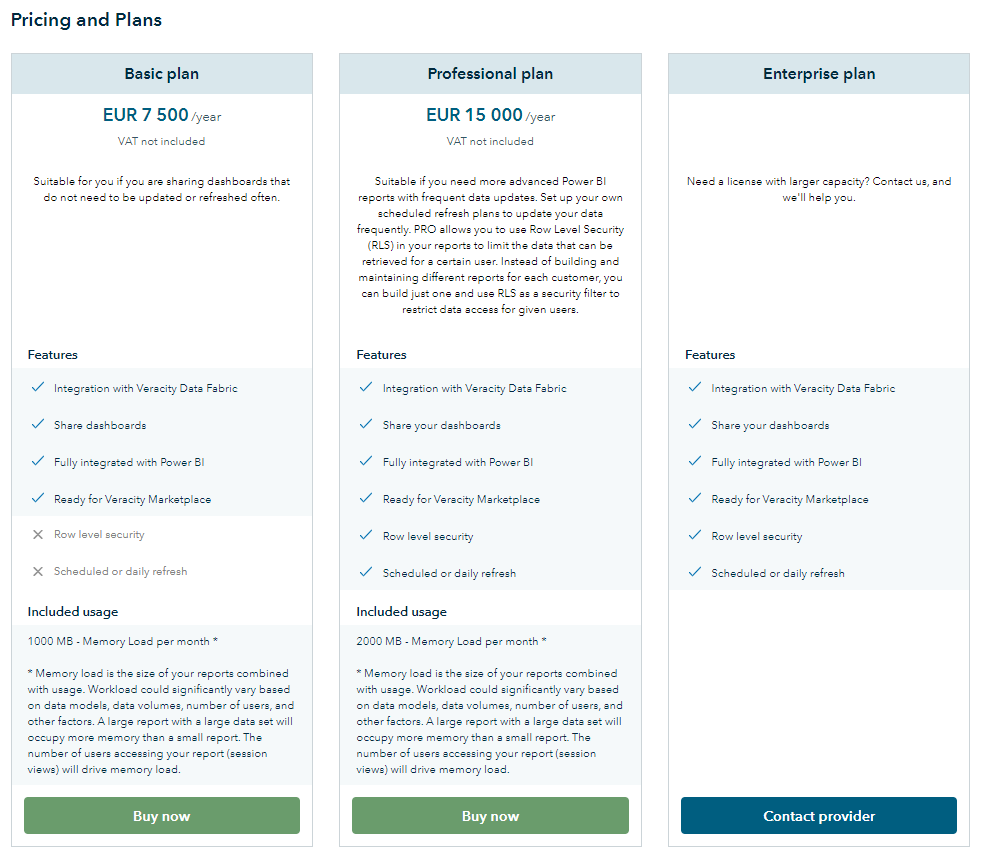

# Choosing your pricing model

Choosing the right pricing model for your product can be challenging. There are several pricing models relevant for digital offerings and we will introduce some of the most common ones;​

## Subscription model

Subscription is a well-known model and is easy for customers to understand. A subscription model can be set up to be just one single subscription in which case you might not capture the entire revenue potential of your service, so using a tiered subscription is advised. When making a tiered subscription you should not make too many tiers as this will make it difficult for the customers to select the one most suitable for them.​​ For subscription services it is also [possible to add a free trial](./paidservices.md)​ to show your prospective customers the value of your service and help them make an informed decision.

Subscription models makes the cost predictable for the customer and the revenue predictable for you as the provider of the service.​

There are some additional mechanisms that can be considered when offering subscriptions; can you offer your customers a limited trial period? Why not let your customers try out what you can offer?

Setting the price for the top tier offering for large enterprises could be difficult. You might keep this tier negotiable and leave the option for the potential customer to request a price quote.

<figure>
	
	<figcaption>Example from Veracity Adapter for Power BI (VAP)​</figcaption>
</figure>

## Consumption model (pay-as-you-go)​

A consumption price model is a solution where customers only pay for what they use. ​For the provider, the model allows easy coverage of the costs.

One of the challenges with the model is that the cost will not be predictable. For the customers, this means they will need some measurable consumption parameters to evaluate their cost. For the provider, a sporadic use by the customers may make revenue unpredictable.

A solution that allows the provider to have better control of revenue, could be to combine a subscription price model with a consumption price model. The user will then have limited capacity included in the subscription and be charged over this capacity, according to consumption.

## Freemium model​

In a freemium model, the entry-level for the customer is low as the service is free. Usually, the free version has limitations in functionality or some other limitation that should trigger the customers need to upgrade to a paid version.​

It is however not necessarily easy to convert free customers to paying customers and the cost of running a free service needs to be factored in when you calculate your bottom line for the service. You also have to consider carefully what you give away in the free version, to ensure that you don’t get too many users who are satisfied by staying on the free version.​
