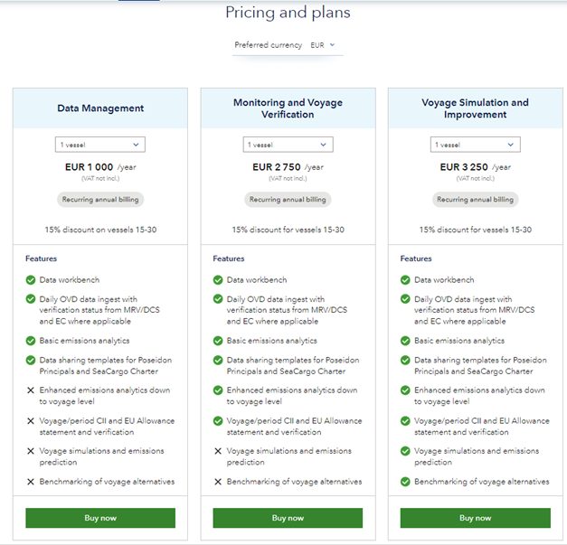

# Access Tiers and Capabilities

## Feature Access
Developers play a key role in defining the access tiers for a product. They must ensure that the product’s architecture allows for scalability and the flexibility to unlock or restrict features based on the user’s subscription level.

## Different Tiers
Consider offering multiple access tiers (for example, basic, standard, premium). Each tier should provide a distinct set of features.

## Feature Mapping
Clearly define which features are available at each tier.

- **Basic Tier**: Essential functionalities.
- **Standard Tier**: Additional features beyond the basics.
- **Premium Tier**: Enterprise or Advanced capabilities.

## Scalability
Ensure that the tiers can accommodate future enhancements, quantity updates (like the number of users), or separate extensions.

<figure>
	
	<figcaption>Pricing plan example</figcaption>
</figure>

## Feature Limitations and Unlocking

**Greyed-Out Features:** In the basic plan, you can intentionally grey out or disable certain features. Users can see them but cannot access them. For example:
**Strategic Placement:** 
Place these features prominently in the UI to raise awareness.

<figure>
	
	<figcaption>Grey-out feature</figcaption>
</figure>

### Unlocking Mechanism :
- **Upgrade Prompt**: When users attempt to access a locked feature, prompt them to upgrade to a higher tier.
- **Conditional Unlocking**: Consider unlocking features based on user behavior (for example, after a certain number of interactions).
- **Time-Based Unlocking**: Unlock features temporarily (for example, during a trial period).

### Communication
Clearly communicate the benefits of upgrading to motivate users.

### Planning for Extensions

**Roadmap:** Develop a roadmap for future feature enhancements.

**Modular Design:** Architect the software in a modular way, allowing easy integration of new capabilities.

### Business Offer Extensions
- **Upsell Opportunities**: Plan how to introduce new features as upsell opportunities.
- **Feedback-Driven Extensions**: Gather user feedback to prioritize extensions.
- **Market Trends**: Stay informed about industry trends and adapt your offerings accordingly.