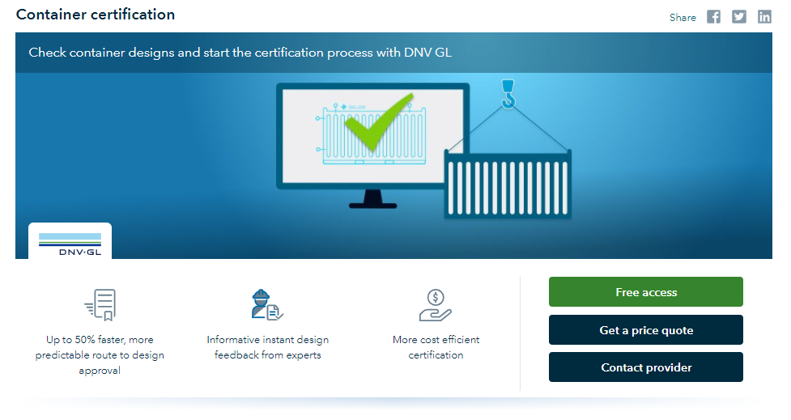
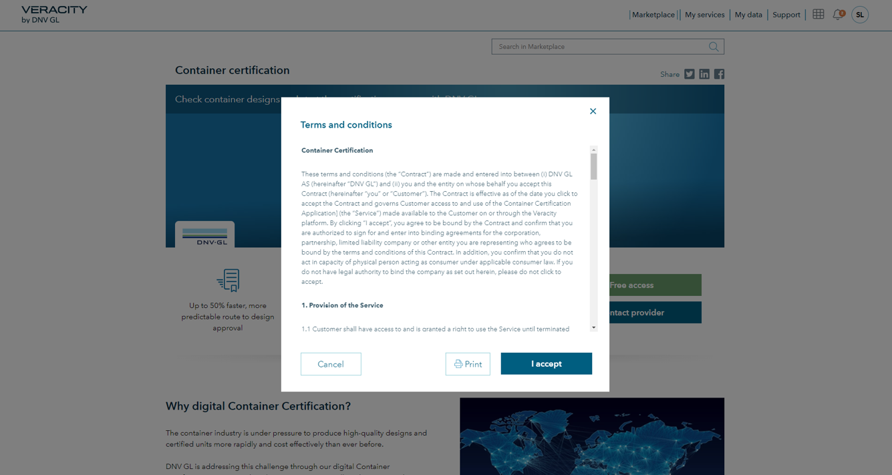

# Giving access to free services

## Purchase process for free services

In some cases you might want to give access to a free application or data set. For free products the main call to action button is "Free access" as seen below.

<figure>
	
	<figcaption>Product page for product with free access</figcaption>
</figure>

Free services might still have terms and conditions that have to be approved before the customer can start using them

<figure>
	
	<figcaption>Terms to accept for free services</figcaption>
</figure>

## Delivering the free service
For applications that are integrated with Veracity identity, access to the free application can be given immediately by Veracity to the customer.
Veracity can also handle immediate delivery of data sets. The data will then be made available for the customer in My data. In order to do this the Veracity Marketplace needs to be given necessary rights on the data container(s) in question.

In some egde cases you might want to have an approval process before you give access to the free service. We do have an approval process that is available for applications. However we do recommend to give immediate access to the service.

## Free services as an entry level with uppsell

Giving free access can be used as an entry level for getting customers to start using a service
Premium versions or add-om modules can then be sold as separate products on the Veracity marketplace

## Customer journey
For details on how the journey will be for the customer have a look at this customer journey
<a href="assets/UserJourneyFreeProducts.png" download>Click to Download</a>
