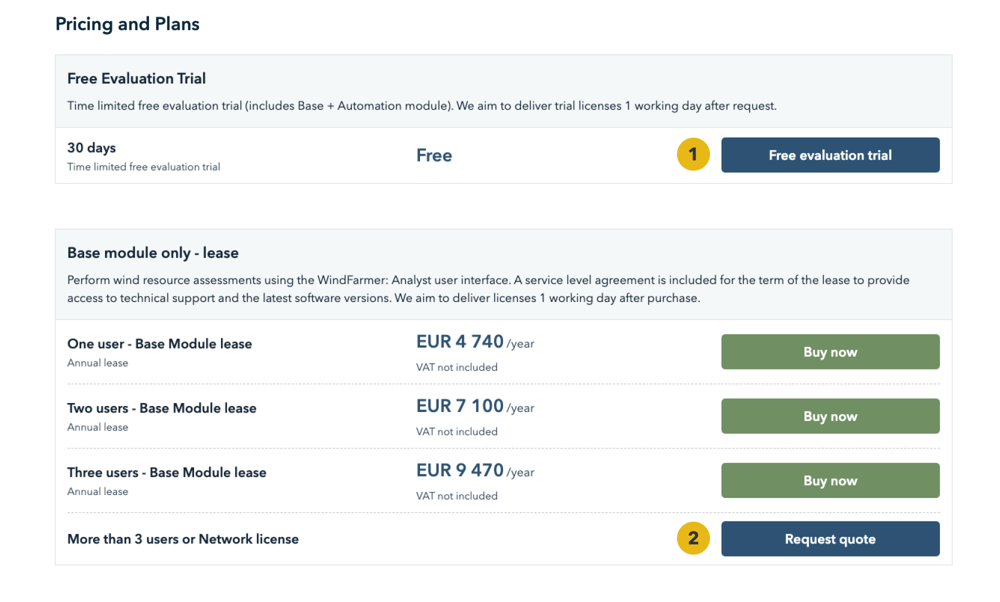
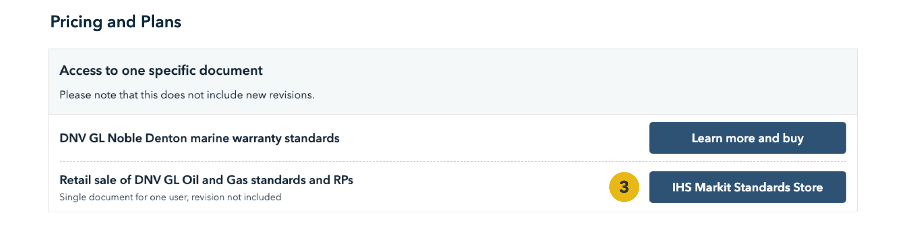
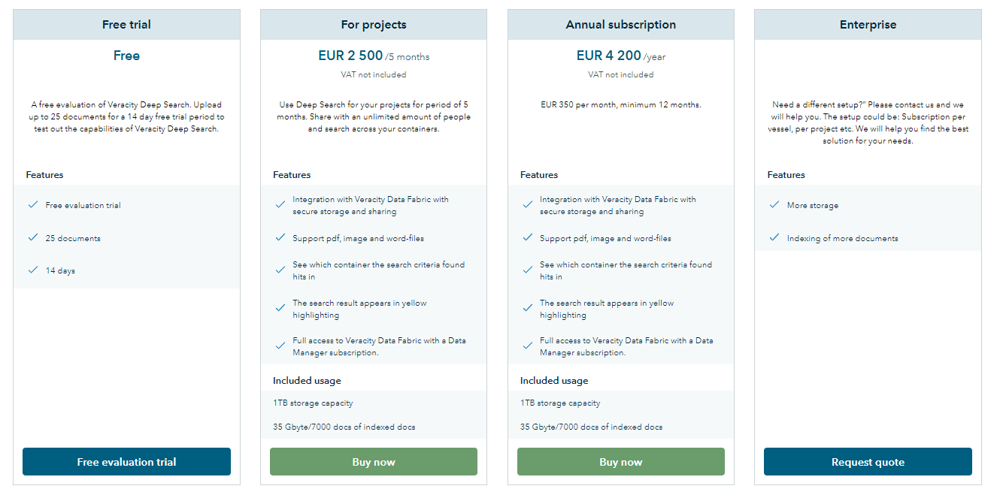

# Combinations
In both the standard horizontal and comparable vertical price plans, you can configure a combination of variants of your product.

As you can see in the picture below, there are three options for buttons configurations:
* "Free access" button (1) – for more information, go [here](freeservices.md).
* "Contact provider" or "Request quote" buttons (2) – use them if your customer needs a customizable price for the package or service. For more information, go [here](leadsgeneratingservices.md).
* Customized button (3) – which can link to an external website.

<figure>
	
	<figcaption>Example from "WindFarmer Analyst"​</figcaption>
</figure>

<figure>
	
	<figcaption>Example from "DNV GL Noble Denton"</figcaption>
</figure>

If you want to offer a free plan, Veracity recommends using a comparable price plan with vertical visualization. That way, you will give your customers more details about what they get as a free plan compared to a paid plan.

You can add specifications about time limitations for the free access in the top description of the pricing plan or variant.

<figure>
	
	<figcaption>Example from "Veracity Deep Search"​​</figcaption>
</figure>