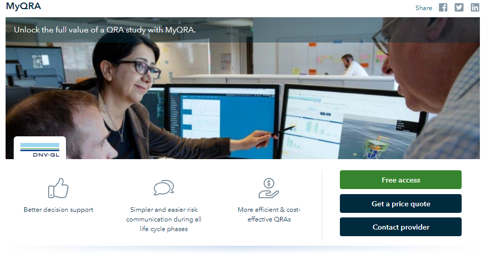

# Lead generating services
## Capturing leads
Even if your product/service is not ready for selling digitally, you can still present your service to get leads.​ A lead is any potential customer who indicates interest in your product or service.​
​
To reach these customers we have two types of interactions available in the upper part of the page:​

1. A “Get a price quote” button that allows potential customers to get a specific price quote for their needs.​
This button is available only for services that are not ready for digital sales or on a specific negotiable price plan.​
​

2. A “contact provider" button that allows a potential customer to write a message for any type of interests/request.​
This button is available for all services no matter if they sell digitally or not.​

After the customer completes the form with details and message, you will get an email with the same data and from there you can continue the sales process manually.​

These buttons are available also in the bottom part in the pricing plans, with some exceptions and rules. You can read more in the “Combinations" paragraph.​

<figure>
	
	<figcaption>Example from MyQRA</figcaption>
</figure>
