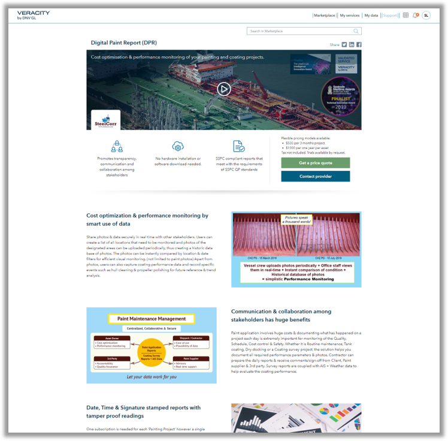

# Capturing leads for your service

If you are not able to display a price that will enable the customer to buy your product digitally. You can use the product page to capture leads.
In order to understand the intent of the potential customers we have split the requests in two. The potential customers can either use the "Contact provider" button and leave their details so that you can contact them or they can use "Get a price quote" and leave their details.  

<figure>
	
	<figcaption>Product page that captures leads</figcaption>
</figure>

When the potential customers have completed the form you will get a mail with all the details of the potential customer so that you can continue the sales process off line.

The Contact provider button will be available on all product pages so that the potential customer can get more information about the product if needed.

The Get a price quote button will not be available if the product is sold in a fully digital sales process and displays the prices.  