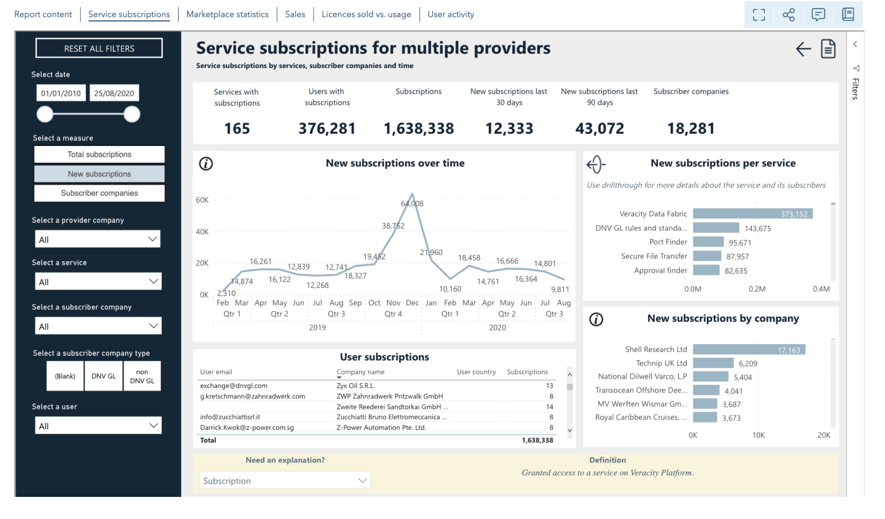
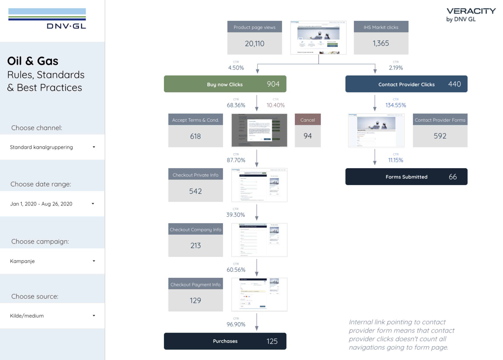
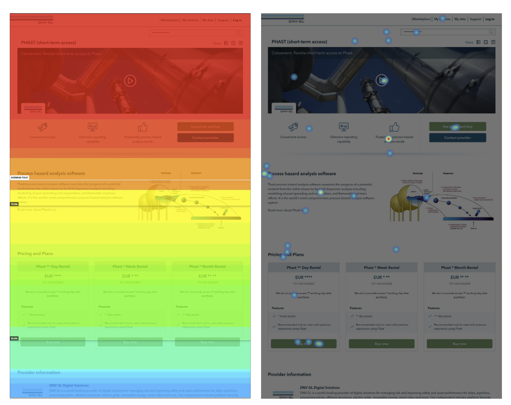

# Marketplace insight

## Service Provider Report
You can use Service Provider Report to get data analytics for a service that is present on Veracity Marketplace. Read this article to learn more.

### What Service Provider Report offers
With the Service Provider Report, you can keep track of: 
* The subscriptions of your service, filtering them by users, companies, and time. 
* The number of page views for your Marketplace page, filtering them by time or country.
* The sales you make. 
* The licences sold compared to usage (beta version). 
* The user activity (beta version). 

<figure>
	
	<figcaption>The Service Provider Report​</figcaption>
</figure>

### How to get access to the Service Provider Report
If you are a registered service owner, you will automatically get access to the Service Provider Report. If you are not the service owner, ask the service provider to send the onboarding team a request at <onboarding@veracity.com> to give you access to the Service Provider Report. 

## Sales funnel visualization
As a service provider, you can access to sales funnel visualizations in Google Data Studio. 
Using these reports, you can see data from the general purchase/access journey and analyse how many users: 
* Visited your product page. 
* Contacted you through forms. 
* Started the checkout process or the get access to free product process. 
* Were converted as part of a marketing campaign. 
​
<figure>
	
	<figcaption>Product page funnel in Google data studio​​</figcaption>
</figure>

To get access to Google Data Studio sales funnels, contact the onboarding team at <onboarding@veracity.com>. 

## User behaviour tracking
You can track user behaviour on your pages using Hotjar.

### What is Hotjar? 
Hotjar is a user-behaviour-tracking tool that provides colour data visualizations called heatmaps. Hotjar anonymously records how users behave by tracking their where they move on the product page and what they click.

The heatmaps give you a deeper understanding of how users interact with your content. You can use the aggregated statistics as a basis for testing assumptions and further design and content improvements. 

<figure>
	
	<figcaption>Heatmap and interaction map in Hotjar​​</figcaption>
</figure>

To configure Hotjar for your needs, contact Joacim Vestvik-Lunde at <joacim.vestvik-lunde@dnv.com>.