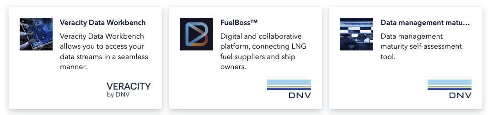
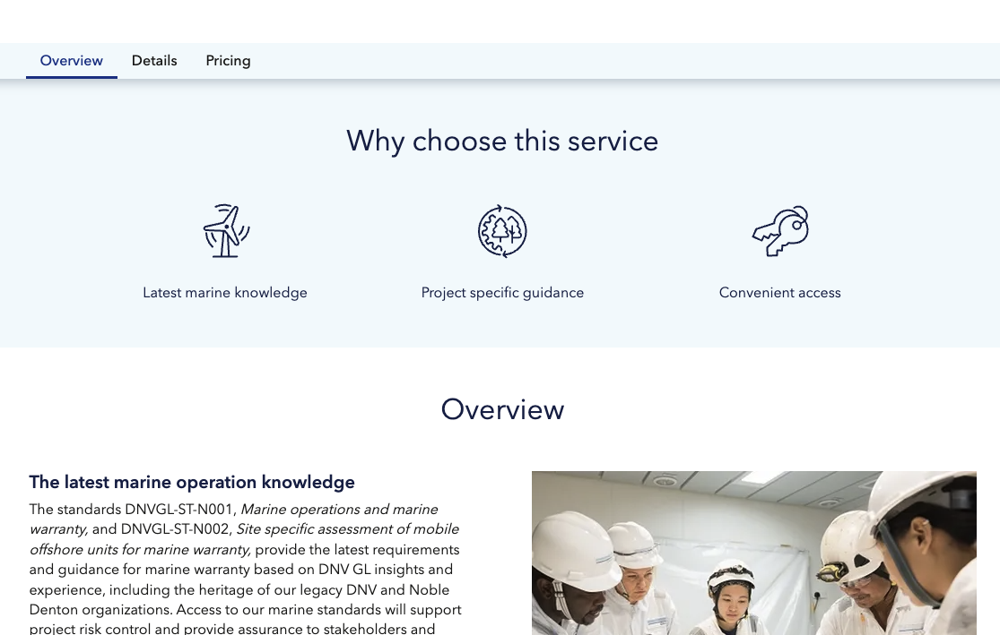
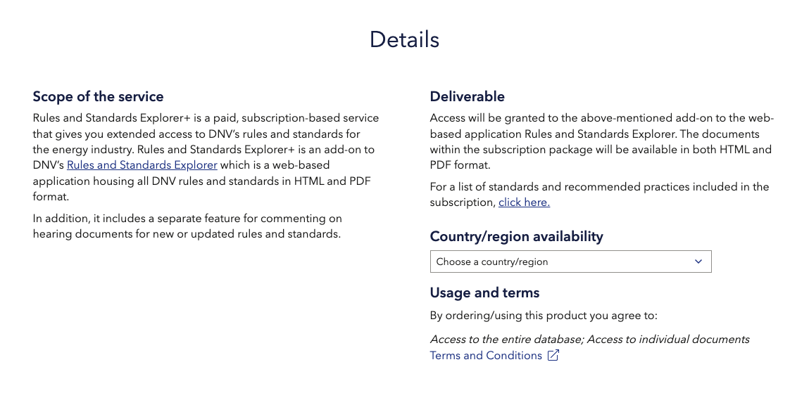

# How to go live on Veracity Marketplace?
When you are ready to publish your service or product on Veracity Marketplace, you can do it in two ways: 
* Create a Marketplace page for your service or product yourself.
* Fill in a form and send it to <onboarding@veracity.com> to request assistance.

Before publishing on Marketplace, see other [product pages](https://store.veracity.com) for inspiration and read this article for guidelines.

### Create a Marketplace page by yourself 
You can create a Marketplace page for your product or service by yourself. To do that, contact the Veracity onboarding team at <onboarding@veracity.com> and ask them to give you access to the Sanity content platform. 

### Request help with creating a Marketplace page 
The onboarding team can create a product or service Marketplace page for you. To request their assistance, do the following: 
1. Download [the service content form for the Veracity Marketplace](https://veracity-static.azureedge.net/docs/marketplace/Ver_Marketplace_Guide_ServiceContentForm_2021_09.docx). 
2. Fill in the form with content information about your service or product. 
3. Indicate what media (images, videos) you want to include on your Marketplace page. 
4. Send the filled-in form with attachments to the onboarding team at <onboarding@veracity.com>. 

## Recommendations for your Marketplace page
Since many Veracity users are not technical experts, choose a name that will: 
* Inform what your service offers. 
* Be easy to understand. 

## Writing content 
When writing your content, you should: 
* Be concise and clear – describe your service in a short and simple way. Avoid using technical terminology. 
* Avoid abbreviations – avoid using abbreviations unless it is necessary. If you have to use them, explain their meaning. 
* Do some Search Engine Optimization (SEO) – Help users find your page through search engines. Find out what words they type in their search engines when they look for products or services and use them on your page. Veracity suggests using [Google Trends](https://trends.google.com/) for that. 

## Service tile 
Your product or service will be presented on a service tile. At the top, it will display the name of your product or service. Below that, you should add a text that explains what you offer. Note that this text will also be displayed as a subtitle at the top of your product page. 
 
To write a good text for the service tile:
* Inform what you sell and why it is relevant to the user.
* Be concise and to the point. You cannot exceed 100 characters.
* Read the text aloud and ensure your stakeholders clearly understand what you sell.

See the following examples:

Forecaster — Real-time, 24/7 predictions of wind, solar and power demand for a single plant, a fleet, or a whole market.

FuelBoss — Digital and collaborative platform connecting LNG fuel suppliers and ship owners.

<figure>
	
</figure>
 
## Service key benefits
The Marketplace product page shows three key benefits of your service. They are represented with an icon and a short text paragraph. When you present the benefits, be concise, and state what your unique value proposition is. Ensure the reader understands how your product stands out from your competitors offer.

Below you can see an example of service key benefits.
<figure>
	
</figure>

## Overview section
Use this section to describe your service or product:
* Explain its main functionalities.
* Avoid using technical language.
* Add videos or images to show your potential customers what your product looks like and how it works.
* Make sure that your text is between three to five paragraphs long.

Below you can see an examploe of an overview section.

<figure>
	
</figure>

## Details section
You must add this section to sell your service or product digitally and offer a pricing plan. Veracity recommends that you start it by describing your service and the scope of what it provides.

Veracity also suggests that you cover the information below, preferably dedicating one section to each type of information.
* Delivery – how your service will be delivered.
* Payment options – what payment options are available.
* Technical requirements – what are the technical requirements for using your service or product.
* Country availability – to what countries you deliver your service or product.
* Usage and Terms – link to the Terms and Conditions of your service or product. Apart from Terms and Conditions, you can add links to other legal documents, for example, Service Level Agreement, Open-Source Software Licensing Terms, or Data Processing Agreement.

Below you can see an example of a details section.

<figure>
	
</figure>