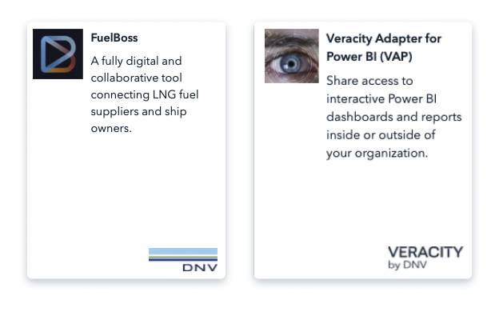
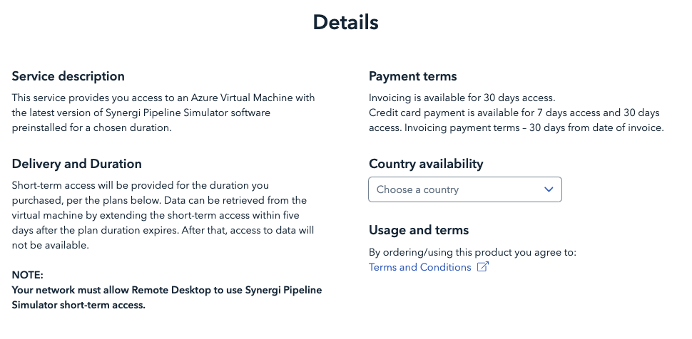

# Presenting your product in the Marketplace
When your service is at a mature stage, and you are ready to present it or sell it on our marketplace you have two options: 
- Download marketplace Content form and send it back to us with content and media requested, so that we can create a marketplace page for you; <a href="assets/Ver_Marketplace_Guide_ServiceContentForm_2021_09.docx" download>Click to Download</a>
- Upload content yourself, through our Sanity content platform. Contact us for more guidance.

In both cases, we also suggest that you read the following guidelines, and that you familiarize yourself with the different product pages at store.veracity.com.

## Naming your service and writing content
When deciding the name of your service, and when writing descriptions, you should think both about being user-friendly and choosing the right words for SEO (Search Engine Optimization). Both in the name of the service and in the content it`s important to: 
- write what the service is about in a simple and short way; 
- avoid using only abbreviations, and if needed explain what the abbreviation means; 
- write in a user-friendly way, not too technical, as many of our users are not technical experts; 
- do research about the most typical words used from your target group - we suggest https://trends.google.com/ as a smart tool to compare usage of words in search (e.g. If your users are more exposed to the word “boat”, use that instead of vessel). 

## Naming your service tile in marketplace
The text on the service tile in marketplace, that will also be the same text shown as a subtitle at the top of the product page, should be short and to the point. 
Write what you sell and why it is relevant to the user in a few words (max 100 characters). Read the text out loud and test with your stakeholders if they understand what you sell. 

Good examples:  
Forecaster — Real-time, 24/7 predictions of wind, solar and power demand for a single plant, a fleet, or a whole market. 
FuelBoss — Digital and collaborative platform connecting LNG fuel suppliers and ship owners. 
<figure>
	
	<figcaption>Overview section example</figcaption>
</figure>
 
## Service key benefits 
The marketplace product page will show 3 main key benefits of your service. They are represented with an icon and a short text paragraph, and they should describe your service's unique selling points. Be short and tell what is important first:
- what is the value proposition of your product?
- why should a customer buy from you and not from a competitor?
<figure>
	
	<figcaption>Service key benefits example</figcaption>
</figure>

## Overview section
You can write here from 3 to 5 paragraphs to describe what the service is about.
- explain the main functionalities and add video or images of screens so that the user gets concrete examples. 
- avoid too technical description, remember that the potential buyers do not always have a technical background.

<figure>
	
	<figcaption>Overview section example</figcaption>
</figure>

## Details section 
This section must be shown for services that are sold digitally and are presenting a pricing plan. While the overview section above tells the good marketing story and focuses on awareness and interest phase, the "Details" section is focusing on the consideration phase. The user is considering buying and needs all the details of the process.  

Below Details, it is mandatory to fill in at least one paragraph and we suggest starting from "Service description" that tells about the scope. In addition to this you could fill other details like “Delivery”, “Payment options”, “Technical requirements”.  
The "Country availability" paragraph should be there too, as users can check ahead if the service is sold in their country). 
The Terms and Condition paragraph will always be shown with the link to T&C.  
You can also add other links to legal documents (eg. Service Level Agreement, Open-Source Software licensing terms, Data Processing Agreement). 

<figure>
	
	<figcaption>Details section example</figcaption>
</figure>
