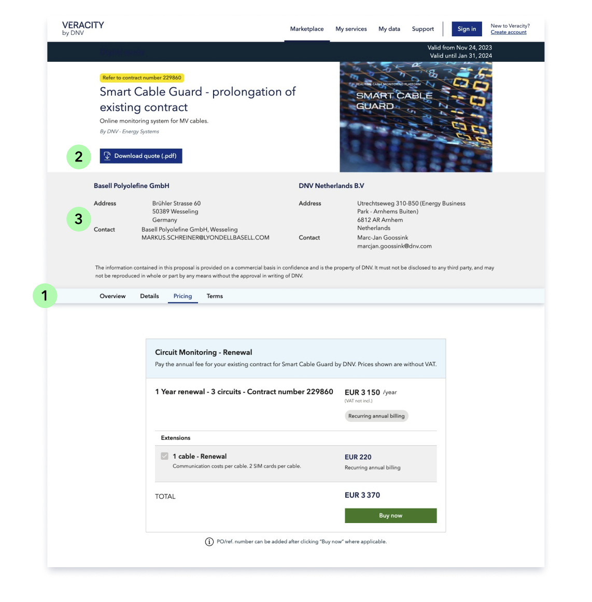

# Digital Quote
To increase sales reach or maintain a good ​conversation with clients, providers have the option to send their customers a digital quote based on an existing marketplace product page.​ **The quote page is available only for services that are already sold digitally via marketplace.** The primary benefit of our digital quote solution is the ability to offer clients different pricing variations for the product, such as based on a different quantity or a discount for a specific customer.​

To create a digital quote, providers must contact our Veracity onboarding team, which can set it up for you.​

The quote includes Overview and Details sections taken from the original marketplace product page and shows also Terms and Conditions (1).​ It is downloadable as a pdf, so that the client can forward it internally for approval (2).​ Moreover, the quote includes details from the buyer and the seller (3) and a tag on the top left corner with extra specifications of the offer (see yellow tag).​

In the top right corner, we display a validity period that sets a time frame for the quote, but it doesn't prevent the client from making a purchase after the validity end date.

<figure>
	
	<figcaption>Example of digital quote for Rules and Standards</figcaption>
</figure>