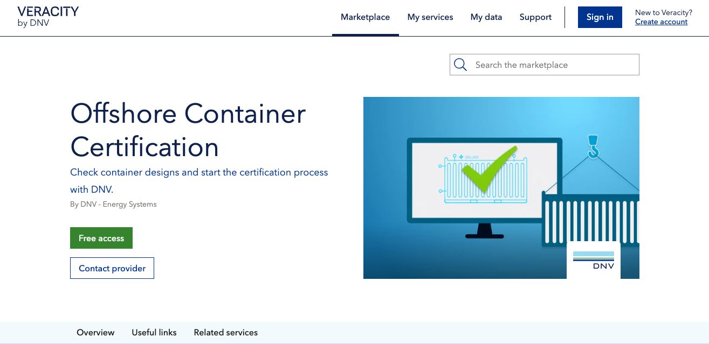

# Giving access to free services

## Purchase process for free services
If you want to give free access to an application or a data set, you can use the "Free access" button, as shown below.

<figure>
	
</figure>

You can add terms and conditions to free services so that the customer must approve them before they start using it.

## Delivering free services
Veracity enables the delivery of free services by:
* Giving customers immediate free access to applications integrated with [Veracity Identity](https://developer.veracity.com/docs/section/identity/identity).
* Handling immediate delivery of data sets. After you give the Veracity Marketplace necessary rights on the data container(s) in question, data will be made available for customers in “My data”.
* Providing an approval process that you can use before you give access to your free service. However, Veracity recommends that you give your customers immediate access to your service.

## Free services as an entry-level with upsell possibilities
You can give free access to your service as an entry-level for getting customers to start using a paid plan. You can sell premium versions or add-on modules as separate products on the Veracity Marketplace.

## Customer journey
Have a look at how the customer journey for free services looks like <a href="assets/UserJourneyFreeProducts.png" download>here</a>.