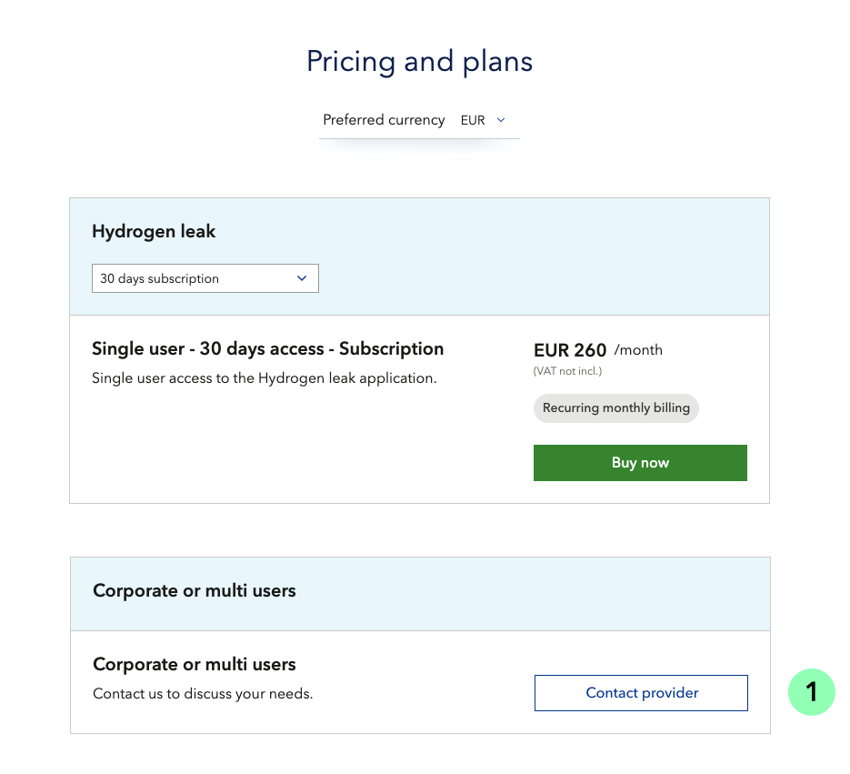
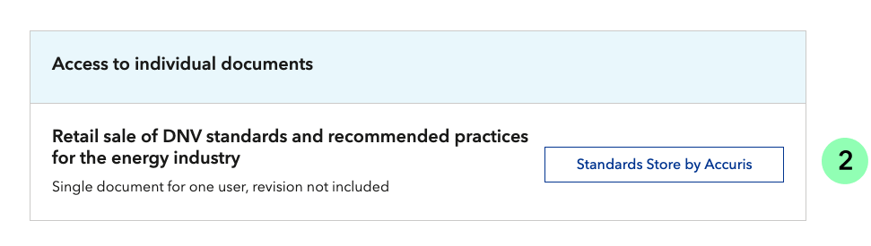

# Combinations
In both "One-column" and "Side-by-side" display options, you can configure a combination of variants of your product. 
For example, you can combine a free plan above a paid plan, or even add an extra variant of plan for users that have special needs, and show a “contact provider” button (1).
<figure>
	
</figure>
Also, you can show a plan with customized button (2) – which can link to an external website.
<figure>
	
</figure>
If you need another pricing model or help with complex pricing configuration, contact the [onboarding team](mailto:onboarding@veracity.com)

