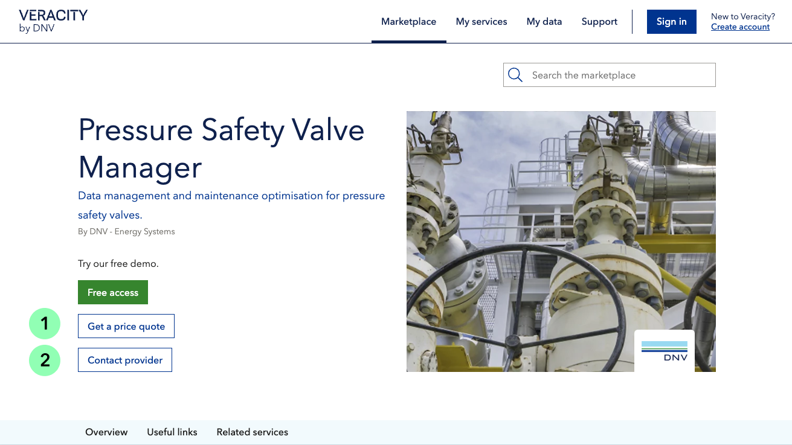

# Lead generating services
## Capturing leads
You can present your service to potential customers even if your service is not ready for digital sale. A potential customer who shows interest in your product or service is usually called a lead. 

To reach your leads, you can use the two following buttons in the upper part of the page:
* "Get a price quote" (1) – allows potential customers to fill out a form and get a price quote tailored for their needs.
It is available for:
	* Services that are not ready for digital sales. 
	* Services that offer a negotiable price plan. 
* "Contact provider" (2) – allows potential customers to fill out a form and message the service provider with any questions or requests. This button is available for services sold both digitally and non-digitally.
<figure>
	
</figure>

After the customer fills out the form, you will get an email with their details and their message. From there, you can continue the sales process manually.
"Get a price quote" and "Contact provider" buttons can also de shown in a pricing plan. To learn more about this option, see [Combinations](./hybridsolutions​.md).

## Customer journey
For an example of a customer journey for generating services, go [here](https://veracity-static-stag.azureedge.net/docs/marketplace/sellingyourproduct/UserJourneyLeadsProcess.png).