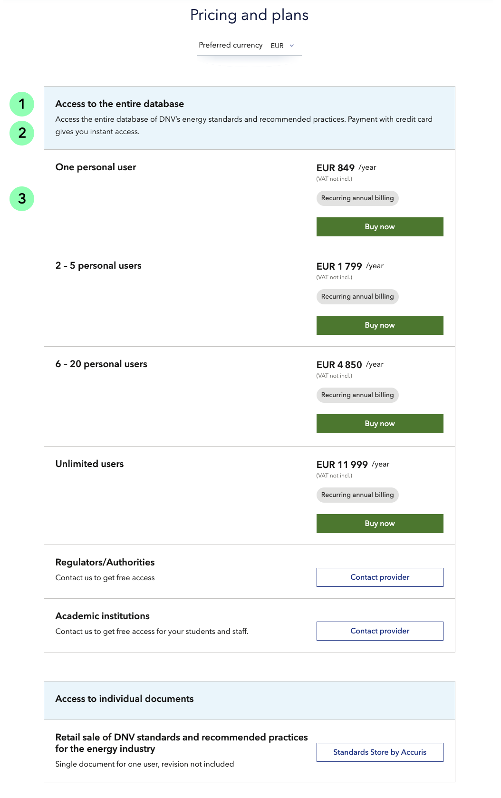
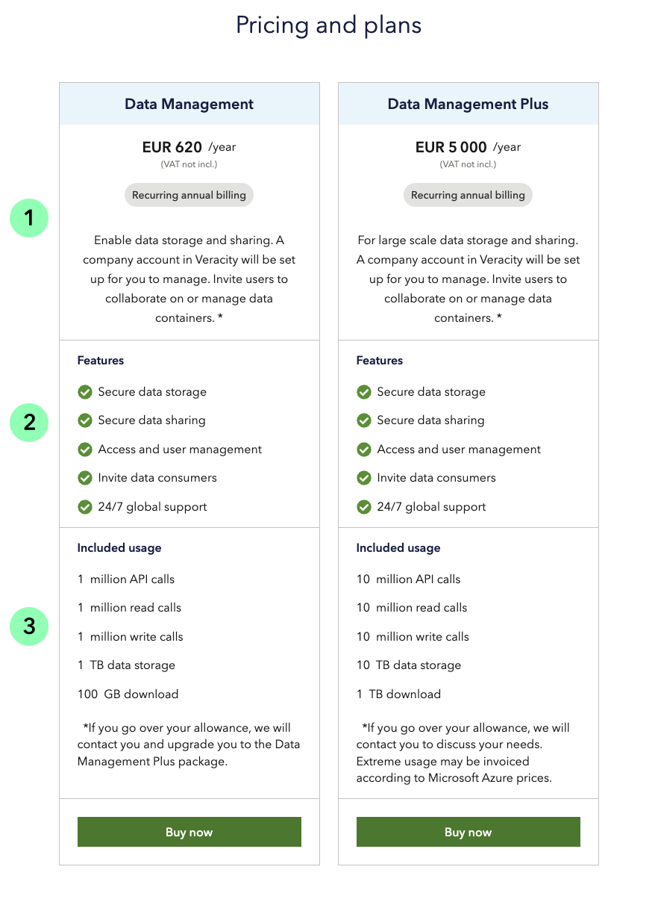
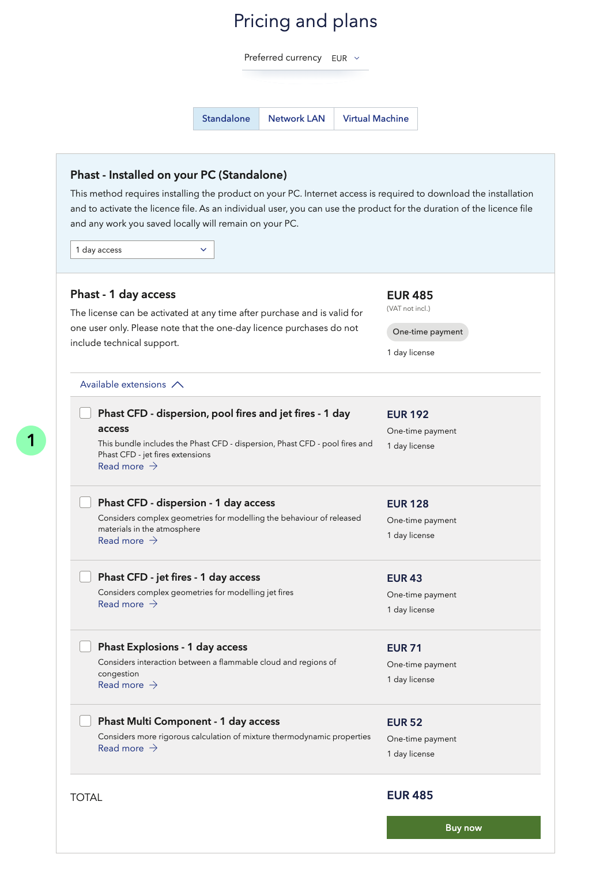
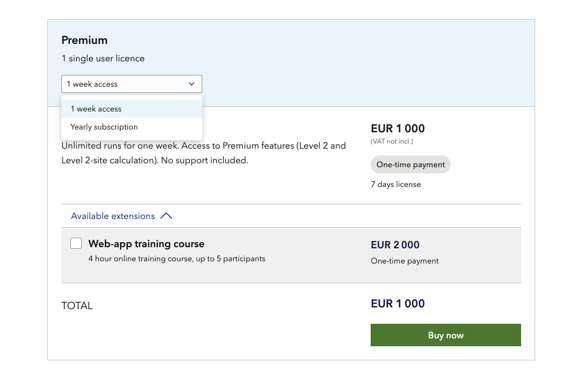
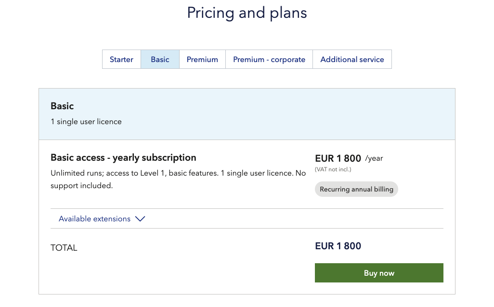
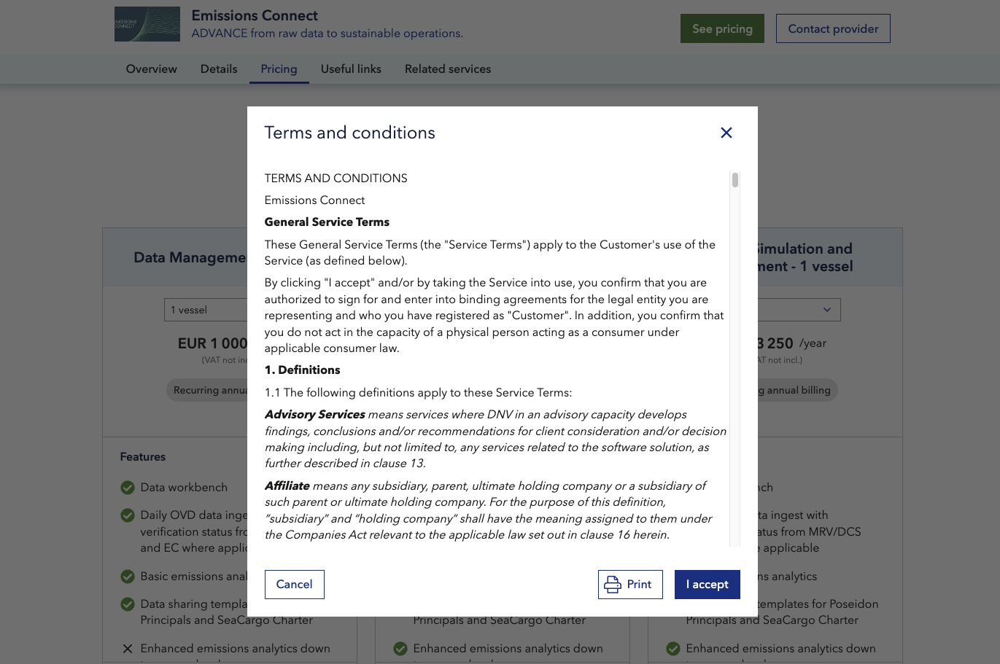
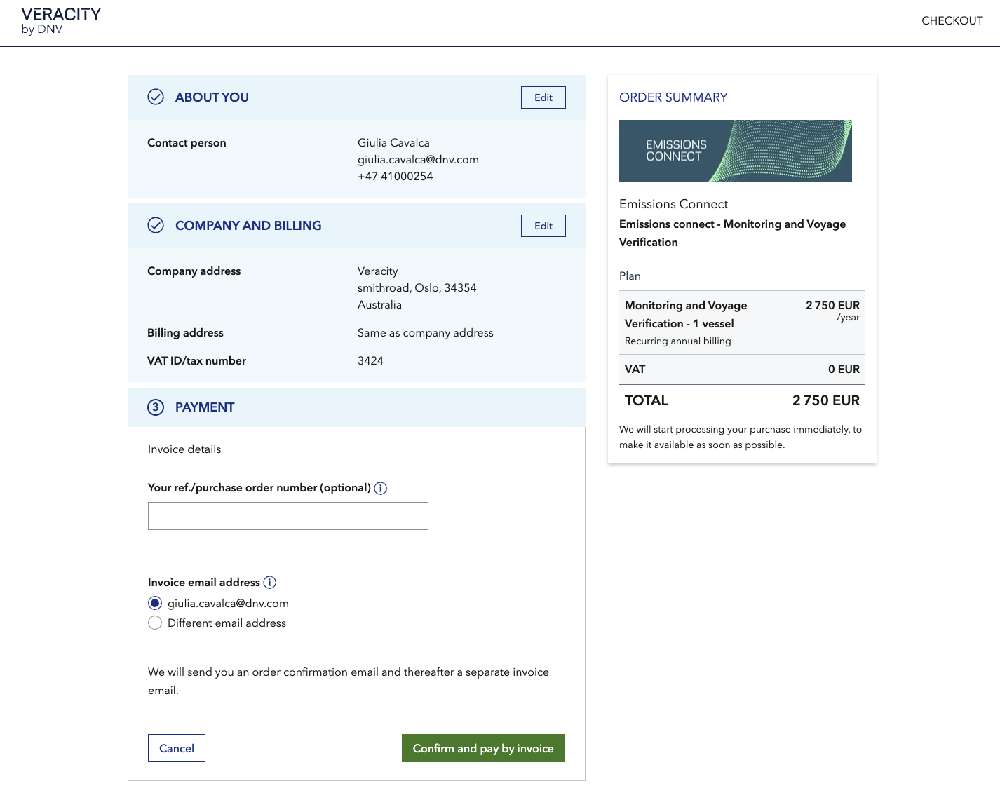
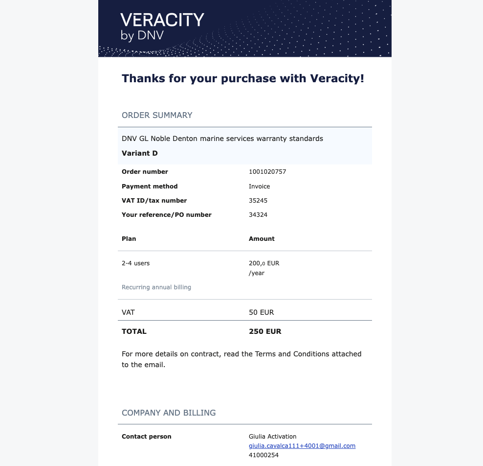

# Paid services
When planning to sell a service through Veracity Marketplace, you should have reached a high level of maturity of your product and be ready for scalability. Get in touch with us if you want to know more about how "ready you are for selling digitally". 

Prices are set in Euro (EUR), but can also be displayed, and processed in multiple currencies, including British pound sterling (GBP), U.S. Dollars (USD) and Norwegian krone (NOK). 

## Terminology when defining and pricing your product
A product pricing should be set up following a hierarchy: 

_Variants_
High level configuration of your product, for example defined by included products/servicesfeatures, or subscription tiers (like Standard, Professional, Advanced). Each variant can include one or more plans. 

_Plans_  
Plans show variations of price inside a specific variant. Plans can be defined by period (like monthly, yearly subscription), quantity (like number of users, number of vessels, or MBb, etc), or other elements that might affect the price. 

_Extensions_  
Extensions are extra optional modules included in the plan, with their own price.  

After you have an idea of how to set up your product pricing, you should plan how to display it to the customers on the marketplace. 

There are two main ways to display your pricing: “Side-by-side” and “One-column”. Inside these two display types, you can also offer extensions and trials, or structure your offer in a more flexible way (like adding a pricing plan selector). Read the following paragraphs to get a better overview of the display possibilities. 

## One-column pricing plan
With this visualization, pricing plans are displayed below each other in one column. As customers need to scroll to get a full overview, Veracity suggests this visualization if you need to show not more than 3/4 variants of pricing pans. Note that the last variant can end up at the end of the page, having less visibility compared to the ones above. 

In specific, the variant name (1) and description (2) are shown at the top blue area, while the plans (3) and different prices are shown in the rows below. 

<figure>
	
	<figcaption>Example from Rules and Standards Explorer</figcaption>
</figure>

## Side-by-side pricing plan​
With this visualization, pricing plans are displayed beside each other. Customers can easily compare prices (1), and eventual differences in features (2), usage (3), delivery periods, or extensions (see paragraph on extension to learn more). For better readability Veracity suggests displaying no more than four columns in a page.  

The “side-by-side" visualization should be preferred when showing subscription tiers (Starter, Advanced, Premium, Professional) or when you have a pricing model based on different usages (Mb or consumption). 

In general try to keep the description in the plan short and if needed refer to further explanation in the "Details section" above pricing plans section. 

<figure>
	
	<figcaption>Example from Veracity Data Fabric</figcaption>
</figure>

## Offering trials
Offering a free trial for a short period will show your customers the value of your service and help them make an informed decision. When purchasing your service with trial, the customers share their payment information and after the trial period ends, they are automatically charged, prior cancellation. 

See the following example. 

<figure>
	 
	<figcaption>Free trial period on DATE for CMC</figcaption>
</figure>

In the example above, DATE for CMC choose a six-month free trial for their customers. There are five trial periods to choose from for your "Try free" button: 
* 7 days trial 
* 14 days trial 
* 1 month trial 
* 3 months trial 
* 6 months trial 

Contact your onboarding manager to discuss the possibility of adding a free trial period to your service.

## Offering extensions
You can decide to sell your service together with extensions (1). Extensions can be extra modules, or extra features of an application, that the customer can buy in addition to the selected plan (see picture). An extension should have a short, intuitive name, a brief description, and eventually, a link to an external page for extra information. 

<figure>
	
	<figcaption>Example of extension in Phast 1-day-access plan </figcaption>
</figure>

## Pricing plan selector
If you need to display different price plans with a common differentiating element (like “users” as in the example below), you can use a drop-down selector. The selector shows only one plan at a time in a drop-down list. It helps the user choose without being overwhelmed with too many options and buy buttons. 

Pricing plan selector can be shown on “one-column” or “side-by-side” pricing plans display options.

<figure>
	
	<figcaption>Selector of different pricing plans</figcaption>
</figure>

## Grouping options
As explained previously, a variant can gather one or more plans. Sometimes, displaying different variants can lead to a quite long page with many plans and buy buttons. To avoid this complexity and increase readability, you have the possibility to gather different variants in a button group (or switch button). 
Customers can use the buttons to switch between the different variants and select what they are really interested in. 

Grouping option can be enabled for both “one-column” and “side-by-side" pricing plans display options. 

<figure>
	
	<figcaption>Example of pricing plan with grouping option</figcaption>
</figure>
 

## Online contracting
To do online contracting, you need terms and conditions of your service that the customer can select to accept. Veracity supports only B2B purchases, so your customers must provide their company information when buying your service.

See an example of terms and conditions below.

<figure>
	
	<figcaption>Terms and conditions example</figcaption>
</figure>

## Payment options
After accepting the terms and conditions of your service, the customer needs to enter details about themselves and their company. If the customer is already a Veracity user, the information they already provided will be prefilled.

<figure>
	
	<figcaption>Purchase form</figcaption>
</figure>

There are two payment options avaialble in Veracity marketplace: credit card and invoice. Different combination are possible: 
* Only one payment option (credit card or invoice).
* Two payment options (credit card and invoice).
* Credit card for small amounts and both payment options for plans with higher price amounts. 

## Order confirmation and invoice
After the purchase, your customer get to an order confirmation page, with instructions. In addition he/she will receive an order confirmation mail by Veracity with the same details of the purchase.
Later, an invoice file from the system will be sendt to the same email. If the customers payed by card, the invoice will be marked as pre-paid.

<figure>
	
	<figcaption>Order confirmation mail</figcaption>
</figure>

## Delivering the purchased service

Once the purchase is completed you can decide to deliver the service yourself or through our Veracity “My services” landing page. The second option should be preferred as it ensures consistent user experience and secure access with the same Veracity sign-in solution. You can also deliver data set, through our “My data” page. 
In addition, Veracity offers a “User management” solution to support purchases of multi-user licenses. In this webpage, admin users can share and manage licenses, inviting new users into a service. 

A manual process for giving access to customers is also possible. 
You can offer your customers automatic or manual access based on the plan price or payment method. For example, you can give automated access to customers paying by credit card and manual access to customers paying by invoice (in case of bigger contracts, and enterprise solutions). You may need to set up access levels inside the service. In such cases, Veracity provides you with messages to initiate this process. 

## Customer journey
For an example of a customer journey for paid services, go [here.](https://veracity-static-stag.azureedge.net/docs/marketplace/sellingyourproduct/UserJourneyPurchasableProducts.png)