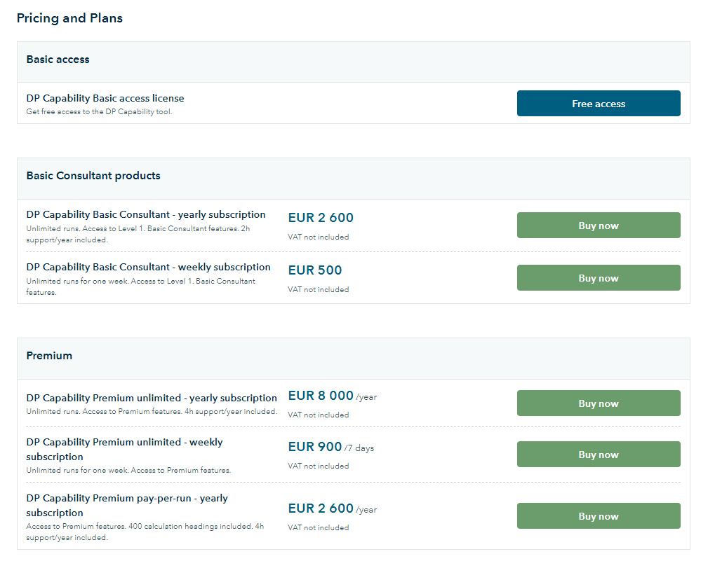
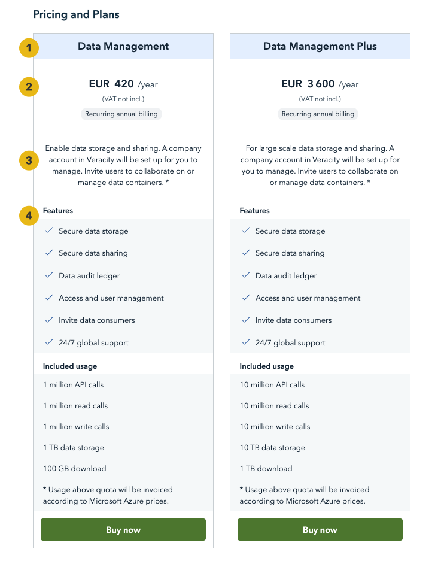
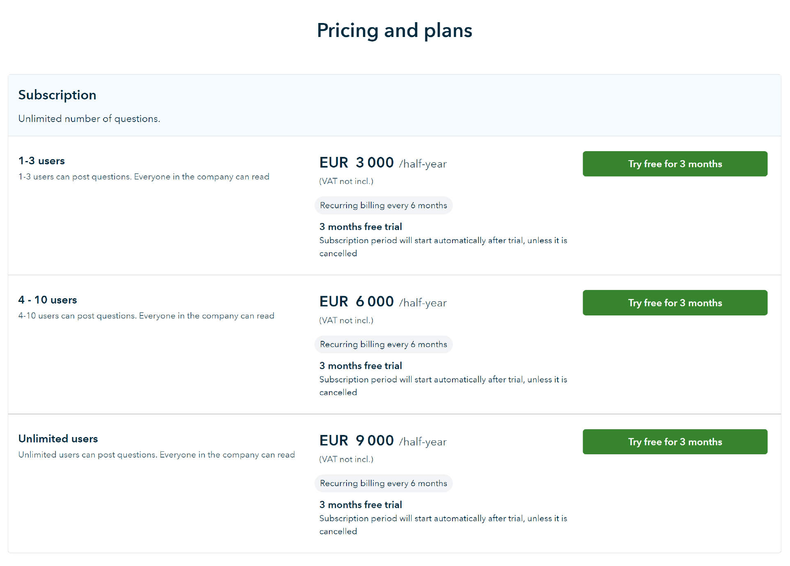
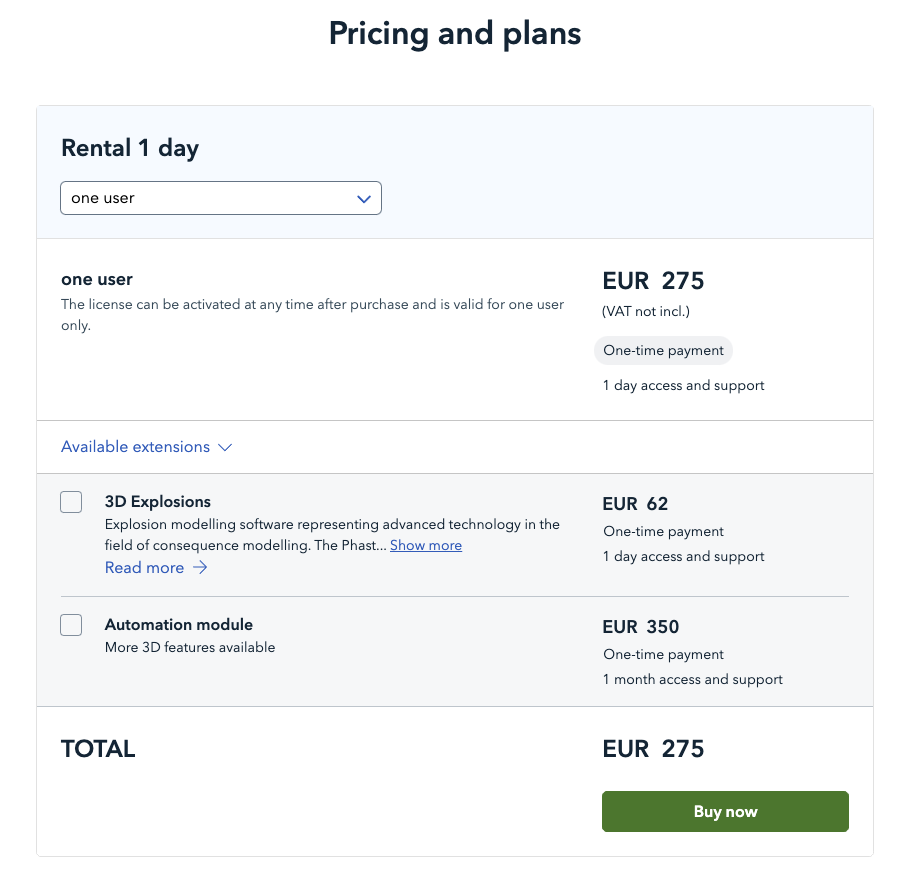
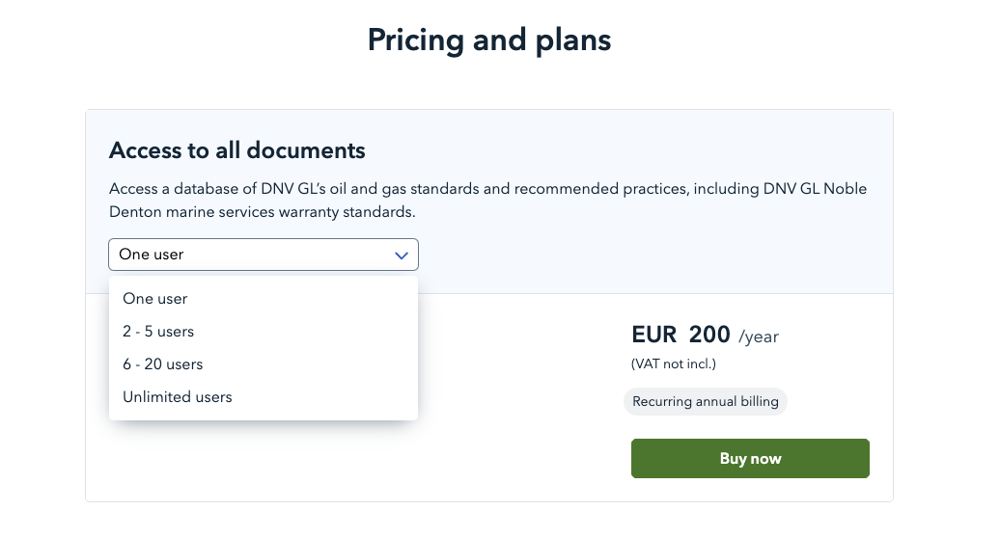
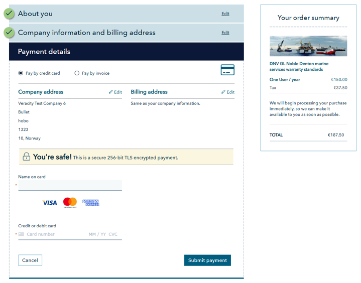
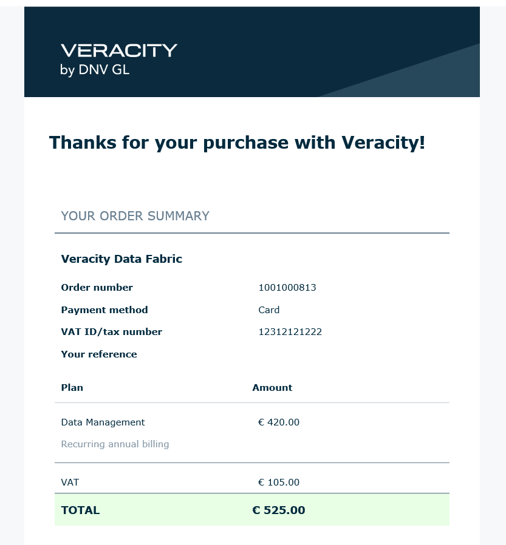

# Paid services
When planning to sell a service through Veracity Marketplace, you should have reached a high grade of maturity of your product and be ready for scalability. Get in touch with us if you want to know more about how "ready you are for selling digitally". 

Veracity supports processing charges in multiple currencies, including Euro (EUR), British pound sterling (GBP) and U.S. Dollars (USD).

The following section gives an overview of the different pricing models you can use for your product.

## Standard price plan - horizontal visualization
If you want to sell different product variants, use a standard price plan with a horizontal pricing visualization.

A product variant describes different software solutions or packages of online software/APIs, and data sets.

There are three elements you need to fill in: 
* Name (1) - a short and self-explanatory name of the product variant. 
* Description (2) - details on what the variant includes. 
* Pricing models rows (3) - differentiate them by: 
	* Prices 
	* Type and number of customers – for example: one user, 2-5 users, students, enterprise 
	* Subscription type - for example: one-time, recurrent, yearly, monthly, support duration 

<figure>
	
	<figcaption>Example from Dynamic Positioning Capability Assessment</figcaption>
</figure>

## Comparable price plan - vertical visualization​
For a detailed explanation of each product variant, use a comparable price plan with a vertical pricing view. 
In this plan, you need to fill in: 
* Name (1) – a short and self-explanatory name of the product variant. 
* Price and subscription type (2) – for example: one-time, recurrent, yearly, monthly, support duration. 
* Description (3) – short information on the product variant. 
* Features (4) – what features a variant offers.

Typical product features are: 
	* Available technical integrations 
	* Sharing features 
	* Access level or rights (for example, manager, viewer)
* Usage or consumption (5) – for example: Mb/Tb data storage, number APIs.

Keep the pricing and plans section short. Include any detailed description of your offer in the paragraphs above this section. 

<figure>
	
	<figcaption>Example from Veracity Data Fabric</figcaption>
</figure>

## Offering trials
You can add a free trial to show prospective customers the value of your service and help them make an informed decision. When purchasing your service, the customer puts in their payment information. After the trial period ends, the customer is charged for the service.

See the following example. 

<figure>
	 
	<figcaption>Free trial period on DATE for CMC</figcaption>
</figure>

In the example above, DATE for CMC chose a three-month free trial for their customers. The purchase buttons on the right reflect the chosen period. You can choose between the following trial periods: 
* 7 days trial 
* 14 days trial 
* 1 month trial 
* 3 months trial 
* 6 months trial 

Contact your onboarding manager to discuss the possibility of adding a free trial period to your service.

## Offering add-ons
You can sell your service with add-ons. Add-ons are extra modules, extensions, or features that the user can buy in addition to the pricing plan.

An add-on should have:
* A short and descriptive name.
* A brief description of what it does.
* A link to an external page with extra information (optional). 

See the example of add-ons below.

<figure>
	
	<figcaption>Example of Add-ons</figcaption>
</figure>

## Pricing plan selector
If you have a lot of different price packages or too much information to manage on one page, you can use a drop-down selector. The selector shows only one plan or package plan at a time in a drop-down list. It helps the user choose without being overwhelmed with too many options and buy buttons.

<figure>
	
	<figcaption>Selector of different pricing plans</figcaption>
</figure>

## Online contracting
To do online contracting, you need terms and conditions of your service that the customer can select to accept. Veracity supports only B2B purchases, so your customers must provide their company information when buying your service.

See an example of terms and conditions below.

<figure>
	
	<figcaption>Terms and conditions example</figcaption>
</figure>

## Payment options
After accepting the terms and conditions of your service, the customer needs to enter details about themselves and their company. If the customer is already a Veracity user, the information they already provided will be prefilled.

<figure>
	
	<figcaption>Purchase form</figcaption>
</figure>

Veracity makes it possible for your customers to pay by credit card or invoice. You, as a provider, can: 
* Enable only one payment option (credit card or invoice).
* Give your customers two payment options (credit card and invoice).
* Allow credit card payments for small amounts and offer both options for larger amounts. 

## Order confirmation and invoice
After the purchase, your customer:
* Sees a message with their order confirmation.
* Receives their order confirmation by mail.

Later, the customer will get an invoice to be paid. If they already paid for the purchase by credit card, the invoice will be marked as pre-paid.

<figure>
	
	<figcaption>Order confirmation mail</figcaption>
</figure>

## Delivering the purchased service
It is best to deliver your products through Veracity. It ensures a consistent user experience and secure access to products with Veracity Identity. Digital services are delivered on "My services", and data sets are delivered on "My data".

The user can get automatic access to your services with: 
* Single-user licence 
* Multi-user licence 

For a multi-user licence, the customer can share licence with other users using a separate module in Veracity.

It is also possible to set up a manual process to give access to the customer.

You can offer your customers automatic or manual access based on the plan price or payment method. For example, you can give automated access to customers paying by credit card and manual access to customers paying by invoice.

You may need to set up access levels inside the service. In such cases, Veracity provides you with messages to initiate this process.

## Customer journey
You can see what the customer journey looks like <a href="../assets/UserJourneyPurchasableProducts.png" download>here</a>.