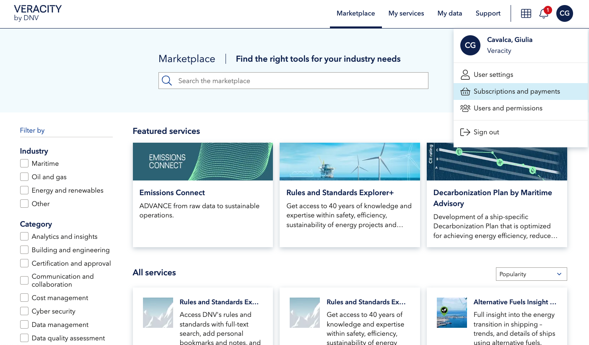
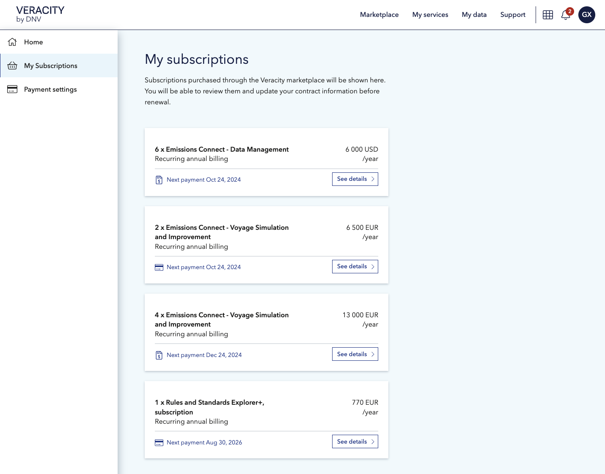
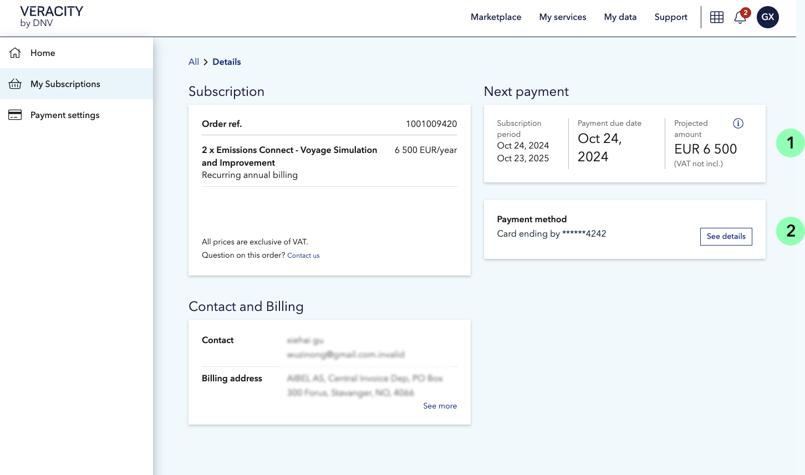
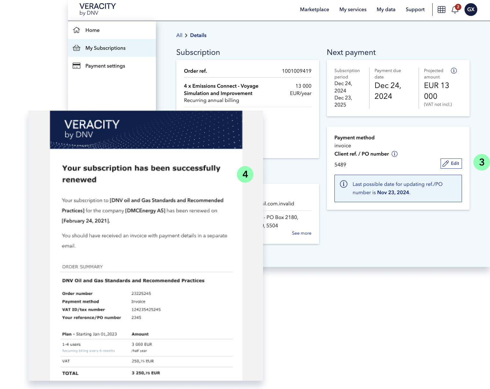

# Subscriptions renewal

Subscription models are a growing offer in the world of e-commerce solutions, showing benefits of a more predictable recurring cost both for the client and the supplier.​ In alignment with emerging trends, our goal is to make the management of subscription contracts purchased through the marketplace smoother and more automated.

Whenever users purchase a service subscription on the Veracity marketplace, they can access a summary of their contract details in the 'Subscriptions and Payments' section and from there manage their subscription renewal digitally.​
From the top Veracity menu, users can click on their initials and navigate to the 'Subscriptions and Payments' link.

<figure>
	
	<figcaption>Delete text</figcaption>
</figure>

Here, under 'My Subscriptions', they can view a list of their purchased subscriptions and click further into the relative details. 

<figure>
	
	<figcaption>Active subscriptions overview</figcaption>
</figure>

In the new page, they can check the next payment due date (1) and other contract details, like extra extensions included in the purchase, or which payment method they used (2).

<figure>
	
	<figcaption>Subscription detail page</figcaption>
</figure>

When the renewal date approaches, users will get an automatic email from Veracity to remind them about updating their Purchase Order number (3) or their card details if necessary. On due date, if card is valid and PO number in place, we automatically start the new subscription term, and users get notified with a confirmation email from Veracity (4). If the system encounters some errors, like problems with the card, or a missing payment, we will send out further reminder emails (both automatic or manual ones in case of invoice payments)​

By reducing manual work from our side, we aim to make the renewal process a more self-service solution for clients, and in general, enhance the scalability of subscription renewals.

<figure>
	
	<figcaption>Confirmation renewal email and "Edit PO number" feature</figcaption>
</figure>