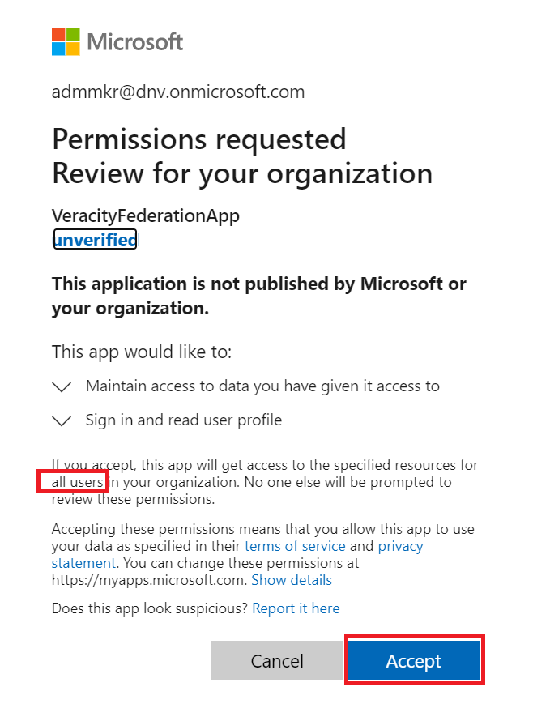
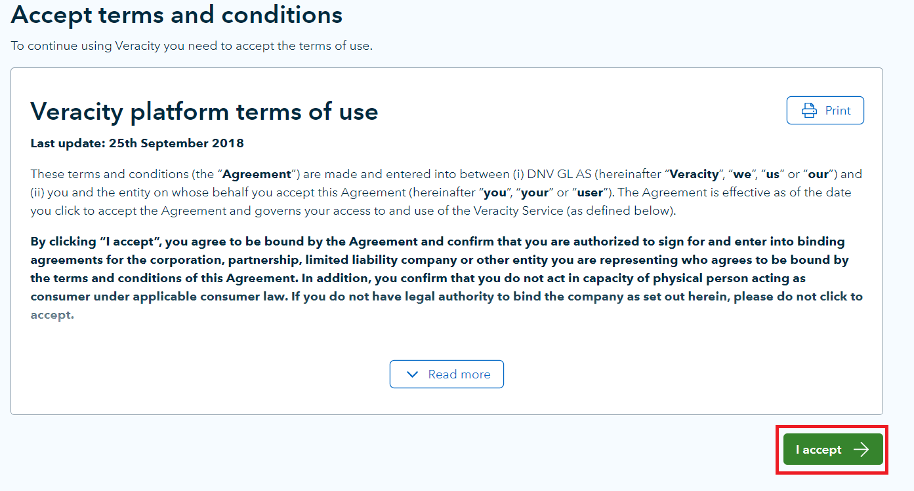

# How to configure a customer&#39;s Azure AD as a Trusted Identity Provider with Veracity

## Introduction

This document describes the actions that must be done on the customer side to set up the customer&#39;s Azure AD as a trusted Identity Provider with the Identity Provider used by Veracity (Azure AD B2C). We also refer to the setup as **federation** between Veracity and the customer&#39;s company. When these tasks are completed, employees of the customer company can use their accounts in the customer&#39;s Azure AD to log in to Veracity.

NOTE! We normally configure the federation in our Staging environment first to make sure everything works. The steps below are valid for both Staging and Production, but there are different URLs for each environment, so please make sure you use the right URLs for the relevant environment.

## Configuration

**NOTE!** This chapter must be done in advance of the implementation of the federation

1. Make sure you have an account in your Azure AD with at least &quot;Application Administrator&quot; permissions (this is required to do Admin Consent of the application that configures the trust relationship with Veracity)

1. Open a browser in InPrivate/Incognito mode

1. Go to the following link:

**Staging:**

[https://login.microsoftonline.com/common/oauth2/authorize?response\_type=id\_token&amp;redirect\_uri=https%3A%2F%2Floginstag.veracity.com%2F307530a1-6e70-4ef7-8875-daa8f5a664ec%2Foauth2%2Fauthresp&amp;client\_id=9f136cdb-b1c8-493b-8a70-43e49decc629&amp;scope=openid+profile&amp;response\_mode=form\_post&amp;nonce=d309437392864ab7a1a706acdd04e45d20181029214511&amp;state=jijie2op89hehj2&amp;prompt=admin\_consent](https://login.microsoftonline.com/common/oauth2/authorize?response_type=id_token&amp;redirect_uri=https%3A%2F%2Floginstag.veracity.com%2F307530a1-6e70-4ef7-8875-daa8f5a664ec%2Foauth2%2Fauthresp&amp;client_id=9f136cdb-b1c8-493b-8a70-43e49decc629&amp;scope=openid+profile&amp;response_mode=form_post&amp;nonce=d309437392864ab7a1a706acdd04e45d20181029214511&amp;state=jijie2op89hehj2&amp;prompt=admin_consent)

**Production:**

[https://login.microsoftonline.com/common/oauth2/authorize?response\_type=id\_token&amp;redirect\_uri=https%3A%2F%2Flogin.veracity.com%2Fa68572e3-63ce-4bc1-acdc-b64943502e9d%2Foauth2%2Fauthresp&amp;client\_id=9c55f433-2724-467b-a987-a957575655bc&amp;scope=openid+profile&amp;response\_mode=form\_post&amp;nonce=d309437392864ab7a1a706acdd04e45d20181029214511&amp;state=jijie2op89hehj2&amp;prompt=admin\_consent](https://login.microsoftonline.com/common/oauth2/authorize?response_type=id_token&amp;redirect_uri=https%3A%2F%2Flogin.veracity.com%2Fa68572e3-63ce-4bc1-acdc-b64943502e9d%2Foauth2%2Fauthresp&amp;client_id=9c55f433-2724-467b-a987-a957575655bc&amp;scope=openid+profile&amp;response_mode=form_post&amp;nonce=d309437392864ab7a1a706acdd04e45d20181029214511&amp;state=jijie2op89hehj2&amp;prompt=admin_consent)

1. Log in with the account that has at least Application Administrator rights in the Azure AD tenant

1. You will see a similar picture as the one below:

<figure>
	
</figure>

1. Make sure the message states &quot; **all users**&quot; and then click &quot; **Accept**&quot;.
  - What you consent to is that this app is allowed to sign user in and read profile data for the signed-in user. This is necessary for Veracity to get back data about what user is logging in.
  - Handling of the profile data is controlled by the Veracity [Terms of use](https://id.veracity.com/terms-of-use) and [Privacy statement](https://services.veracity.com/PrivacyStatement).

1. You will then see the below page which can just be ignored and closed. It means that the admin consent was successfully set:

<figure>
	
</figure>

1. In the Azure Portal, go to &quot; **Azure Active Directory**&quot; -\&gt; &quot; **Enterprise applications**&quot; and search for the app named &quot; **VeracityFederationApp**&quot; (for Staging it is called &quot;VeracityFederationApp-STAG&quot;). This is the app that controls the trust relationship between Veracity and your Azure AD. (In order to remove the admin consent that was granted above, you can just delete this app.)

## Verification

**NOTE!** This chapter can only be done after you get notification from Veracity that the federation has been set up.

1. Please go to:

**Staging:** [https://wwwstag.veracity.com](https://wwwstag.veracity.com/)

**Production:** [https://www.veracity.com](https://www.veracity.com/)

and click &quot; **Log in**&quot; in the upper right corner:

<figure>
	
</figure>

1. Specify your email address and click &quot; **Continue**&quot;

<figure>
	
</figure>

1. You should now be redirected to your Azure AD tenant and be authenticated there

1. If you have never logged on to Veracity before, you will see an enrollment page where you need to specify your country and thereafter accept terms of use

<figure>
	
</figure>

<figure>
	
</figure>

1. You should the see the following page:

<figure>
	
</figure>

1. Next, please navigate to this URL:

**Staging:**

[https://loginstag.veracity.com/307530a1-6e70-4ef7-8875-daa8f5a664ec/oauth2/v2.0/authorize?p=B2C\_1A\_SignInWithADFSIdp&amp;client\_id=2d76e500-54db-43b9-9f91-0a5e8d47e7d7&amp;nonce=defaultNonce&amp;redirect\_uri=https%3A%2F%2Fjwt.ms&amp;scope=openid&amp;response\_type=id\_token](https://loginstag.veracity.com/307530a1-6e70-4ef7-8875-daa8f5a664ec/oauth2/v2.0/authorize?p=B2C_1A_SignInWithADFSIdp&amp;client_id=2d76e500-54db-43b9-9f91-0a5e8d47e7d7&amp;nonce=defaultNonce&amp;redirect_uri=https%3A%2F%2Fjwt.ms&amp;scope=openid&amp;response_type=id_token)

**Production:**

[https://login.veracity.com/a68572e3-63ce-4bc1-acdc-b64943502e9d/oauth2/v2.0/authorize?p=B2C\_1A\_SignInWithADFSIdp&amp;client\_id=58d531de-c4f6-4fce-b792-4a1edfe32e2d&amp;nonce=defaultNonce&amp;redirect\_uri=https%3A%2F%2Fjwt.ms&amp;scope=openid&amp;response\_type=id\_token](https://login.veracity.com/a68572e3-63ce-4bc1-acdc-b64943502e9d/oauth2/v2.0/authorize?p=B2C_1A_SignInWithADFSIdp&amp;client_id=58d531de-c4f6-4fce-b792-4a1edfe32e2d&amp;nonce=defaultNonce&amp;redirect_uri=https%3A%2F%2Fjwt.ms&amp;scope=openid&amp;response_type=id_token)

and copy the &quot; **Decoded Token**&quot; and send this back to the Veracity team (the page will show the claims that are sent in the token for your user, so that we can verify that the authentication and login process is working as intended):

<figure>
	
</figure>

Page 3 Version 1.0
