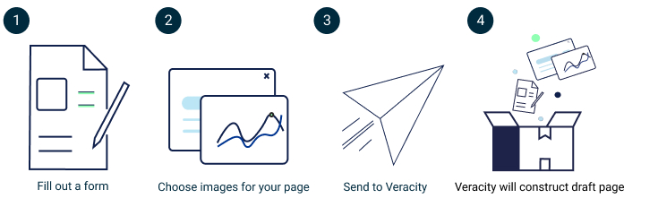
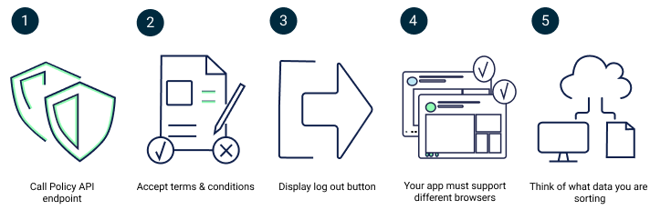

# Onboarding

## Why onboard to the Veracity platform?

The onboarding process is here to help you in your quest to reach your customers through Veracity.

**The Veracity Marketplace will allow you to significantly lower the cost of goods sold. Your customers can click-accept the terms & conditions and pay with credit card or invoice, with instant provisioning of access to your service (if technically feasible)**  

We also offer simple setups where you list your product and Veracity handles payment, but you handle the provisioning of the service. This is relevant for services with a custom/tailored setup for each customer, or where instant provisioning is not possible for technical reasons. 

By going through our onboarding process we ensure together that your project reaches the Veracity Marketplace successfully and with minimal delays. 

Reach out to us to discuss your product - we are always excited to hear about new products! Try to involve us as early as possible - we have a lot of experience with best practices for online digital sales and we are eager to help.

## How to onboard a service

The three main requirements you need to ensure are:

<figure>
	
</figure>

1. Marketplace requirements
2. Technical requirements
3. Legal requirements (only for DNV apps) 

This post will explain the main process of onboarding your application/service to Veracity. 

When we say something is “on Veracity” we mean two different things:
1. The application is available through Veracity Marketplace.
   or
2. The application uses Veracity technology like Veracity Identity login. 

Many applications are both available through the marketplace and use Veracity technologies. 

The reason why there is an onboarding process is to maintain some minimum technical standards for applications using Veracity tech, as well as creating a coherent look and feel to the Veracity Marketplace.  

There are also legal requirements! But these mainly apply for DNV services. A service owned by a non-DNV will need to conform to some platform standard agreements. As a developer it is often tempting to use software components not owned by your own company, but that has its risks. 

The Veracity onboarding team will help you throughout this process, you don’t have to go through this alone. We are here to guide you!

You can reach us at  [onboarding@veracity.com](mailto:onboarding@veracity.com)

   
Marketplace requirements

Marketplace requirements:

There are some strict limits on what you can do on your own Veracity Marketplace page. 
See more details here:

[Marketplace - Service presentation](https://developer.veracity.com/services/marketplace)

Learn about the Veracity marketplace

<figure>
	
</figure>

1. Fill out the form. TODO: link
2. Choose some images for your page. TODO: images
3. Send to Veracity.
4. Veracity will construct and draft your page.

We also have the option for self-service of the marketplace pages after the initial draft has been created. Let us know if you’d like access to the self-service tool. 
We’ll iterate together on your marketplace page until you are happy.

Recommendations:
- Keep in mind that not all existing business models work well with online digital sales.
- It does not make sense to cram 47 different product variants on a single marketplace page.
- Keep it to 3-4 product variants maximum, with the option for a “contact us to learn more” approach for more complex variants.
- It is common for 1 or 2 of your product variants to represent a vast majority of your sales - focus on these variants!
- Think about the product variants you see in your daily life online - be it on Netflix, Spotify or any other digital platform.
- Make it easy for your customers to buy! Limit the amount of choices, and make it super clear to your customer what it is they are purchasing.

   
Technical Requirements

Tech requirements are found here:

[Onboarding your service to Veracity - technical requirements](https://developer.veracity.com/article/veracity-technical-requirements)

<figure>
	
</figure>

1. You have to call the Policy API endpoint. This enforces terms-acceptance for users.
2. Users who have not accepted the latest terms & conditions should not be allowed into your app if they use their Veracity account for login.
3. You have to display a logout button.
4. Your app must support different browsers.
5. And you have to think about what sort of data you are storing. If you are storing personal data, then some additional requirements kick in.

   
Legal Requirements

Legal requirements  summarized (only relevant for DNV apps):

All DNV-owned apps need their own set of terms & conditions to provide a legal framework which follows DNV contracting principles. It is important with a tailor made set of terms and conditions for each service to capture legal risks unique for _your_ service.

<figure>
	
</figure>

We are interested in three main topics: 

1. You need to ensure that you have updated agreements for use of intellectual property not owned by DNV.
2. You need to ensure that you are up to date on GDPR requirements.
3. You have to read the license text.

We’ll ask the following questions:
- Are you using any 3rd party data?
- Are you using any 3rd party components?
- Do you have contracts in place regulating your use of this 3rd party stuff?
- Are you using open source components, and if so, have you looked at the licenses regulating your use of these components? Licenses like GPL and LGPL can contain clauses which can restrict DNV’s ability to sell the product and use of these licenses must be reviewed together with the Veracity onboarding team.
- Have you implemented cookie-consent if it is a webapp? 
And if you are storing personal data, we have to inform our users!

So you have to tell the lawyers so they can create good service-specific terms & conditions for your service. 

We recommend using Snyk to get a good overview of the licenses for your software components (“dependencies”).

**Always read the license text.** They are often quite short, so not a lot of effort. 
There are three categories of open sources licenses you should be aware of: 

1. Permissive licenses, like MIT, Unlicense, Apache 2.0. Permissive licenses are rarely problematic.
2. Hybrids/weak copyleft, like MPL 2.0, LGPL. You must read the license text very carefully in the context of your usage of the dependency. These can create problems if you are not careful, but they are often unproblematic.
3. Copyleft, like GPL and EUPL. These are often problematic and should be avoided. Do your utmost to use another dependency with a more permissive license. If you cannot remove them you must read the license text carefully. Different copyleft licenses may have mutually exclusive requirements, so having two or more copyleft licenses might make your app impossible to legally distribute.

Some public resources concerning licenses:

[Overview with description of most common licenses](https://choosealicense.com/licenses/)

[Table view of common licenses. Rule of thumb: The more blue dots, the more problematic the license.](https://choosealicense.com/appendix/)

[Another resource with overview of licenses](https://opensource.org/licenses)

DNV has good relations with our suppliers of software and components, but some of these contracts are ageing. An example would be a valid contract that allows DNV to use a software in exchange for royalties, however the agreements explicitly lists floppy disks or CD-ROM as the distribution method of the software. That doesn’t support DNV’s preferred delivery model today, and we need to update contracts like these even if both DNV and the software supplier are happy with the status quo. 

