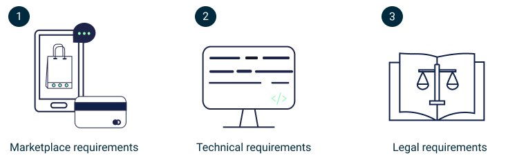

# Legal requirements
This is an overview of legal requirements for onboarding DNV apps on Veracity. For non-DNV applications, ask the [onboarding team](mailto:onboarding@veracity.com) for assistance.

If you work for DNV, ensure that your app meets the following requirements:
* You have updated agreements for use of intellectual property not owned by DNV.
* Your app meets current GDPR requirements.
* You have read licenses for components you use, and your app complies with them.

Note that all DNV-owned apps need their own set of terms & conditions to provide a legal framework which follows DNV contracting principles and covers their unique risks.

<figure>
	
</figure>

To onboard a DNV-owned app, contact the [onboarding team](mailto:onboarding@veracity.com). Prepare to answer the following questions about your application:
* Are you using any third party data?
* Are you using any third party components?
* Have you entered in necessary legal agreements for using third party data and components?
* Are you using open source components? If yes, do you comply with their terms & conditions?
* Are you storing personal data?

Regarding open source licenses, they usually fall into three categories:
* Permissive licenses, like MIT, Unlicense, Apache 2.0. Permissive licenses are rarely problematic.
* Hybrids/weak copyleft, like MPL 2.0, LGPL. These types of licenses are usually unproblematic, but read the license text carefully.
* Copyleft, like GPL and EUPL. These are often problematic and should be avoided. If you use two licenses of this type, this would probably make the distribution of your app impossible. Because of that, try to use another dependencies with more permissive licenses.

Veracity recommends using [Snyk](https://docs.snyk.io/products/snyk-open-source/licenses/getting-started-snyk-licensing-compliance) to get a good overview of the licenses for your software components (“dependencies”).
	
## DNV reference materials
To learn more about DNV policies regarding licenses, go to the links below.
* [DNV Policy Guidance Document](https://dnv.sharepoint.com/sites/intranet/support/finance/Documents/2022%20IPR%20Nissen%20Group%20Legal/01%20Appendix%201%20Policy%20Guidance%20Document%20FINAL%20220516%20Group%20Legal%20intranet%20page%20220603%28396653.1%29.pdf)
* [Use of third party IPR](https://dnv.sharepoint.com/sites/intranet/support/finance/Pages/Use-of-third-party-IPR.aspx?OR=Teams-HL&CT=1655730337181&params=eyJBcHBOYW1lIjoiVGVhbXMtRGVza3RvcCIsIkFwcFZlcnNpb24iOiIyNy8yMjA1MDEwMTAwOSJ9).
* [DNV Policy for Open Source Software](https://dnv.sharepoint.com/sites/intranet/support/finance/Documents/2022%20IPR%20Nissen%20Group%20Legal/00%20Policy%20Open%20Source%20Software%20FINAL%20220506%20Group%20Legal%20intranet%20page%20220603%28396651.1%29.pdf)
	
## Public licenses reference materials
To learn more about public licenses, go to the links below.
* [Overview with description of most common licenses](https://choosealicense.com/licenses/)
* [Table view of common licenses.](https://choosealicense.com/appendix/)
* [Another overview of licenses](https://opensource.org/licenses)
