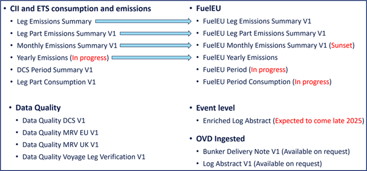
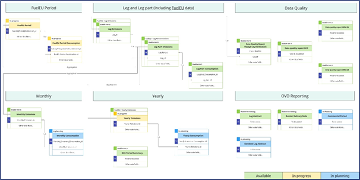

# OVD Egest Data 
The  **OVD Egest Data** is based on submissions made in accordance with the Operational Vessel Data (OVD) standard. The OVD data has been processed by DNV through validation, enrichment, data quality control and verification steps to support a variety of emissions use cases.

The goal is to provide customers with access to the complete datasets as available in Emissions Connect through the Veracity Data Workbench — including not only the data displayed in Emissions Connect, but also more detailed and comprehensive datasets intended to support deeper analysis and smooth integration with other services.

## Four categories of datasets
1.	**CII and ETS consumption and emissions**
Includes verified data on fuel consumption, emissions, and voyage-specific metrics focused on CII and ETS. Available at multiple levels of granularity:
- Voyage leg part
- Voyage leg
- Monthly
- Yearly and DCS reporting period
2.	**FuelEU**
Structurally similar to the CII and ETS datasets, with additional columns and attributes specific to FuelEU Maritime compliance, such as:
- Actual and target GHGIE
- Compliance balance
- Penalty cost
3.	**Data Quality**
Provides insights into data completeness, consistency, and the results of quality checks — including voyage leg verification (VLV) performed during the verification process and MRV and DCS regulatory compliance.
4.	**Event-Level Data (Planned for release in late 2025)**   
With the ingested OVD data as basis, without any aggregation, enrichments have been added like MRV/ETS/FuelEU scope, type of voyage the event belongs to, data quality status of the event, calculated measures on lowest level, AIS based measures, etc. This dataset can be used to feed back to source systems to enrich the original datasets.

## Overview of the available datasets on Veracity Data Workbench
<figure>
	
</figure>

Additionally, ingested OVD data is available upon request through the Data Workbench. These datasets have undergone validation but do not include enrichment or data quality enhancements. Currently available datasets include **Log Abstract** and **Bunker Delivery Note**, with **Commercial Period** and **Cargo Nomination** to be added in future updates.

The overview below illustrates the available, upcoming, and planned datasets, along with their interrelationships.
<figure>
	
</figure>

If the image is too small, open it with the button below.

 

   

## Dataset descriptions 
- **Leg Emissions** contains emissions data aggregated to the vessel and berth to berth voyage leg level. Each row represents the emissions data for a single vessel on a specific voyage leg. It also includes the leg CII score and rating.

- **Leg Part Emissions** contains emissions data aggregated to the vessel and voyage leg part level. Each row represents the emissions data for a single vessel on a specific voyage leg part. A voyage leg may be divided into parts based on business requirements, such as the start of a new voyage or a new month. It also includes the leg CII score and rating. 
**FuelEU Leg Part Emissions** contains additional FuelEU compliance-related columns. This includes actual and target GHGIE, compliance balance and penalty cost.

- **Leg Part Consumption** contains fuel consumption and emissions data aggregated to vessel, voyage leg part, fuel type, and consumer type. Each row represents the total consumption of a specific fuel type for a single vessel and consumer type (e.g., main engine, auxiliary engine) within a voyage leg part.

- **Monthly Emissions** contains emissions data aggregated to the vessel level and month. Each row represents the total emissions for a single vessel in a specific month.

- **IMO - Yearly Emissions** contains emissions data aggregated at the vessel level for each calendar year. Each row represents one vessel and its corresponding annual data. The dataset also includes the vessel’s annual CII score and rating. For the current year, the data reflects year-to-date values.

- **EU - Yearly Emissions** contains emissions data aggregated at the vessel level for each reporting year. Each row represents one vessel and its corresponding annual totals. All unspecified elements in this schema represent total values within the scope of the EU, relevant for both MRV and ETS regulations. For the current year, the data reflects year-to-date values.

- **Yearly Consumption (Blend)** contains fuel consumption and emissions data aggregated by year, vessel, fuel type or blend, consumer type, GHG intensity, and lower heating value (LHV). Each row represents the total consumption of a specific fuel type or blend, along with its associated GHG intensity and LHV, for a given vessel and consumer type (e.g., main engine, auxiliary engine) over the entire year.

- **Yearly Consumption (Component)** contains fuel consumption and emissions data aggregated by year, vessel, fuel type, ETS CO₂ conversion factor, and consumer type. Each row represents the total consumption of a specific fuel type, along with its corresponding CO₂ conversion factor, for a given vessel and consumer type (e.g., main engine, auxiliary engine) over the entire year.

- **FuelEU Leg Part Emissions** contains emissions data aggregated to the vessel level for each year. Each row represents one vessel and its yearly data. For the current year, the data reflects year-to-date values. It also contains additional FuelEU columns in addition to this dataset. This is a temporary schema and will be replaced by new FuelEU schemas.

- **DCS Period** contains aggregated emissions and fuel consumption data for each DCS reporting period. Each row corresponds to one vessel's reported emissions and fuel consumption during a specific period, categorized by the vessel's document of compliance holder and flag state. It also includes the verification status of the reported data. Note: A vessel may appear multiple times in the dataset.

- **Data Quality Report Voyage Leg Verification** includes all checks applied during the Voyage Leg Verification (VLV) process, including those required for MRV and DCS compliance.

- **Data Quality Report MRV-EU** includes all checks according to MRV-EU requirements. Granularity depends on the type of check. It can be an event, a voyage leg, or year-to-date.

- **Data Quality Report MRV-UK** includes all checks according to MRV-UK requirements. Granularity depends on the type of check. It can be an event, a voyage leg, or year-to-date.

- **Data Quality Report DCS** includes all checks according to DCS reporting requirements. Granularity depends on the type of check. It can be an event, or a reporting period.

- **Log Abstract** contains raw data extracted from OVD Log Abstract Interface. This is data as it was delivered to OVD by the customer.

- **Bunker Delivery Note** contains raw data extract from OVD Bunker Report. This is data as it was delivered to OVD by the customer. 
