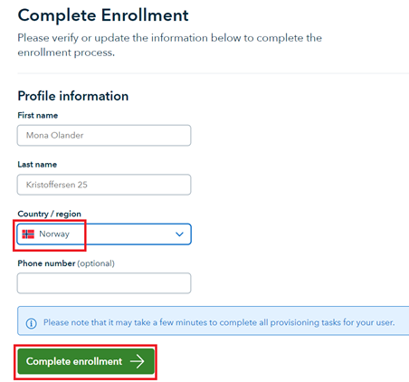

# Implementation
1. Make sure you have an account in your Azure AD with the **Application administrator** or **Global administrator** role (this is required to do Admin Consent of the application that configures the SSO with Veracity).
2. Open a browser in InPrivate/Incognito mode.
3. Go to the following link:
**TO BE ANNOUNCED**

4. Log in with the account that has the **Application administrator** or **Global administrator** role.
5. You will see a picture similar to the one below.
    - What you consent to is that this app is allowed to sign user in and read profile data for the signed-in user. This is necessary for Veracity to get back necessary data on which user is logging in.
    - Handling of the profile data is controlled by the [Veracity Terms of use](https://id.veracity.com/terms-of-use "Veracity Terms of use") and [Privacy statement](https://services.veracity.com/PrivacyStatement "Veracity Privacy statement") which all users must personally accept before they can use the Veracity platform.
    - When you click **Accept**, an app will be installed in your **Enterprise applications** blade in your Azure AD with the name **VeracityFederationApp**. This is the app that controls the trust relationship between Veracity and your Azure AD. In order to remove the admin consent that was granted above, you can just delete this app.
     - Make sure the message states **all users** and then click **Accept**:
     
    <figure>
	
	<figcaption></figcaption>
    </figure>

6. Once the previous steps are done, you will be redirected to a page where we will gather more information from you and also perform an analysis of your (if any) existing user base in Veracity. The main steps are the following:
    - You will be asked to input the email domain(s) for which you want the SSO to be set up
        - Note that these domains must match what is in the **mail** attribute of your users' accounts in Azure AD
    - To prove that you own the domain, you will be asked to register a TXT record in your DNS. The verification of this may take some time.
    - You will be asked to input your technical contact and support contact email addresses and also accept our Terms of Use.
    - A process will be started to analyze your (if any) existing user base in Veracity. If we find any issues that might not work well with SSO, we will stop the process and contact you for manual cleanup. If no issues are found and the DNS records are verified, you will be presented with a **Submit** button and once you click this, we will continue to configure the SSO on our side. The whole process, after clicking the **Submit** button, should take 5-10mins.

7. Find the **VeracityFederationApp** in the **Enterprise applications** blade in your Azure AD. In order for your users to be able to use the SSO, you need to make sure to add your users on the **Users and groups** blade.
    - We recommend that you make sure all your users can use the **VeracityFederationApp** app by adding all users (or a group that contains all your users):
    
    
    - Alternatively you can set **Assignment required** (**Properties** blade) to **No**, in order to automatically add all your organization's users:
    
    - The SSO is implemented so that when your users type their email address on the Veracity logon page, we will, based on the email suffix of the users, redirect the users to your Azure AD for authentication. This means that if there are users from your company that are not assigned to the **VeracityFederationApp**, they will not be able to use Veracity at all.
 
 
 
# Verification
1. When the SSO is set up, you can verify that it works by going to the Veracity Home page [https://www.veracity.com](https://www.veracity.com), and press **Log in** in the upper right corner:
    <figure>
	
	<figcaption></figcaption>
    </figure>
2. Specify your email address and click **Continue**:
    <figure>
	
	<figcaption></figcaption>
    </figure>
3. You should now be redirected to your Azure AD tenant and be authenticated there.
4. If you have never logged on to Veracity before, you will see an enrollment page where you need to specify your country and thereafter accept terms of use. This step is required for all users logging in to Veracity for the first time:
    <figure>
	
	<figcaption></figcaption>
    </figure>
    <figure>
	
	<figcaption></figcaption>
    </figure>
5. You should then see the logged-in version of the Veracity Home page where your initials are shown in the top right:
    <figure>
	
	<figcaption></figcaption>
    </figure>

# Support
If you have any issues with the above, please contact us at [support@veracity.com](mailto:support@veracity.com).

