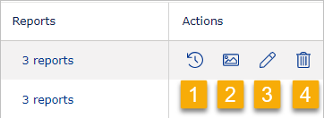
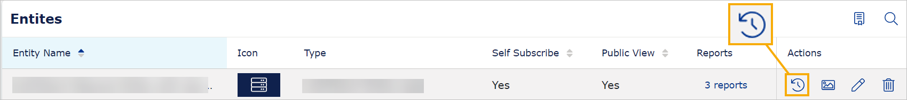

# Entities

* An entity can contain one or more reports or other content types.
* An entity allows you to share access to end users.
* An entity serves as a way of grouping and structuring reports.
* An entity represents top-level concepts such as companies, projects, or assets.

To visualize an entity, imagine your VAP service as a filing cabinet. Entities are the folders within, and Power BI reports, PDFs, images, and web apps are the documents inside those folders

## To filter and sort
You can filter and sort most of the columns in your VAP service. For help, go the [Overview page](overview.md).

## To manage entity types
You can manage entity types if you are a Data Admin or System Admin user.

To manage entity types, in the upper right corner, select **Entity Types**. In the window that appears, you can do the following:
* Add an entity type.
* Edit an entity type.
* Delete an entity type.

<figure>
	
</figure>

## To manage entities
The "Entities" page shows all entities created in your VAP service. To sort entities by a specific column, select the column header.

In the right corner of each row, in the **Actions** column, you can:
* View history (1).
* Add an icon to the the entity (2).
* Edit the entity and view its ID (3). Note that you can drag and drop the reports to arrange their order.
* Delete the entity (4).

<figure>
	
</figure>

## To add an entity

To add an entity:
1. In the top right corner, select the plus icon. Alternatively, in the left navigation sidebar, select the plus icon and **Add Entity**.
2. In the **Title** field, provide the internal name of the entity. This name is visible only to administrators. By default, it will be used to generate the entity's URL
3. Optionally, deselect the toggle **Use Title as Entity URL Name** and then in the **Entity URL name** field provide a custom URL for the entity. The URL name must be unique and cannot contain spaces or special characters. You can use alphanumeric values, underscore, and hyphen.
4. In the **Type** dropdown, select the type of the entity you want to create.
5. To allow users to add themselves to the entity, toggle Allow Self Subscribe (a blue toggle indicates it's enabled). If you are creating a demo entity, this access might be suitable. If this option is disabled, contact your VAP System Admin user, or if this is you, go to the "Config" tab to enable it.
6. If you want users to access the entity without signing in to Veracity, toggle **Allow Public View**. This option might be suitable for a freemium model.
7. In the **Reports** dropdown, select one or more reports that should be available to the users who will have access to the entity you are creating. Then, click the **Add to Report List** button.
1. Decide whether to **Show report's parameter(s) and value in Entity display in Home page**, and if so, toggle the setting.
8. In the right corner, select the **Save** button.

Note that when using **Allow Self Subscribe** or **Allow Public View**, the data you share is publicly available. Because of that, ensure it does not contain client secrets or personal data.

Note that if one or more reports use Row Level Security, enter the value in the **Value** field under the **Row level security configuration** section.

## Allow Public Access
You can enable Public Viewer to let anyone access a report or another entity via URL and without signing into Veracity.

To enable or disable Public Viewer:
1. Go to the **Entities** page and find the entity for which you want to enable or disable Public Viewer.
2. In the "Actions" column, select **Edit**.
3. Next to **Allow Public View**, toggle it on or toggle it off. When the toggle is off, it is grey and users can't access the entity via URL without signing in.
4. At the right bottom, select the **Save** button to confirm your changes.
5. Go to the Home page and interact with the entity and report to see the **Generate a Link** icon. Click it and copy the URL to the public viewer.

Note that Public View may not be available for all services. If it is disabled on the Config > Tenant Properties page, contact VAP support to request enabling it.

### Copy link to a publicly accessible entity
As an admin, you can go to a report with Public Viewer enabled, and **Generate a link** that can be used to access this report without signing into Veracity.
<figure>
	
</figure>

## Allow Self Subscribe
If you toggle on Allow Self Subscribe, you let user self-register to access the entity.

To enable self-subscribe, start by checking your tenant's settings:
1. Go to the [Config page](configure.md) and under Category, select **Tenant Properties**.
1. In the top right corner, select **Edit**.
1. Ensure that **Allow Self Subscribe** is set to **Yes**.
1. Optionally, for **Notified Group**, select the type of users that will get notifications when a users self-registers to the entity.
1. Go to the **Entities** page and find the entity for which you want to enable Allow Self Subscribe.
2. In the "Actions" column, select the **Edit** icon.
1. Toggle on **Allow Self Subscribe**.

When Self Subscribe is enabled, the entity on the Home page will show a tag "Self Subscribe," indicating to signed-in users that they can share the URL to the entity with their colleagues and they can self-register to get access to it.
Note that users can share their personal bookmarks.

### To limit domains that can self-subscribe
When you edit an entity, you can set a list of domains from which emails are allowed to self-subscribe to the entity. You can use it to restrict access to people from certain domains such as "@dnv.com" or "@your.company.domain.com".

To restrict access to an entity to the specified domains:
1. Go to the **Entities** page and find the entity for which you want to enable Allow Self Subscribe.
2. In the "Actions" column, select the **Edit** icon.
3. Toggle on **Only Allow Specific Email Domains to Self-subscribe** and under **Email Domain List**, add domains from which users can self-register to your entity; for example, you can add "@dnv.com".

## Entity statistics

For each entity, you can see when it was accessed from the Home menu and by whom. You can also see the number of interactions with the entity (year to date). To do so, in the row with the entity, select the icon below and then select the **User Visit History** tab in the pop-up window that opens. Here, you can sort and filter the data.

<figure>
	
</figure>