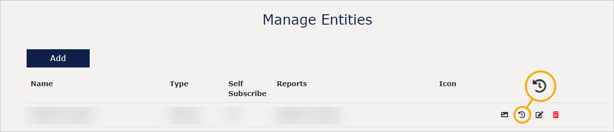

# Entities

An entity:
* Can contain one or more reports or other content types.
* You share access to end users to one or more entities.
* Is a way of grouping and structuring your reports.
* Represents the top-level concepts such as companies, projects or assets.

To understand better what an entity is, think of your VAP service as a filing cabinet. Then, entities would be folders inside this cabinet. Finally, Power BI reports, PDFs, images, and web apps would be documents within a folder inside the filing cabinet.

## To manage entities
The "Manage Entities" page shows all entities created in your VAP service. To sort them by a specific column, select the column. 

In the right corner of each row, you can:
* Add an icon for the entity.
* See history.
* Edit the entity and see its ID.
* Delete the entity.

The actions above are listed from the first to the last icon from the left.

## To add an entity

To add an entity:
1. Select the **Add** button.
2. In the **Title**, provide the internal name of the entity. It will be shown only to admin users. By default, the title will be used to create the URL for the entity.
3. Optionally, deselect the toggle **Use Title as Entity URL Name** and then in the **Entity URL name** field provide a custom URL for the entity. The URL name must be unique and cannot contain spaces or special characters. You can use alphanumeric values, underscore, and hyphen.
4. In the **Type** dropdown, select the type of the entity you want to create. If you are a System Admin user, you can add more types to the dropdown list from the "Configure" tab.
5. If you want users to be able to add themselves to the entity, select **Allow Self Subscribe**. If you are creating a demo entity, this access might be suitable. If this option is disabled, contact your VAP System Admin user or, if this is you, go to the "Configure" tab to enable it.
6. If you want users to access the entity wihout signing in to Veracity, select **Public View**. If you are creating a freemium model, this might be suitable.
7. In the **Reports** dropdown, select one or more reports that should be available to the users who will be shared access to the entity you are creating.
8. In the right corner, select the **Add** button.

Note that, when using **Self Subscribe** or **Public View**, the data you are sharing is avaliable to everyone with an access. Because of that, ensure it does not contain client secrets or personal data.

## Entity statistics

For each entity, you can see when it was accessed from the Home menu and by whom. You can also see the number of interactions with the entity (year to date). To do so, in the row with the entity, select the icon below and then select the **User Visit History** tab in the pop-up window that opens.

<figure>
	
</figure>
