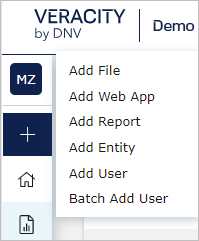
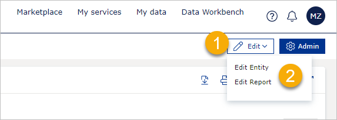
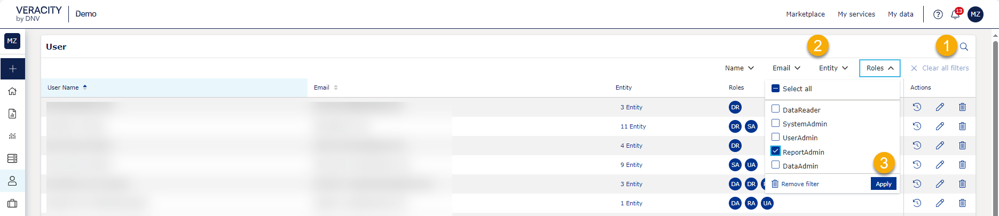
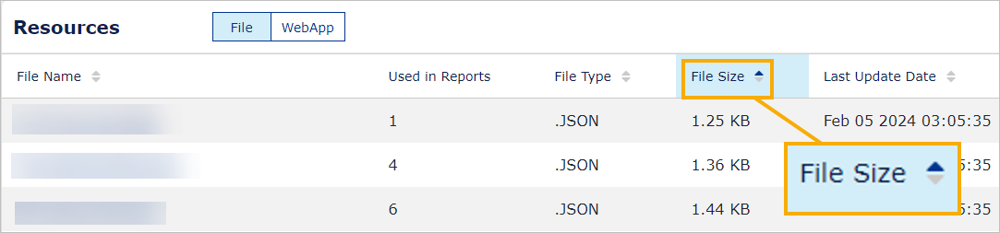

# Admin tab overview

To do administrator tasks in Veracity Adapter for Power BI (VAP), [sign in to your VAP service](../reading-reports/overview.md), and select the **Admin button**. Note that your [user role](../user-roles.md) might not give you access to all the tasks.

If you are a SystemAdministrator, in the left sidebar, you can see the full list of tasks:
* Create - Create a resource. You can add a file, web app, report, entity, user or batch add users.
* Home - Go to your Home page.
* [Resources](resource.md) - In the **File** subtab, upload and delete files. Supported formats are PBIX, PDF, PNG, JPEG, GIF,JSON. In the **Web App** subtab, [manage web applications](manage-webs.md).
* [Reports](manage-reports.md) - Select reports and connect them to files or web applications and set properties.
* [Entities](entities.md) - Create entities and connect them to reports, documents, PDFs, and web applications.
* [Users](users.md) - Create, edit, and delete users. Assign and revoke user roles and entities.
* [Background Jobs](background-jobs.md) - See and delete the jobs that run in the background (for example, batch add users).
* [Activity Statistics](statistics.md) - See statistics for your reports or entity.
* [Config](configure.md) - Config scaffolding and other properties.

## To create a resource
No matter where you are in VAP, you can create a resource in the following way:
1. When you are interacting from Home, select the **Admin** button.
2. In the left sidebar, select the plus icon.
3. Select the resource type you want to create.
<figure>
	
</figure>

## To edit a resource from Home
As a System, Report or Data Admin, you can now edit a report or entity. To do it, on the **Home** page, select a report or entity you want to edit.
1. In the top right corner of the page, select **Edit**.
2. Select either **Edit Entity** or **Edit Report**. This will open the current entity or report.
<figure>
	
</figure>

Make changes to your report or entity. To save changes, select **Save**.

## Filtering and sorting
On most pages, you can filter and sort data. Below is an example of how to use on the Users page.

**To filter**, in the right corner, select the magnifying glass icon, select a filter, select filter settings, and select the **Apply** button.

To hide filtering options, select the magnifying glass icon again.

<figure>
	
</figure>

If you can sort a column, it has two arrows next to its name. The arrow in the dark blue colour shows the current sorting direction. For example, if the bottom arrow is dark blue, the column is sorted in the descending order. 

**To change the column's sorting order**, select the column's name.

<figure>
	
</figure>