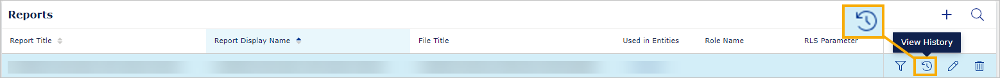

# Reports
This page describes administrator tasks you can do to create and edit reports.

## To upload a file
1. In the left navigation sidebar, select the plus icon.
2. Select **Add Resource File**.
3. Under **File Name**, name the file.
4. Then, drag and drop the file from your local machine onto **Drop file here or click to upload** or select **Drop file here or click to upload** to add the file from your local machine.
5. In the bottom right corner, select **Save**.

## To refresh a report with new content 

If your Power BI report contains imported data and you want to show its newer version with the fresh data, refer to [Resources](resource.md#refresh-schedule-plan).

## To change to the latest file version 

If you need to replace a file with a newer version, upload the file again in the **Resources** section. Then, edit the report here to connect to the latest file. It will allow your user to interact with the last version of the file.

## To create a new report
1. In the left navigation sidebar, select the plus icon.
1. Select **Add report**.
1. Under **Report Type**, select the type of the report that you want to add (either "Power BI / Paginated / PDF / Image" or "Web App"). Note that for the paginated report type, when you create an RDL file, the legacy report settings fields are not displayed.
2. In the **Display name**, name the report. This is the name that will show in the Home menu.
4. If you want to create a custom URL for your report, deselect the toggle **Use Display Name as Report URL Name**. Then, in the field **Report URL name** provide your custom URL for the report. The URL name must be unique and can't contain spaces or special characters. You can use alphanumeric values, underscore, and hyphen.
5. Optionally, in the **Description** field, describe your report for the end users. Note that currently we don't show the description to the users.
6. From the **File title** dropdown, select what file you want your report to connect to.	
7. Under **Report Feature**, you can let users print and download the report. This is optional. To allow printing the report, toggle on **Print**; to allow donwloading the report, toggle on **Download**.
10. Under **Connect Tutorial**, you can select which tutorial for your report should be shown to the users. You can use tutorials to present new features, teach users how to read your reports, and so on.
11. To save and add the report, in the bottom right corner, select **Save**.

**If you didn't find the file you needed** to create the report, upload the file, and try again.

## To add a new Web app

To add a new Web app report:
1. In the left navigation sidebar, select the plus icon.
2. Select **Add Web App**
3. Under **Root URL**, provide the full root URL to your web app (use HTTPS).
4. Read the legal disclaimer below Root URL, and toggle on **I accept and understand...**. Note that you can't add a web app without accepting our terms of use.
5. Under **Display name**, provide the name that will be visible to everyone.
6. Optionally, in the **Description** field, describe your Web App for the end users. Note that currently the description is not shown to the users.
7. Read **Personal data policy** and, below it, select the options that applies to your web app ("I hereby confirm...").
8. Optionally, toggle on any of the following: Enable Dedicated Domain Name, Enable Service Worker. Single page application, Host In One Gateway, Attach User Token. If you need more information on any of them, hove over the "i" icon next to the name of the option to see a tooltip.
9. Select **Check connection**. If the check is unsucessful, troubleshoot the issues.
10. To confirm adding a Web App, in the bottom right corner, select **Save**.

## To add a report filter
1. In the row with the report, in the **Actions** column, select the **Report Filter** icon.
2. Select the filters that you want to apply to the report.
3. In the right corner of the window, select the **Save** button.

Note that the **Report Filter** icon needs to be enabled in Config tenant properties to appear in the Reports user interface.

## To see report statistics

You can see who and when interacted with the report for each report. You can also see the number of interactions with the report (year to date) and the entity that was used.

To do so:
1. In the row with the report, select **View History** (the icon from the picture below).
2. Select the **User Visit History** tab. Note that you can sort and filter the data.

<figure>
	
</figure>

## To edit report
1. In the row with the report, in the **Actions** column, select the editing icon.
2. Edit the report.
3.  In the right corner of the window, select the **Save** button.

### To enable or disable bookmarks in a Power BI report
When you edit a report, you can enable or disable personal and report bookmarks. Bookmarks work like links and allow users to navigate to the parts of the report they were created on. For details, go [here](../reading-reports/bookmarks.md).

To enable or disable personal bookmarks:
1. Choose a report and in the right corner of the row, select the editing icon.
2. Under **Report feature**, toggle on **Bookmark**. Alternatively, to disable bookmarks, toggle it off.
3. In the right corner of the window, select the **Save** button.

To report bookmarks (the bookmarks that were created by the report author):
1. Choose a report and in the right corner of the row, select the editing icon.
2. Under **Report feature**, toggle on **Bookmarks based on report file**. Alternatively, to disable report bookmarks, toggle it off.
4. In the right corner of the window, select the **Save** button.

### Deleting user bookmarks in a Power BI report

A personal bookmark is associated with the User GUID, Entity ID, and Report ID. If you do one of the actions below, it will be deleted.
* Delete any of the elements the bookmark is associated with.
* Remove the entity, report or the report object on which the bookmark was saved.

If you are updating the report by changing the reference for the report file from one PBIX file to another, VAP will ask if you want to preserve users' personal bookmarks. If you have done major changes to the report, preserving the bookmarks is not recommended.

### Role name
In the **Role name**, if you have enabled [Row Level Security (RLS)](../data.md), provide the role name as defined in your PBI report (Manage roles > Roles).

### Role level security
In the **Row level security parameter**, if you have enabled [RLS](../data.md), provide filter key and from the dropdown, select its type.

## To delete a report
1. In the row with the report, in the **Actions** column, select the **Delete Report** icon.
3.  In the right corner of the window, select the **Delete** button.