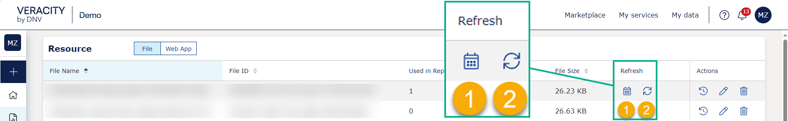

# Resources

The 'Resources' tab consists of the **File** subtab (that opens by default) and the <a href="#webapp">**Web App** subtab</a>.

Resources are shown in a table and each resource is presented in one row. Some columns are sortable which is inidcated by arrow symbols next to the column name. To sort the column, select its name.

In the **Actions** column, you can:
* See the history of the changes done to the resource (1).
* Edit the resource (2).
* Delete the resource (3).

<figure>
	
</figure>

## File

Once you have built your report in Power BI, you can upload it into VAP and share access to it with your clients. By default, VAP will use the data sources from the report, but you can override and update them when uploading a file. For details on data sources and security, go [here](../data.md).

In the **File** subtab in the **Refresh** column, you can schedule refreshes (1) or manually refresh (1) data source(s) for a Power BI report or anotehr file with data sources.

<figure>
	
</figure>

### To upload a file

To upload a file:
1. From the left sidebar, select the plus icon and the **Add File** button.
2. Under **File Name**, enter the name for the file. Veracity recommends including in the file name information that would help recognize the latest version of the file, such as, for example, the client's name, the report's date, and the upload date.
3. Under **Uploaded File**, select **Choose File** and select a file from your local machine. Supported file formats are PBIX, PDF, PNG, JPEG, GIF.
4. Under **Personal data policy**, confirm if the file contains no personal data or it contains personal data and you agree to process it according to Veracity DPA.
5. Select the **Upload** button.

If you upload a Power BI report:
* Under **Privacy Level**, select a privacy level for the report. For details, see the 'Privacy Level' subsection below.
* Toggle "I accept and understand that I'm responsible for the content I share in my report".
* Optionally, toggle **I am using Azure Analysis Service** if you are using this service. Using this as a data source will load your data significantly faster than from Azure SQL DB. **Before enabling this toggle**, check the prerequisites under <a href="#AAS">'To use Azure Analysis Service as a data source'</a>.

Note that:
* If you are using a database for the first time in VAP, use the icons from the warning message to set the credentials for the database.
* If your data source cannot be automatically refreshed, you can either check whether your data is stored in a [location supporting refreshable data sources](../data.md) or accept the default fix (no automatic data refresh) and do manual data updates by replacing the file with your report.

### To use Azure Analysis Service as a data source

To be able to load data, add a Veracity VAP service account to your Azure Analysis Services Cube for PowerBI:
* If your VAP service URL starts with insight.**dnv**.com, add 'srvPBIAppPBIEProd@dnv.onmicrosoft.com' to your Azure Analysis Services Cube for PowerBI.
* If your VAP service URL starts with insight.**veracity**.com, add 'srvPBIAppPBIEProdVAP@dnv.onmicrosoft.com' to your Azure Analysis Services Cube for PowerBI.

When uploading your report file, enable 'I am using Azure Analysis Service'.

After this, VAP will pass the Veracity user 'GUID' (the unique Veracity user ID) to the 'CustomData' field in your report. The CustomData feature lets you add a Row filter in your Power BI report. Then, your report can control what Power BI data the user can view.

For more information, refer to [Power BI documentation](https://eur01.safelinks.protection.outlook.com/?url=https%3A%2F%2Fdocs.microsoft.com%2Fen-us%2Fpower-bi%2Fdeveloper%2Fembedded%2Fembedded-row-level-security&data=05%7C02%7CMichal.Zieba%40dnv.com%7Cf56e31065363481d6fdc08dbfc95dc7e%7Cadf10e2bb6e941d6be2fc12bb566019c%7C0%7C0%7C638381492816141580%7CUnknown%7CTWFpbGZsb3d8eyJWIjoiMC4wLjAwMDAiLCJQIjoiV2luMzIiLCJBTiI6Ik1haWwiLCJXVCI6Mn0%3D%7C3000%7C%7C%7C&sdata=l%2FsdbYT6obGcAl6T8ijvWheeWEariONKXRPzvPFYKOE%3D&reserved=0).

### Privacy Level

There are the following privacy levels:
* None - Before this release, it was the default setting.
* Organizational
* Private
* Public

For details on privacy levels, go [here](https://learn.microsoft.com/en-us/power-bi/guidance/powerbi-implementation-planning-security-content-creator-planning#privacy-levels).

Note that privacy levels set in Power BI Desktop are **not transferred** during the upload. However, after uploading the report, you can set data privacy for each data source separately.

#### For organizational privacy level
Suppose the privacy level in Power BI Desktop data source is organizational. In that case, you must also set it on the data source in your service to avoid issues with refreshing the data source. For details, go [here](https://learn.microsoft.com/en-us/power-bi/guidance/powerbi-implementation-planning-security-content-creator-planning#privacy-levels).

### To set a privacy level for a data source

To set a privacy level for a data source, in the Admin Panel > Manage Files, in the row with the name of the report:
1. Select the editing icon.
2. Select the **Load datasource status** button.
3. Select the icon shown below.
4. For each data source, under **Privacy Level**, select a privacy level.

<figure>
	
</figure>

## Web App 

The "Web app" subtab shows all connections created in your VAP service. 

## To create a new web connection

To create a new web connection:
1. From the left sidebar, select the plus icon and the **Add Web App** button.
2. In the **Root URL**, enter the full root URL to your web application.
3. To accept the legal terms of using the service, below the **Root URL**, enable the toggle **I accept and understand...**
4. In the **Display name**, enter the name that the end users should see when they change between different reports or applications.
5. Optionally, in the **Description** field, describe your web application for the end users. Note that currently the description is not shown to the users.
6. Under **Personal data policy**, confirm if the web app contains no personal data or it contains personal data and you agree to process it according to Veracity DPA.
7. Below **Personal data policy**, you can enable the following toggles:

	Enable Dedicated Domain Name - if your web app requires a dedicated domain name, enable this to enter the domain name.
	
	Enable Service Worker - if your web app uses service workers, enable this and enter the full URL of the JS file where you register the service workers for your web app.
	
	Single page application (SPA) - if your web app is a single page application, enable this, and select your app's framework, and the full URL of the "App.js" file containing routing configuration for your SPA framework.
	
	Host In One Gateway - if your web app is hosted in One Gateway, enable this, and enter your app's Client ID for One Gateway. Then, go to your One Gateway, and allow access for the VAP Web App. Also, allow for VAP to control the authentication. After that, the configuration for your web app will disable URL direct access, making it only valid when interacting from VAP.
	
	Attach User Token - if you want to attach user token in the request header, enable this.

7. Select the **Check connection** button to verify if your web application can connect to your VAP service.
8. After establishing a connection, select the **Add** button to add the connection.
9. After you have added a new web connection, go to [Reports](reports.md) and add your web application to a new or existing report object.
10. After that, go to [Entities](entities.md) and add your web application to a new or existing entity.

For help with connecting your web app to VAP, go to [Veracity Community](https://community.veracity.com/t/how-to-plug-the-web-apps-into-vap/145/3).

