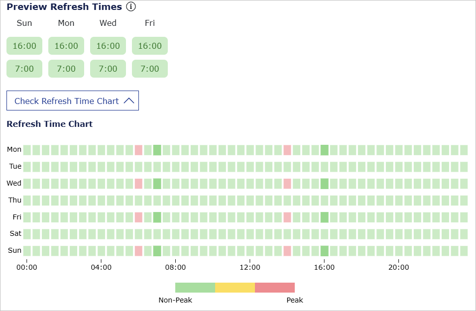
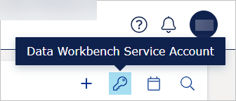

# Resources
The 'Resources' tab lets you manage files (like Power BI reports) and web app connections in your VAP service. It includes two subtabs:
- **File**: Opens by default.
- **[Web App](#web-app)**: Available only for selected services; most services do not include Web App support by default.

## Resources table
Resources are shown in a table and each resource is presented in one row. Some columns are sortable which is inidcated by arrow symbols next to the column name. To sort the column, select its name.

In the **Actions** column, you can:
* See the history of the changes done to the resource (1).
* Edit the resource (2).
* Delete the resource (3).
* Download the resource which file type is .PBIX (4). 

<figure>
	
</figure>

Note that:
* Due to limitations set by Microsoft, you cannot download a large .pbix. It may time out after 4 minutes. If it happens, send a support ticket to get help to download the report. For more information, go [here](https://learn.microsoft.com/en-us/power-bi/create-reports/service-export-to-pbix#limitations-when-downloading-a-report-pbix-file).
* Downloading .PBIX file types is only possible if a System Admin enabled it. To enable the download of Power BI files, on the **Config** page, in the **Tenant Properties**, select **Edit** and toggle on **Allow download Pbix**.

## To upload a file
Once you have built your report in Power BI, you can upload it into VAP and share access to it with your clients. 

By default, VAP will use the data sources from the report, but you can override and update them when uploading a file. For details on data sources and security, go [here](../data.md).

To upload a file:
1. In the top right corner, select the plus icon. Alternatively, from the left sidebar, select the plus icon and the **Add Resource File** button.
2. Under **File Name**, enter the name for the file. Veracity recommends including information like client name, report date, or upload date.
3. Drag and drop the file onto **Drop file here or click to upload**, or select it manually. Supported formats: PBIX, PDF, PNG, JPEG, GIF, RDL.
4. Under **Personal data policy**, confirm if the file contains no personal data or, if personal data is used, confirm you are following the data processing terms that are linked as Veracity DPA.
5. Select **Upload**.

If you upload a Power BI report:
- Set the [**Privacy Level**](#privacy-level).
- Toggle **I accept and understand that I'm responsible for the content I share**.
- Optionall,y toggle **I am using Azure Analysis Service** if you are using this service. Using this as a data source will load your data significantly faster than from Azure SQL DB. Before enabling this toggle, check the prerequisites under <a href="#AAS">'To use Azure Analysis Service as a data source'</a>.

**Note that**:
- For first-time database connections in VAP, use the warning icons to set credentials.  
- If your data source cannot refresh automatically, either ensure it's stored in a [supported location](../data.md) or replace files manually to update data.

### Privacy Level
There are the following privacy levels:
* None - Before this release, it was the default setting.
* Organizational
* Private
* Public

For details on privacy levels, go [here](https://learn.microsoft.com/en-us/power-bi/guidance/powerbi-implementation-planning-security-content-creator-planning#privacy-levels).

Note that privacy levels set in Power BI Desktop are **not transferred** during the upload. However, after uploading the report, you can set data privacy for each data source separately.

### For organizational privacy level
Suppose the privacy level in Power BI Desktop data source is organizational. In that case, you must also set it on the data source in your service to avoid issues with refreshing the data source. For details, go [here](https://learn.microsoft.com/en-us/power-bi/guidance/powerbi-implementation-planning-security-content-creator-planning#privacy-levels).

### To set a privacy level for a data source
To set a privacy level for a data source, in the Admin Panel > Manage Files, in the row with the name of the report:
1. Select the editing icon.
2. Select the **Load datasource status** button.
3. Select the icon shown below.
4. For each data source, under **Privacy Level**, select a privacy level.

<figure>
	
</figure>

## To use a Paginated report
You can upload a paginated report in `.rdl` format. Paginated reports are ideal for certificates, audit findings, purchase orders, or long tabular data.

### Service Principal required
Your VAP service must use a Service Principal account. Legacy Power BI Service Principal setups cannot upload paginated reports.

### Supported data sources
- Databases: Azure SQL.
- Semantic models: Azure SQL, on-prem SQL, Web (API), files (.csv, .xlsx), Azure Blob.

### Reloading and session expiry
- Reports reload after 1 hour of interaction (reload icon will appear).  
- Inactive sessions expire after 10 minutes. Use **'X'** or **'Refresh'** to resume.

## To Schedule Refresh Plans
Admins (Data Admins, Report Admins, and System Admins) can schedule automatic refreshes for Power BI reports to keep data up to date.

1. In the top right corner of **Resources** > **File**, select the schedule icon.

<figure>
	
</figure>

2. In the panel, add, edit, or delete a refresh plan.
3. Set the start time, interval, and number of daily refreshes (up to 48 times per day, every 30 minutes).

**Note that**:
- Refreshes run as background tasks.
- User interactions (like opening or filtering reports) are prioritized, so refreshes may be delayed during busy periods.

## Optimize performance with the Refresh Time Chart
When you add or edit a Refresh Schedule Plan, you can **Preview Refresh Times** to check for the best time to schedule a refresh, and you can also click **Check Refresh Time Chart** to visualize this information.

Peak hours are red, and non-peak hours are green. Try to schedule your refreshes during green hours to get smoother performance.

<figure>
	
</figure>

### Why timing matters
Refresh operations are resource-intensive because they:
- Load new data
- Recalculate models
- Update visuals in the background

In contrast, user clicks (for example, opening a report) are lightweight since they only display already-loaded data.

When too many refreshes run at once, they can slow down the entire VAP service in your region.
By scheduling refreshes during off-peak (green) times, you help maintain good performance for everyone.

**Note that** refresh schedules don't auto-adjust for daylight saving time. Update manually when DST changes.

## To apply a refresh plan
To apply a plan:
1. In a PBIX row, under **Refresh**, select the schedule icon.
2. Pick a plan under **Select a Schedule Plan** and select **Save**.

**Note that** paginated reports (`.RDL`) do not support scheduled refresh.

<figure>
	
</figure>

## To refresh a file on demand
Trigger an on-demand refresh for PBIX or RDL files with semantic models:
1. In the report row, under **'Refresh'**, select **'Refresh Report'**.

**Note that** most semantic models with dynamic data sources can't refresh in paginated reports. [See Microsoft docs](https://learn.microsoft.com/en-us/power-bi/connect-data/refresh-data#refresh-and-dynamic-data-sources).

## Configure Data Workbench Service Account
If your reports use Data Workbench data sets, configuring your Data Workbench Service Account allows the necessary connection details to be automatically filled in whenever needed. This saves you from manually entering them each time you access your data sets.

To configure your Data Workbench Service Account, select its icon in the top right corner and add the following information:
- **Data Workbench workspace ID**: [Check here how to find it](https://developer.veracity.com/docs/section/dataworkbench/apiendpoints#workspace-id).
- **Data Workbench workspace name**: You can find it in your Data Workbench > Workspace > [Details tab](https://developer.veracity.com/docs/section/dataworkbench/workspace#details).
- **[Data Workbench Service Account ID](../../dataworkbench/apimanagement.md)**: Note that you can only add an account with "Grant all workspace data" enabled.
- **[Account Secret](../../dataworkbench/apimanagement.md)**.
<figure>
	
</figure>

## Data Workbench data set ID
When you open a data set, you can find its ID in the URL after `datasets`. For example, in the URL `https://dw.veracity.com/veracity/ws/f6427539-6y63-41d0-8795-b878213631d8/dataCatalogue/datasets/4f7rfb44-b632-4d78-843f-0j15a66k8944`, the part after `datasets/` is the data set ID, which is `4f7rfb44-b632-4d78-843f-0j15a66k8944` in our example.

For more details, go to [Data Workbench documentation](../../dataworkbench/datacatalogue.md).

## To find a SAS token
Your report can use Data Workbench data sets as data source. If it does, you will be prompted to provide a SAS token for this data set. 

To generate a SAS token in Data Workbench UI, follow [the instructions](https://developer.veracity.com/docs/section/dataworkbench/filestorage/filestorage#to-generate-a-sas-token).
To generate a SAS token with Data Workbench API, refer to the API specification:
1. Under Data sets, call the `workspaces/{workspaceId}/datasets/{datasetId}/sas` endpoint to get a readonly SAS token for a workspace data set, including an uploaded data set. [See the detailed instructions here](../file-storage-as-data-source/create-report.md).
1. Under Storages, call the `/workspaces/{workspaceId}/shares/{shareId}/storage/sas` to get a SAS token for a data set in File Storage that was shared with you. [See the Data Workbench API specification for the details on this endpoint](https://developer.veracity.com/docs/section/api-explorer/76904bcb-1aaf-4a2f-8512-3af36fdadb2f/developerportal/dataworkbenchv2-swagger.json).

## Auto-renew SAS token for Data Workbench structured uploaded data sets
You can now automatically renew SAS tokens for Data Workbench structured uploaded data sets (data sets of the Uploaded type that you can find in Data Workbench > Data catalogue > Created data sets).

This ensures your data connections remain active without manual intervention.
If you want to learn more about structured uploaded data sets, [go here](../../dataplatform/concepts/structdata.md).

To enable auto-renewal for a SAS token:
1. Edit your report in the **Resource** section.
2. Click the **Load Data Source** button.
3. For Data Source "Azure Data Lake Storage", under **Data Source Sub Type**, select **DWB Structured Dataset**.
4. Tick the **Auto Renew SAS Token** box. The token will renew automatically once a day at CET midnight.

**Note that** we have a **tutorial** showing how to [**Create a report with a Data Workbench source**](../file-storage-as-data-source/create-report.md).
### To use Azure Analysis Service as a data source

To be able to load data, add a Veracity VAP service account to your Azure Analysis Services Cube for PowerBI:
* If your VAP service URL starts with insight.**dnv**.com, add 'srvPBIAppPBIEProd@dnv.onmicrosoft.com' to your Azure Analysis Services Cube for PowerBI.
* If your VAP service URL starts with insight.**veracity**.com, add 'srvPBIAppPBIEProdVAP@dnv.onmicrosoft.com' to your Azure Analysis Services Cube for PowerBI.

When uploading your report file, enable 'I am using Azure Analysis Service'.

After this, VAP will pass the Veracity user 'GUID' (the unique Veracity user ID) to the 'CustomData' field in your report. The CustomData feature lets you add a Row filter in your Power BI report. Then, your report can control what Power BI data the user can view.

For more information, refer to [Power BI documentation](https://eur01.safelinks.protection.outlook.com/?url=https%3A%2F%2Fdocs.microsoft.com%2Fen-us%2Fpower-bi%2Fdeveloper%2Fembedded%2Fembedded-row-level-security&data=05%7C02%7CMichal.Zieba%40dnv.com%7Cf56e31065363481d6fdc08dbfc95dc7e%7Cadf10e2bb6e941d6be2fc12bb566019c%7C0%7C0%7C638381492816141580%7CUnknown%7CTWFpbGZsb3d8eyJWIjoiMC4wLjAwMDAiLCJQIjoiV2luMzIiLCJBTiI6Ik1haWwiLCJXVCI6Mn0%3D%7C3000%7C%7C%7C&sdata=l%2FsdbYT6obGcAl6T8ijvWheeWEariONKXRPzvPFYKOE%3D&reserved=0).

## Web App
The "Web app" subtab shows all connections created in your VAP service. This tab is available on request, so if you don't have it, you can contact [VAP support](mailto:mailto:VAP@dnv.com) to request it.

## To create a new web connection
To create a new web connection:
1. From the left sidebar, select the plus icon and the **Add Web App** button.
2. In the **Root URL**, enter the full root URL to your web application.
3. To accept the legal terms of using the service, below the **Root URL**, enable the toggle **I accept and understand...**
4. In the **Display name**, enter the name that the end users should see when they change between different reports or applications.
5. Optionally, in the **Description** field, describe your web application for the end users. Note that currently the description is not shown to the users.
6. Under **Personal data policy**, confirm if the web app contains no personal data or it contains personal data and you agree to process it according to Veracity DPA.
7. Below **Personal data policy**, you can enable the following toggles:

	Enable Dedicated Domain Name - if your web app requires a dedicated domain name, enable this to enter the domain name.
	
	Enable Service Worker - if your web app uses service workers, enable this and enter the full URL of the JS file where you register the service workers for your web app.
	
	Single page application (SPA) - if your web app is a single page application, enable this, and select your app's framework, and the full URL of the "App.js" file containing routing configuration for your SPA framework.
	
	Host In One Gateway - if your web app is hosted in One Gateway, enable this, and enter your app's Client ID for One Gateway. Then, go to your One Gateway, and allow access for the VAP Web App. Also, allow for VAP to control the authentication. After that, the configuration for your web app will disable URL direct access, making it only valid when interacting from VAP.
	
	Attach User Token - if you want to attach user token in the request header, enable this.

7. Select the **Check connection** button to verify if your web application can connect to your VAP service.
8. After establishing a connection, select the **Add** button to add the connection.
9. After you have added a new web connection, go to [Reports](reports.md) and add your web application to a new or existing report object.
10. After that, go to [Entities](entities.md) and add your web application to a new or existing entity.

For help with connecting your web app to VAP, go to [Veracity Community](https://community.veracity.com/t/how-to-plug-the-web-apps-into-vap/145/3).