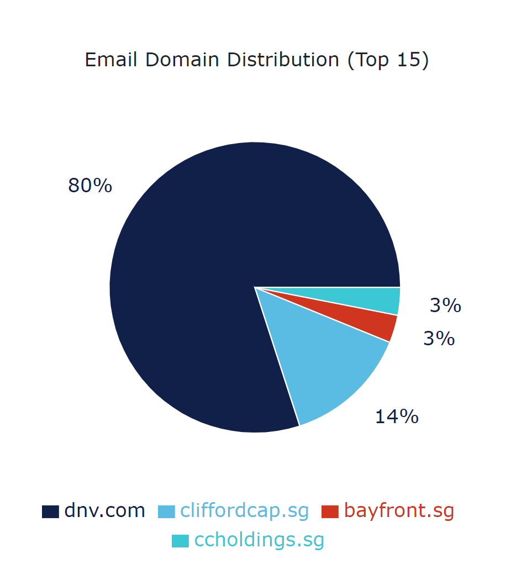

# Activity Statistics

The "Activity Statistics" page is divided into two tabs:
* Report Statistics - Show usage statistics for reports.
* Entity Statistics - Show usage statistics for entities.

To change the time period for which you are seeing the statistics, under the tab's name, select **Statistics Time** and then select the desired value. Fore example, 6M for six months.

The reports and entities are listed in a table on the left. To change for which report or entity you are viewing statistics, select another report or entity from the table.

For both tabs, you can see a list of users and when they interacted with the report or entity. You can also see the report page view data in the **Report Statistics** tab.

To see the list of users and the time when they interacted with the report or entity, in **Report Statistics** or **Entity Statistics**, under **Email Domain Distribution**, select (click) the chart. This will open a pop-up window with the list of the users and the time they interacted with the report.

To see the number of users who interacted with the report page, in **Report Statistics**, under **Page View Distribution**, select the chart. This will open a pop-up window with the number of page views and the time of the last view.

Below is a sample Email Domain Distribution chart.

<figure>
	
</figure>